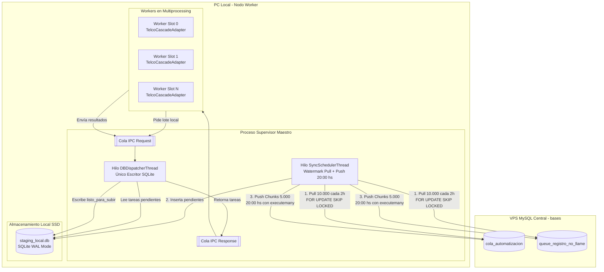
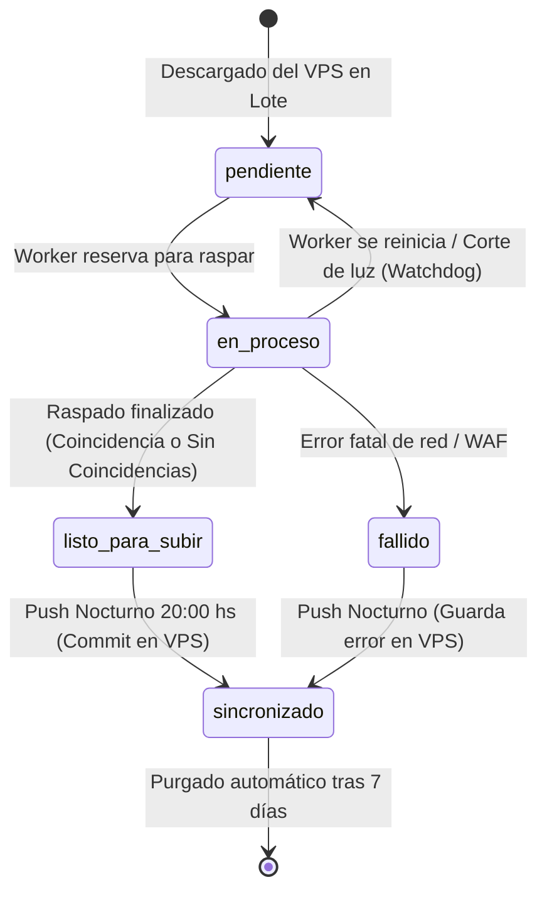

# Plan Maestro de Implementación: Staging Local Offline-First y Push Nocturno
**Arquitectura Hexagonal - Soporte Polimórfico (`cola_automatizacion` y `queue_registro_no_llame`)**

> **Documento de Especificación e Implementación Técnica**  
> **Fecha**: 29 de Septiembre de 2026  
> **Estado**: Plan Definitivo y Exhaustivo para Aprobación  

---

## 1. Definición de Límites: Qué se puede hacer y qué NO se puede hacer

### Qué SE PUEDE hacer (Garantías del Sistema):
1. **Doble Cola Polimórfica**: El motor de staging procesa indistintamente registros de `cola_automatizacion` (Power CRM) y de `queue_registro_no_llame` (Reg No Llame Clásico).
2. **Cascada Telco con Cortocircuito**: En `cola_automatizacion`, evalúa Claro (con DNI) ➔ Personal (ANI) ➔ Movistar (ANI) ➔ Sin coincidencias en un solo ciclo local.
3. **Reabastecimiento Automático por Umbral (Watermark Buffer)**:
   - Bloque de descarga: **10.000 registros** por viaje.
   - Umbral de recarga: cuando en local quedan **menos de 2.000** pendientes, pide otros 10.000 en 1 sola consulta atómica con `FOR UPDATE SKIP LOCKED`.
   - Los workers nunca se quedan sin tareas y el VPS recibe 1 lectura cada 2 horas en vez de consultas cada segundo.
4. **Protección en el VPS al Descargar**: Al hacer el pull, las filas se marcan en el VPS como `en_proceso` (o `procesando`) asignadas a `target_pc = WORKER_PC_ID`. Ninguna otra máquina las puede reclamar.
5. **Subida Nocturna de a 5.000 (20:00 hs)**:
   - Chunks de hasta **5.000 filas por transacción atómica** (`autocommit=False`, `executemany`).
   - **Manejo de remanentes**: Si el último lote tiene 1.450 o 12 filas, se sube ese remanente sin esperar.
   - **Barrido Final (Sweep)**: Al terminar los lotes, captura las tareas finalizadas por los workers durante el push antes de cerrar la conexión.
6. **Historial Rotativo de 7 Días**:
   - Filas sincronizadas se conservan 7 días en SQLite local (`staging_local.db`).
   - Purgado diario automático de filas sincronizadas con `fecha_sincronizado < NOW() - 7 días`.
7. **Control Manual CLI**: Comandos `--sync-now` y `--pull-now` para forzar sincronizaciones bajo demanda.

### Qué NO se puede hacer (Restricciones e Invariantes Absolutas):
1. **NO alterar el esquema de base de datos en el VPS**: No se crean tablas nuevas ni se agregan columnas en MySQL VPS. Todo el desacoplamiento es en el nodo local.
2. **NO conectar los subprocesos workers directamente al VPS ni a SQLite**:
   - Los workers no abren sockets al VPS.
   - Los workers no abren escrituras directas a SQLite (evitando el error `database is locked`).
   - Toda la I/O pasa por el despachador IPC del Supervisor (`DBDispatcherThread`), que es el único escritor centralizado.
3. **NO omitir ni descartar campos técnicos**: En el JSON final (`resultado` o `datos_json`) se preserva el 100% de los datos: bloque `enacom`, datos de titular, servicio, fechas, comprobantes desglosados, tokens decodificados, hashes y su `ultima_modificacion`.
4. **NO dejar transacciones abiertas en el VPS**: Cada chunk de 5.000 ejecuta `commit` o `rollback` inmediato con timeout estricto de 30 segundos.
5. **NO interferir con otros procesos**: El pull matutino solo reclama tareas con `target_pc IS NULL`, `target_pc = ''`, o `target_pc = WORKER_PC_ID`.
6. **NO tocar el código productivo de IRIS**: La lógica actual de `iris_http` se mantiene 100% aislada e intacta.

---

## 2. Diagrama de Arquitectura de Procesos y Concurrencia



---

## 3. Especificación Técnica de Base de Datos y Consultas SQL

### 3.1 SQLite Local: `data/staging_local.db`
```sql
PRAGMA journal_mode = WAL;
PRAGMA synchronous = NORMAL;
PRAGMA temp_store = MEMORY;
PRAGMA cache_size = -64000; -- 64 MB de cache en RAM
PRAGMA busy_timeout = 30000; -- 30s tolerancia a locks

CREATE TABLE IF NOT EXISTS tareas_staging (
    id_vps BIGINT NOT NULL,
    tipo_cola TEXT NOT NULL,         -- 'cola_automatizacion' | 'registro_no_llame'
    numero_de_linea TEXT NOT NULL,
    dni TEXT,
    auto_id TEXT,                    -- Identificador (ej: 'telco_scraper')
    target_pc TEXT NOT NULL,         -- Identificador de esta PC (ej: 'PC-01')
    scraper_actual TEXT,             -- Etapa del pipeline para registro_no_llame
    estado_local TEXT NOT NULL DEFAULT 'pendiente', -- 'pendiente' | 'en_proceso' | 'listo_para_subir' | 'sincronizado' | 'fallido'
    payload_origen TEXT,             -- Datos originales del VPS
    resultado_json TEXT,             -- JSON enriquecido final
    fuente TEXT,                     -- Array JSON de fuentes acumuladas
    scrapers_intentados TEXT,        -- Lista de motores consultados ('claro,personal,movistar')
    descripcion TEXT,
    latencia REAL DEFAULT 0.0,
    error_msg TEXT,
    reintentos_sync INTEGER DEFAULT 0,
    fecha_descarga DATETIME DEFAULT CURRENT_TIMESTAMP,
    fecha_procesado DATETIME,
    fecha_sincronizado DATETIME,
    PRIMARY KEY (id_vps, tipo_cola)
);

CREATE INDEX IF NOT EXISTS idx_staging_tipo_estado ON tareas_staging(tipo_cola, estado_local);
CREATE INDEX IF NOT EXISTS idx_staging_sincro ON tareas_staging(estado_local, fecha_sincronizado);
```

### 3.2 Consultas SQL contra MySQL VPS

#### A. Pull desde `cola_automatizacion` (Bloque de 10.000):
```sql
SELECT id, numero_de_linea, dni, auto_id, target_pc, datos
FROM cola_automatizacion
WHERE estado = 'pendiente' 
  AND auto_id = %s
  AND (target_pc IS NULL OR target_pc = '' OR target_pc = %s)
ORDER BY id ASC
LIMIT %s
FOR UPDATE SKIP LOCKED;

UPDATE cola_automatizacion
SET estado = 'en_proceso',
    target_pc = %s,
    fecha_inicio = NOW()
WHERE id IN (%s, %s, ...);
```

#### B. Pull desde `queue_registro_no_llame` (Bloque de 10.000):
```sql
SELECT id, ani, dni, estado, scraper_actual, fuente, datos_json
FROM queue_registro_no_llame FORCE INDEX (idx_scraper_estado)
WHERE scraper_actual = %s 
  AND estado = 'pendiente'
ORDER BY id ASC
LIMIT %s
FOR UPDATE SKIP LOCKED;

UPDATE queue_registro_no_llame
SET estado = 'procesando',
    fecha_modificacion = NOW()
WHERE id IN (%s, %s, ...);
```

#### C. Push Nocturno a `cola_automatizacion` (Chunks de 5.000):
```sql
UPDATE cola_automatizacion
SET estado = %s,
    resultado = %s,
    error_msg = %s,
    scrapers_intentados = %s,
    dni = CASE WHEN (dni IS NULL OR dni = '') AND %s IS NOT NULL THEN %s ELSE dni END,
    numero_de_linea = CASE WHEN (numero_de_linea IS NULL OR numero_de_linea = '') AND %s IS NOT NULL THEN %s ELSE numero_de_linea END,
    fecha_fin = NOW()
WHERE id = %s;
```

#### D. Push Nocturno a `queue_registro_no_llame` (Chunks de 5.000):
```sql
UPDATE queue_registro_no_llame
SET estado = %s,
    scraper_actual = %s,
    fuente = %s,
    datos_json = %s,
    dni = CASE WHEN (dni IS NULL OR dni = '') AND %s IS NOT NULL THEN %s ELSE dni END,
    descripcion = %s,
    latencia = %s,
    fecha_modificacion = NOW()
WHERE id = %s;
```

---

## 4. Ciclo de Vida de los Estados y Manejo de Fallas



### Manejo de Fallas y Resiliencia Extrema:
1. **Corte de Luz / Apagado Imprevisto**:
   - SQLite en modo WAL preserva el estado en disco sin corrupción.
   - Al encenderse, el Watchdog local detecta filas colgadas en `en_proceso` y las revierte automáticamente a `pendiente`.
2. **Corte de Internet durante el Día**:
   - Los workers no se enteran: siguen procesando localmente contra SQLite.
3. **Corte de Internet durante el Push Nocturno (20:00 hs)**:
   - Cada chunk de 5.000 es una transacción atómica. Si se corta en el chunk 3, los chunks 1 y 2 ya quedaron comprometidos y marcados como `sincronizado` en SQLite.
   - El sincronizador reintenta 5 veces con backoff exponencial. Si no vuelve la red, las tareas permanecen seguras en SQLite en estado `listo_para_subir` hasta la reconexión.
4. **Sobrecarga de RAM**:
   - Al usar chunks de 5.000 y persistencia por IPC, la memoria de cada proceso worker se mantiene fija en ~120 MB y el supervisor rota a los workers cada 350 consultas.

---

## 5. Parámetros Fijos de Configuración (Sin Ambigüedad)

Se incorporan en `config.py` y `.env`:

| Parámetro | Valor por Defecto | Descripción |
|---|---|---|
| `LOCAL_STAGING_ENABLED` | `True` | Activa la persistencia local desacoplada. |
| `LOCAL_STAGING_DB_PATH` | `data/staging_local.db` | Archivo SQLite local. |
| `PULL_CHUNK_SIZE` | `10000` | Filas reclamadas al VPS por viaje de reabastecimiento. |
| `LOW_WATERMARK_THRESHOLD` | `2000` | Umbral para disparar el pull matutino/diurno. |
| `PULL_DAILY_LIMIT` | `50000` | Cupo máximo diario a descargar por PC. |
| `SYNC_PUSH_HOUR` | `20` | Hora de inicio del push masivo (20:00 hs). |
| `SYNC_CHUNK_SIZE` | `5000` | Techo máximo de filas por transacción `UPDATE` en VPS. |
| `SYNC_SWEEP_WAIT_SEC` | `10` | Pausa en segundos antes del barrido final de remanentes. |
| `SYNC_RETENTION_DAYS` | `7` | Días de resguardo histórico de filas sincronizadas en SQLite. |

---

## 6. Plan de Implementación Paso a Paso

### Paso 1: Adaptador de Persistencia Local SQLite
* **Archivo**: `adapters/queue/sqlite_staging_adapter.py`.
* Implementa [IColaRepositorioPort](file:///c:/Users/automatizacion.crm/Documents/GitHub/scrapers-reg-no-llame/core/ports/queue_port.py#L11).
* Métodos: `reservar_lote`, `persistir_resultados`, `revertir_a_pendiente`, `obtener_estadisticas`, `purgar_antiguos`.

### Paso 2: Adaptador Motor de Cascada Telco
* **Archivo**: `adapters/scrapers/telcos/telco_cascade_adapter.py`.
* Implementa [IScraperEnginePort](file:///c:/Users/automatizacion.crm/Documents/GitHub/scrapers-reg-no-llame/core/ports/scraper_port.py#L12) heredando de [BaseScraperAdapter](file:///c:/Users/automatizacion.crm/Documents/GitHub/scrapers-reg-no-llame/adapters/scrapers/base_scraper.py#L9).
* Flujo: Claro ➔ Personal ➔ Movistar ➔ Sin coincidencias con cortocircuito.
* Registro en [ScraperRegistry](file:///c:/Users/automatizacion.crm/Documents/GitHub/scrapers-reg-no-llame/adapters/scrapers/registry.py#L19) bajo el alias `'telcos'`.

### Paso 3: Casos de Uso de Sincronización
* **Archivo**: `core/use_cases/sync_pull_use_case.py`: Pull de 10.000 con `SKIP LOCKED` y marcado en VPS.
* **Archivo**: `core/use_cases/sync_push_use_case.py`: Push de 5.000 en 5.000, barrido final de remanentes y purga de > 7 días.

### Paso 4: Hilo Centinela en Supervisor (`SyncSchedulerThread`)
* **Archivo**: `runtime/supervisor.py`:
  - Agrega el hilo de fondo que controla el Watermark de 2.000 y el temporizador de las 20:00 hs.
  - Flags de consola: `--sync-now` (subir ya), `--pull-now` (recargar ya).

### Paso 5: Batería de Pruebas Unitarias e Integración
* `tests/test_sqlite_staging_adapter.py`: Integración SQLite WAL multihilo.
* `tests/test_telco_cascade.py`: 4 caminos de la cascada.
* `tests/test_sync_watermark.py`: Pull de 10.000 al bajar de 2.000.
* `tests/test_sync_push_chunks.py`: Chunks de 5.000 y manejo de remanentes incompletos.
* `tests/test_retencion_7_dias.py`: Limpieza de registros antiguos.

---

## 7. Comandos Operativos Finales

### Para ejecutar Telcos (Power CRM en `cola_automatizacion`):
```powershell
python supervisor_vps.py --queue cola_automatizacion --auto-id telco_scraper --scraper telcos --workers 8 --proxy-pool
```

### Para ejecutar IRIS (en `queue_registro_no_llame`):
```powershell
python supervisor_vps.py --queue registro_no_llame --scraper iris_http --workers 9
```

### Para forzar sincronización nocturna manualmente en cualquier momento:
```powershell
python supervisor_vps.py --sync-now
```
