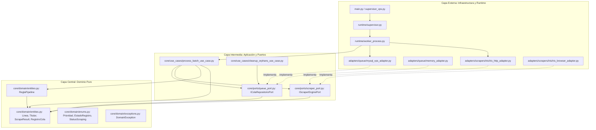
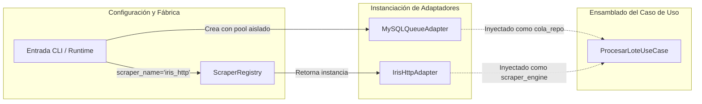

# Arquitectura Hexagonal (Ports & Adapters)

El diseño arquitectónico de este repositorio implementa estrictamente el patrón **Arquitectura Hexagonal** (conocido formalmente como *Ports and Adapters Architecture* de Alistair Cockburn). 

El objetivo fundamental de esta arquitectura es **aislar la lógica esencial del negocio y los modelos de dominio** de los detalles volátiles de infraestructura: bases de datos, protocolos de red, navegadores headless, clientes HTTP externos y orquestadores del sistema operativo.

---

## 1. Principio de Inversión de Dependencias y Regla de Dependencia

La regla dorada de esta arquitectura establece que:
> **Las dependencias en el código fuente solo pueden apuntar hacia adentro, hacia el Dominio.**



- **El Dominio no conoce nada del exterior:** No importa si la base de datos es MySQL, PostgreSQL, DynamoDB o memoria RAM. No sabe si el scraper interactúa mediante un navegador Playwright, peticiones `urllib3`, o un mock de testing.
- **Los Casos de Uso solo conocen Puertos y Entidades:** Orquestan el flujo invocando métodos definidos en interfaces abstractas (`ABC`).
- **Los Adaptadores implementan los Puertos:** Traducen las llamadas del caso de uso a queries SQL reales (`SELECT ... FOR UPDATE SKIP LOCKED`) o a comandos HTTP de WebLogic/JSF.

---

## 2. Los Cuatro Círculos Arquitectónicos

### 2.1. Núcleo: Dominio Puro (`core/domain/`)
Contiene los tipos inmutables, Value Objects, entidades y reglas de negocio puras.
- **Sin librerías de terceros:** Solo librerías estándar de Python (`dataclasses`, `enum`, `typing`).
- **Value Objects:** [`Linea`](file:///c:/Users/Usuario/Documents/GitHub/scrapers%20reg%20no%20llame/core/domain/entities.py#L10-L38), [`Titular`](file:///c:/Users/Usuario/Documents/GitHub/scrapers%20reg%20no%20llame/core/domain/entities.py#L39-L62), [`Servicio`](file:///c:/Users/Usuario/Documents/GitHub/scrapers%20reg%20no%20llame/core/domain/entities.py#L64-L77).
- **Entidades:** [`ScrapeResult`](file:///c:/Users/Usuario/Documents/GitHub/scrapers%20reg%20no%20llame/core/domain/entities.py#L79-L111), [`RegistroCola`](file:///c:/Users/Usuario/Documents/GitHub/scrapers%20reg%20no%20llame/core/domain/entities.py#L113-L124).
- **Regla de Negocio:** [`ReglaPipeline`](file:///c:/Users/Usuario/Documents/GitHub/scrapers%20reg%20no%20llame/core/domain/entities.py#L126-L172), responsable de evaluar el cortocircuito y calcular el siguiente salto del pipeline.

### 2.2. Capa de Casos de Uso / Aplicación (`core/use_cases/`)
Coordina las operaciones del sistema para cumplir los casos de uso específicos:
- [`ProcesarLoteUseCase`](file:///c:/Users/Usuario/Documents/GitHub/scrapers%20reg%20no%20llame/core/use_cases/process_batch_use_case.py#L19-L133):
  1. Reclama un lote mediante el puerto de cola.
  2. Itera sobre las líneas y consulta el puerto de scraper.
  3. Ejecuta la regla de dominio para resolver la siguiente posta.
  4. Agrega los datos acumulativamente en namespaces.
  5. Persiste el lote en la base de datos.
- [`LiberarHuerfanosUseCase`](file:///c:/Users/Usuario/Documents/GitHub/scrapers%20reg%20no%20llame/core/use_cases/cleanup_orphans_use_case.py#L9-L16):
  1. Ordena al puerto de cola revertir a `pendiente` los registros abandonados en `procesando`.

### 2.3. Capa de Puertos (`core/ports/`)
Define los contratos abstractos (Driven / Secondary Ports). Son clases abstractas de Python (`abc.ABC`) que declaran las firmas que la infraestructura debe proveer:
- [`IColaRepositorioPort`](file:///c:/Users/Usuario/Documents/GitHub/scrapers%20reg%20no%20llame/core/ports/queue_port.py#L11-L57)
- [`IScraperEnginePort`](file:///c:/Users/Usuario/Documents/GitHub/scrapers%20reg%20no%20llame/core/ports/scraper_port.py#L10-L49)

### 2.4. Capa de Adaptadores (`adapters/`) y Runtime (`runtime/`)
La capa más externa que se comunica con el mundo exterior:
- **Adaptadores de Persistencia:** [`MySQLQueueAdapter`](file:///c:/Users/Usuario/Documents/GitHub/scrapers%20reg%20no%20llame/adapters/queue/mysql_vps_adapter.py#L36-L358) (conversión de y hacia SQL, gestión de pool de conexiones, sentencias con transacciones) y [`MemoryQueueAdapter`](file:///c:/Users/Usuario/Documents/GitHub/scrapers%20reg%20no%20llame/adapters/queue/memory_adapter.py#L11-L80).
- **Adaptadores de Extracción:** [`IrisHttpAdapter`](file:///c:/Users/Usuario/Documents/GitHub/scrapers%20reg%20no%20llame/adapters/scrapers/iris/iris_http_adapter.py#L12-L112), [`IrisBrowserAdapter`](file:///c:/Users/Usuario/Documents/GitHub/scrapers%20reg%20no%20llame/adapters/scrapers/iris/iris_browser_adapter.py#L12-L111), [`TemplateScraperAdapter`](file:///c:/Users/Usuario/Documents/GitHub/scrapers%20reg%20no%20llame/adapters/scrapers/template_scraper.py#L14-L58).
- **Factoría:** [`ScraperRegistry`](file:///c:/Users/Usuario/Documents/GitHub/scrapers%20reg%20no%20llame/adapters/scrapers/registry.py#L14-L39).
- **Runtime:** [`SupervisorIndustrial`](file:///c:/Users/Usuario/Documents/GitHub/scrapers%20reg%20no%20llame/runtime/supervisor.py#L31-L282) y [`worker_lifecycle_process`](file:///c:/Users/Usuario/Documents/GitHub/scrapers%20reg%20no%20llame/runtime/worker_process.py#L23-L181).

---

## 3. Interfaces de Puertos de Salida (Secondary / Driven Ports)

### 3.1. Contrato `IColaRepositorioPort`

El puerto [`IColaRepositorioPort`](file:///c:/Users/Usuario/Documents/GitHub/scrapers%20reg%20no%20llame/core/ports/queue_port.py#L11-L57) define las operaciones necesarias para gobernar la cola de registros:

```python
from abc import ABC, abstractmethod
from typing import List, Dict, Any, Optional
from core.domain.entities import RegistroCola

class IColaRepositorioPort(ABC):
    """Contrato abstracto para el repositorio de colas y persistencia."""

    @abstractmethod
    def reservar_lote(
        self, 
        batch_size: int = 15, 
        prioridad: Optional[int] = None, 
        scraper_nombre: str = "iris"
    ) -> List[RegistroCola]:
        """
        Reclama atómicamente un micro-lote de registros para el scraper especificado.
        Debe aplicar bloqueo de concurrencia (ej: SKIP LOCKED) y priorización (P1 -> P2 -> P3).
        """
        pass

    @abstractmethod
    def persistir_resultados(self, resultados: List[Dict[str, Any]]) -> bool:
        """
        Actualiza en lote los registros procesados:
        Avanza la etapa (scraper_actual), actualiza estado, anota fuente acumulativa
        y fusiona datos_json bajo el namespace correspondiente.
        """
        pass

    @abstractmethod
    def revertir_a_pendiente(self, ids: List[int]) -> bool:
        """
        Devuelve una lista de IDs del estado 'procesando' al estado 'pendiente'.
        Crucial para recuperaciones ante apagado ordenado o fallos de workers.
        """
        pass

    @abstractmethod
    def liberar_huerfanos(self, minutos_inactividad: int = 15) -> int:
        """
        Watchdog Sweeper: Recupera registros colgados en 'procesando' tras caídas imprevistas.
        """
        pass

    @abstractmethod
    def obtener_estadisticas(self) -> Dict[str, int]:
        """
        Devuelve el conteo de registros desglosado por scraper_actual y estado.
        """
        pass
```

### 3.2. Contrato `IScraperEnginePort`

El puerto [`IScraperEnginePort`](file:///c:/Users/Usuario/Documents/GitHub/scrapers%20reg%20no%20llame/core/ports/scraper_port.py#L10-L49) define el ciclo de vida y la interacción con cualquier portal o servicio de consulta externa:

```python
from abc import ABC, abstractmethod
from core.domain.entities import Linea, ScrapeResult

class IScraperEnginePort(ABC):
    """Contrato abstracto para cualquier motor de extracción externa."""

    @property
    @abstractmethod
    def nombre(self) -> str:
        """Identificador único del scraper (ej: 'iris', 'claro', 'personal')."""
        pass

    @abstractmethod
    def iniciar(self) -> None:
        """Inicializa recursos subyacentes (cliente HTTP, navegador, pools, etc.)."""
        pass

    @abstractmethod
    def autenticar(self) -> bool:
        """Realiza login o validación de tokens/sesión con el portal remoto."""
        pass

    @abstractmethod
    def consultar_linea(self, linea: Linea) -> ScrapeResult:
        """
        Consulta una línea telefónica individual y devuelve el resultado normalizado
        bajo el modelo de dominio ScrapeResult.
        """
        pass

    @abstractmethod
    def verificar_salud(self) -> bool:
        """
        Health-check rápido para el Circuit Breaker (ej: ping al gateway/VPN).
        Retorna True si el portal remoto responde normalmente.
        """
        pass

    @abstractmethod
    def cerrar(self) -> None:
        """Cierra sesiones, clientes y libera el 100% de los recursos en memoria."""
        pass
```

---

## 4. Inyección de Dependencias y Cableado en Runtime

En lugar de utilizar complejos frameworks de Inyección de Dependencias como Spring o Guice, el sistema aplica **Inyección de Dependencias Manual por Constructor (Pure DI)** en el punto de entrada de los procesos workers:



El código de ensamblado en [`worker_lifecycle_process`](file:///c:/Users/Usuario/Documents/GitHub/scrapers%20reg%20no%20llame/runtime/worker_process.py#L57-L88) ilustra con precisión este cableado limpio:

```python
# 1. Adaptador de Cola con Pool de conexiones dedicado por subproceso (PID)
cola_repo = MySQLQueueAdapter(
    pool_size=3,
    pool_name=f"pool_{worker_slot}_{generation}_{os.getpid()}"
)

# 2. Adaptador de Motor de Scraping dinámico vía Registry
kwargs = scraper_kwargs or {}
scraper_engine = ScraperRegistry.obtener(scraper_name, **kwargs)
scraper_engine.iniciar()

# 3. Autenticación inicial del scraper
if not scraper_engine.autenticar():
    return

# 4. Inyección de dependencias en el Caso de Uso de Aplicación
use_case = ProcesarLoteUseCase(
    cola_repo=cola_repo,
    scraper_engine=scraper_engine
)
```

---

## 5. Beneficios Tangibles de la Arquitectura en Producción

1. **Testabilidad Absoluta sin Infraestructura Externa:**
   Gracias a [`MemoryQueueAdapter`](file:///c:/Users/Usuario/Documents/GitHub/scrapers%20reg%20no%20llame/adapters/queue/memory_adapter.py#L11-L80), cualquier programador puede probar el caso de uso [`ProcesarLoteUseCase`](file:///c:/Users/Usuario/Documents/GitHub/scrapers%20reg%20no%20llame/core/use_cases/process_batch_use_case.py#L19-L133) y la regla [`ReglaPipeline`](file:///c:/Users/Usuario/Documents/GitHub/scrapers%20reg%20no%20llame/core/domain/entities.py#L126-L172) en milisegundos sin levantar un contenedor Docker ni conectarse al VPS, utilizando simplemente el flag `--dry-run`:
   ```bash
   python main.py test-batch --scraper iris_http --batch-size 3 --dry-run
   ```

2. **Intercambiabilidad de Motores de Scraping sin Efectos Colaterales:**
   Cambiar de un motor basado en navegador Chromium Playwright ([`IrisBrowserAdapter`](file:///c:/Users/Usuario/Documents/GitHub/scrapers%20reg%20no%20llame/adapters/scrapers/iris/iris_browser_adapter.py)) a un motor HTTP directo ([`IrisHttpAdapter`](file:///c:/Users/Usuario/Documents/GitHub/scrapers%20reg%20no%20llame/adapters/scrapers/iris/iris_http_adapter.py)) requiere únicamente modificar el argumento `--engine http` en la línea de comando. Los casos de uso y la base de datos se mantienen completamente intactos.

3. **Independencia de Frameworks y Bibliotecas Externas:**
   Si la biblioteca `mysql-connector-python` se reemplaza en el futuro por `SQLAlchemy`, `asyncpg` o `redis-py`, el núcleo [`core/`](file:///c:/Users/Usuario/Documents/GitHub/scrapers%20reg%20no%20llame/core) no sufre ninguna modificación. Solo se implementa un nuevo archivo en [`adapters/queue/`](file:///c:/Users/Usuario/Documents/GitHub/scrapers%20reg%20no%20llame/adapters/queue).

---

## 6. Referencias Cruzadas
- [Visión General del Sistema](file:///c:/Users/Usuario/Documents/GitHub/scrapers%20reg%20no%20llame/docs/01_arquitectura/vision_general.md)
- [Pipeline en Cascada y Cortocircuito](file:///c:/Users/Usuario/Documents/GitHub/scrapers%20reg%20no%20llame/docs/01_arquitectura/pipeline_cascada.md)
- [Entidades y Value Objects de Dominio](file:///c:/Users/Usuario/Documents/GitHub/scrapers%20reg%20no%20llame/docs/02_dominio_y_casos_de_uso/entidades_y_value_objects.md)
- [Caso de Uso: Procesar Lote](file:///c:/Users/Usuario/Documents/GitHub/scrapers%20reg%20no%20llame/docs/02_dominio_y_casos_de_uso/caso_uso_procesar_lote.md)
- [Guía para Nuevos Scrapers](../05_guia_nuevos_scrapers/guia_creacion_claro.md)
