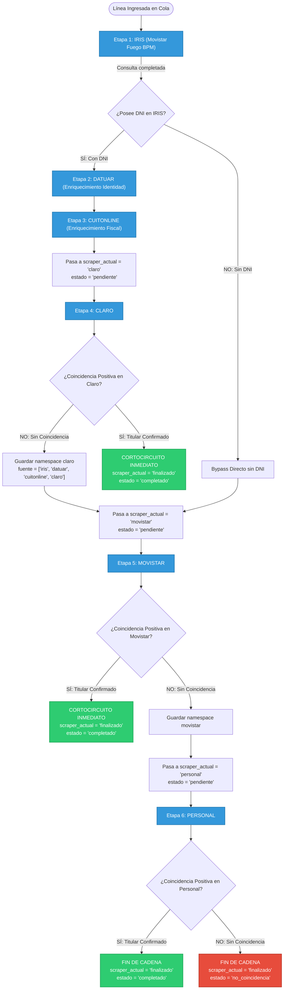

# Pipeline en Cascada y Regla de Cortocircuito

El enriquecimiento de líneas telefónicas en este sistema no es una consulta aislada a una sola base de datos, sino un **proceso secuencial en cadena de responsabilidad (Pipeline en Cascada)** con capacidad de **interrupción inmediata (Cortocircuito o Short-Circuiting)**.

Este documento explica en profundidad la arquitectura del pipeline, las transiciones de estado en la base de datos, la estructura acumulativa de los datos y el comportamiento del cortocircuito.

---

## 1. Concepto de Cascada de Enriquecimiento

El universo de líneas telefónicas a consultar contiene una mezcla de números activos, líneas portadas a otros operadores, números dados de baja y líneas fijas o corporativas. Ninguna base de datos individual posee el 100% de la verdad sobre todas las líneas del país.

Por este motivo, el sistema organiza los scrapers en una secuencia ordenada por probabilidad y riqueza de datos:

$$\text{Pipeline Oficial: } [\text{"iris"} \longrightarrow \text{"datuar"} \longrightarrow \text{"cuitonline"} \longrightarrow \text{"claro"} \longrightarrow \text{"movistar"} \longrightarrow \text{"personal"} \longrightarrow \text{"finalizado"}]$$



---

## 2. La Regla de Cortocircuito (Short-Circuit) y Eslabones No-Terminales

### 2.1. Eslabones de Enriquecimiento No-Terminales (`iris`, `datuar`, `cuitonline`)
1. **IRIS**: Consulta la base de portabilidad numérica corporativa (trámites de cambio de compañía, SPN y port-out). Extrae el DNI del titular cuando existe Port-Out.
2. **Datuar**: Enriquece nombres, apellidos, demografía y geolocalización a partir del DNI. **NUNCA cortocircuita**, dé o no dé resultado.
3. **CuitOnline**: Extrae y normaliza el CUIT verificado, denominación fiscal y situación impositiva ante AFIP (IVA, Ganancias). **NUNCA cortocircuita**, dé o no dé resultado.

Todos los eslabones de enriquecimiento avanzan siempre a la siguiente etapa de validación telco con estado `pendiente`.

### 2.2. Cortocircuito en Compañías Telco (Claro, Movistar, Personal)
A diferencia de los motores de enriquecimiento, los scrapers de operadoras comerciales consultan directamente la titularidad activa del cliente en la red del operador.
- Si la consulta en **Claro** arroja `StatusScraping.COINCIDENCIA`, se ha verificado que la línea pertenece activamente a Claro y ya se extrajo el nombre y documento del titular.
- **Consultar a continuación en Movistar o Personal sería un desperdicio absoluto de recursos**: generaría tráfico innecesario en la red, consumiría cuotas de IP/VPN y añadiría latencia sin aportar valor, ya que una línea activa en Claro no puede estar activa al mismo tiempo en Personal.
- **Acción:** La regla de dominio dispara el cortocircuito:
  $$\text{scraper\_actual} \leftarrow \text{"finalizado"}$$
  $$\text{estado} \leftarrow \text{"completado"}$$

---

## 3. Implementación en Código de Dominio y Ventana Temporal (TTL 7 Días)

La lógica de esta regla reside en la clase [`ReglaPipeline`](file:///c:/Users/Usuario/Documents/GitHub/scrapers-reg-no-llame/core/domain/entities.py):

```python
class ReglaPipeline:
    """
    Regla de Dominio: Cadena de Responsabilidad con Cortocircuito, Condiciones Dinámicas
    y Ventana Temporal de 7 Días (TTL).
    Determina la siguiente etapa de una línea telefónica en el pipeline y la elegibilidad
    para el modelo de piscina autónoma distribuida multi-PC.
    """
    TELCOS = ("claro", "personal", "movistar")
    REQUIEREN_DNI = ("claro", "datuar", "cuitonline")
    CADENA_DEFAULT = ["iris", "claro", "personal", "movistar", "datuar", "cuitonline"]

    @classmethod
    def resolver_siguiente_etapa(
        cls, 
        scraper_actual: str, 
        resultado: ScrapeResult,
        cadena: Optional[List[str]] = None,
        dni_disponible: Optional[bool] = None,
        fuentes_previas: Optional[List[str]] = None,
        coincidencia_telco_previa: bool = False,
        datos_previos: Optional[Dict[str, Any]] = None,
        dias_validez: int = 7
    ) -> tuple[str, str]:
        pipeline = list(cadena or cls.CADENA_DEFAULT)
        datos = datos_previos if isinstance(datos_previos, dict) else {}

        tiene_dni = bool(
            dni_disponible
            or cls.extraer_dni(datos)
            or (resultado.titular and resultado.titular.nro_documento)
            or (isinstance(resultado.detalles, dict) and (
                resultado.detalles.get("titular", {}).get("nro_documento") 
                or resultado.detalles.get("dni")
            ))
        )

        telco_coincidio = (
            coincidencia_telco_previa 
            or (resultado.status == StatusScraping.COINCIDENCIA and scraper_actual in cls.TELCOS)
        )
        if not telco_coincidio and datos:
            for t in cls.TELCOS:
                t_info = datos.get(t, {})
                if isinstance(t_info, dict) and t_info.get("status") == StatusScraping.COINCIDENCIA.value:
                    if cls.es_reciente(t_info.get("ultima_modificacion"), max_dias=dias_validez):
                        telco_coincidio = True
                        break

        pasados = set(fuentes_previas or [])
        pasados.add(scraper_actual)

        def paso_reciente(sc_name: str) -> bool:
            if sc_name == scraper_actual:
                return True
            if sc_name not in pasados:
                return False
            sc_info = datos.get(sc_name, {})
            if isinstance(sc_info, dict):
                ts = sc_info.get("ultima_modificacion")
                if ts:
                    return cls.es_reciente(ts, max_dias=dias_validez)
            return True

        idx = pipeline.index(scraper_actual) if scraper_actual in pipeline else -1

        for candidato in pipeline[idx + 1:]:
            if telco_coincidio and candidato in cls.TELCOS:
                continue

            # Para motores que NO son de compañía (datuar, cuitonline): solo nutrir si no tienen datos previos
            if candidato not in cls.TELCOS:
                sc_info = datos.get(candidato, {})
                if isinstance(sc_info, dict) and sc_info.get("status"):
                    continue

            # Precedencias temporales de 7 días (exclusivas para compañías: Claro, Personal, Movistar):
            # 1. Personal con DNI exige haber pasado por Claro en los últimos 7 días (si Claro forma parte de la cadena)
            if candidato == "personal" and tiene_dni and "claro" in pipeline and not paso_reciente("claro"):
                continue

            # 2. Movistar ('de nadie', solo ANI) exige haber pasado por Personal en los últimos 7 días
            if candidato == "movistar" and not paso_reciente("personal"):
                continue

            # Dependencia de Identidad (NO aplica regla de 7 días):
            # 3. CuitOnline requiere haber pasado por Datuar previamente
            paso_datuar = ("datuar" in pasados or (isinstance(datos.get("datuar"), dict) and datos["datuar"].get("status")))
            if candidato == "cuitonline" and not paso_datuar:
                continue

            return (candidato, EstadoRegistro.PENDIENTE.value)

        estado_final = (
            EstadoRegistro.COMPLETADO.value 
            if (telco_coincidio or resultado.status == StatusScraping.COINCIDENCIA)
            else EstadoRegistro.NO_COINCIDENCIA.value
        )
        return ("finalizado", estado_final)
```

---

## 4. Matriz Completa de Transiciones de Estado

La siguiente tabla resume las combinaciones de entrada y salida calculadas por la regla de dominio (asumiendo la secuencia por defecto `["iris", "claro", "personal", "movistar", "datuar", "cuitonline"]`):

| Scraper Actual | Estatus Obtenido (`StatusScraping`) | Condición DNI | Siguiente Scraper (`scraper_actual`) | Siguiente Estado (`estado`) | Efecto / Justificación |
| :--- | :--- | :--- | :--- | :--- | :--- |
| `iris` | `COINCIDENCIA` | Con DNI | `claro` | `pendiente` | Posee DNI; avanza a Claro para consulta con DNI. |
| `iris` | `SIN_COINCIDENCIA` | Sin DNI | `personal` | `pendiente` | **Bypass Inteligente:** Sin DNI; saltea Claro, Datuar y CuitOnline e ingresa directo a Personal (solo ANI). |
| `claro` | `COINCIDENCIA` | Con DNI | `datuar` | `pendiente` | **Cortocircuito Telco:** Titularidad Claro confirmada. Se descarta Personal/Movistar y avanza a Datuar. |
| `claro` | `SIN_COINCIDENCIA` | Con DNI | `personal` | `pendiente` | No es Claro; se delega a Personal. |
| `personal` | `COINCIDENCIA` | Sin DNI | **`finalizado`** | **`completado`** | Titularidad Personal confirmada. Al no poseer DNI, concluye sin pasar por Datuar ni Movistar. |
| `personal` | `COINCIDENCIA` | Con DNI | `datuar` | `pendiente` | Titularidad Personal confirmada. Al poseer DNI previo, avanza a Datuar y CuitOnline. |
| `personal` | `SIN_COINCIDENCIA` | - | `movistar` | `pendiente` | No pertenece a Personal; se delega a Movistar. |
| `movistar` | `COINCIDENCIA` | Sin DNI | **`finalizado`** | **`completado`** | Titularidad Movistar confirmada. Sin DNI; concluye de inmediato. |
| `movistar` | `COINCIDENCIA` | Con DNI | `datuar` | `pendiente` | Titularidad Movistar confirmada. Con DNI previo; avanza a Datuar. |
| `movistar` | `SIN_COINCIDENCIA` | - | **`finalizado`** | **`no_coincidencia`** | Fin del pipeline telco sin coincidencia. |
| `datuar` | `COINCIDENCIA` / `SIN_COINCIDENCIA` | Con DNI | `cuitonline` | `pendiente` | Motor no-terminal. Deriva obligatoriamente a CuitOnline para constancia fiscal. |
| `cuitonline`| `COINCIDENCIA` / `SIN_COINCIDENCIA` | Con DNI | **`finalizado`** | **`completado`** | Fin de la cadena con perfil de identidad completo. |

---

### 4.1. Bandera Configurable `--solo-sin-coincidencia` en Motores de Compañía (Telcos)

Para auditorías masivas iniciales (*first pass*), el sistema incorpora la bandera `--solo-sin-coincidencia` (`solo_sin_coincidencia: bool = False`), aplicable a los scrapers de compañías (`claro`, `personal`, `movistar`).

#### Objetivo Operativo:
Garantizar que los workers de compañías auditen **exclusivamente registros sin coincidencia previa en ninguna de las 3 telcos** (`status != 'coincidencia'` en Claro, Personal y Movistar, así como en el status raíz legado de la base de datos).

| Modo Operativo | Valor de `solo_sin_coincidencia` | Comportamiento en Reclamo de Lote (`reservar_lote`) |
| :--- | :---: | :--- |
| **Auditoría Inicial (Primera Pasada)** | `True` (`--solo-sin-coincidencia`) | **Estricto**: Descarta todo registro que tenga `coincidencia` en Claro, Personal, Movistar o raíz, sin importar la antigüedad. Solo toma registros vírgenes o con `sin_coincidencia`. |
| **Control Estándar (Post-Auditoría)** | `False` (Por defecto) | **Ventana TTL de 7 Días**: Aplica exclusividad telco dentro de los últimos 7 días. Si un registro fue consultado hace más de 7 días, puede ser re-auditado según las reglas de refresco. |

---

## 5. Fusión Acumulativa de Datos JSON (`datos_json`)

A medida que una línea recorre los distintos eslabones de la cadena, cada scraper encapsula sus datos bajo su propia clave (*namespace*) llamando a [`resultado.to_namespace_dict()`](file:///c:/Users/Usuario/Documents/GitHub/scrapers-reg-no-llame/core/domain/entities.py#L97-L111).

El caso de uso [`ProcesarLoteUseCase`](file:///c:/Users/Usuario/Documents/GitHub/scrapers-reg-no-llame/core/use_cases/process_batch_use_case.py#L81-L84) toma el diccionario existente en la base de datos y ejecuta:
```python
datos_acumulados = dict(reg.datos_existentes or {})
datos_acumulados.update(resultado.to_namespace_dict())
```

### 5.1. Ejemplo Real de Evolución del JSON

#### Estado 1: Luego de ser procesada por IRIS (con coincidencia de Port-Out):
```json
{
  "iris": {
    "status": "coincidencia",
    "fuente": "iris",
    "operador": "Claro",
    "operador_receptor": "Claro",
    "titular": {
      "nombre": "JUAN CARLOS",
      "apellido": "PEREZ",
      "razon_social": "",
      "tipo_documento": "DNI",
      "nro_documento": "28112233",
      "tipo_persona": "Fisica",
      "telefono_contacto": "1144332211",
      "email": ""
    },
    "servicio": {
      "tecnologia": "GSM",
      "producto": "Pospago",
      "modalidad_factura": "Digital"
    },
    "fechas": {
      "fecha_operacion": "2024-03-15",
      "fecha_alta": "2018-05-10",
      "fecha_estado": "2024-03-16"
    },
    "detalles": {
      "nro_tramite_abd": "ABD-998822",
      "resultado_spn": "Aprobado"
    },
    "raw": { ... }
  }
}
```
*Campos en BD:* `scraper_actual = 'claro'`, `estado = 'pendiente'`, `fuente = '["iris"]'`.

#### Estado 2: Luego de ser procesada por Claro (Cortocircuito exitoso):
```json
{
  "iris": {
    "status": "coincidencia",
    "fuente": "iris",
    "operador": "Claro",
    "titular": {
      "nombre": "JUAN CARLOS",
      "apellido": "PEREZ",
      "nro_documento": "28112233"
    },
    ...
  },
  "claro": {
    "status": "coincidencia",
    "fuente": "claro",
    "operador": "Claro Argentina",
    "titular": {
      "nombre": "JUAN CARLOS",
      "apellido": "PEREZ",
      "tipo_documento": "DNI",
      "nro_documento": "28112233",
      "tipo_persona": "Fisica",
      "telefono_contacto": "1144332211",
      "email": "jcperez@gmail.com"
    },
    "servicio": {
      "tecnologia": "4G/5G LTE",
      "producto": "Plan Control 5GB",
      "modalidad_factura": "Debito Automatico"
    },
    "detalles": {
      "segmento_comercial": "Individuos",
      "antiguedad_meses": 24
    }
  }
}
```
*Campos en BD:* `scraper_actual = 'finalizado'`, `estado = 'completado'`, `fuente = '["iris", "claro"]'`.

---

## 6. Auditoría y Trazabilidad en la Columna `fuente`

Para permitir auditorías analíticas instantáneas sin necesidad de descomprimir o parsear el campo `datos_json`, la columna `fuente` de la tabla almacena un array JSON de texto con las etapas transitadas:
```python
fuentes_actuales = reg.fuente or "[]"
if self.scraper.nombre not in fuentes_actuales:
    fuente_norm = f'["{self.scraper.nombre}"]' if fuentes_actuales in ("[]", "None", "") else fuentes_actuales.rstrip("]") + f', "{self.scraper.nombre}"]'
else:
    fuente_norm = fuentes_actuales
```

Esto permite ejecutar consultas analíticas SQL directas y eficientes como:
```sql
-- Cuántas líneas pasaron por IRIS y terminaron confirmadas en Claro
SELECT COUNT(*) 
FROM queue_registro_no_llame 
WHERE fuente LIKE '%"iris"%' 
  AND fuente LIKE '%"claro"%' 
  AND estado = 'completado';
```

---

## 7. Referencias Cruzadas
- [Regla del Pipeline en Dominio](file:///c:/Users/Usuario/Documents/GitHub/scrapers-reg-no-llame/docs/02_dominio_y_casos_de_uso/regla_pipeline_dominio.md)
- [Caso de Uso: Procesar Lote](file:///c:/Users/Usuario/Documents/GitHub/scrapers-reg-no-llame/docs/02_dominio_y_casos_de_uso/caso_uso_procesar_lote.md)
- [Entidades y Value Objects de Dominio](file:///c:/Users/Usuario/Documents/GitHub/scrapers-reg-no-llame/docs/02_dominio_y_casos_de_uso/entidades_y_value_objects.md)
- [Esquema de Base de Datos y Colas](../03_base_de_datos_y_colas/esquema_ddl_vps.md)
