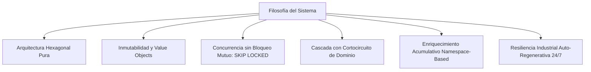
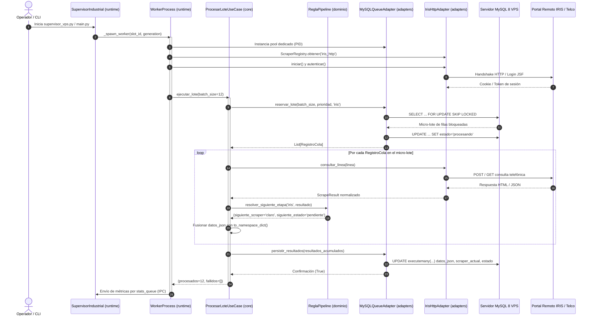

# Visión General de la Arquitectura del Sistema

El sistema es una plataforma distribuida, concurrente e industrial desarrollada en Python y SQL, orientada a la **consulta, extracción, normalización y enriquecimiento acumulativo de líneas telefónicas** en Argentina para campañas de telecomunicaciones y contact centers.

Su diseño responde a la necesidad de orquestar múltiples fuentes de datos dispares (sistemas CRM corporativos como Oracle BPM / Fuego IRIS Movistar, portales de autogestión de operadores telco como Claro, Movistar y Personal, y registros de identidad como RENAPER) sobre un volumen masivo de datos en una base centralizada, garantizando resiliencia 24/7, cero colisiones de concurrencia y máxima velocidad de procesamiento.

---

## 1. Propósito y Contexto de Negocio

En el ecosistema de telecomunicaciones de Argentina, la identificación del titular y del operador actual de una línea telefónica móvil o fija es un desafío crítico:
- Las bases de prospectos suelen contener únicamente el número de abonado (`ANI` de 10 dígitos) o datos desactualizados.
- La dinámica de la portabilidad numérica (*Port In* / *Port Out*) hace que las líneas cambien de operador de forma constante.
- La existencia de registros oficiales como el *Registro Nacional No Llame* exige verificar el estado y los datos registrales de las líneas antes de cualquier acción operativa.

El sistema actúa como un **motor de enriquecimiento en cascada**:
1. Recibe o mantiene una cola masiva de líneas telefónicas a procesar en la tabla `queue_registro_no_llame`.
2. Procesa secuencialmente cada línea a través de una cadena de extracción (`iris` ➔ `datuar` ➔ `cuitonline` ➔ `claro` ➔ `movistar` ➔ `personal`).
3. Cortocircuita el recorrido cuando se obtiene una coincidencia positiva y concluyente en un operador telco, optimizando el consumo de red, credenciales y cuotas de consulta.
4. Acumula los datos estructurados en un documento JSON unificado (`datos_json`), preservando la trazabilidad de cada fuente consultada.

---

## 2. Filosofía de Diseño

El sistema está cimentado sobre seis principios rectores de ingeniería de software:



### 2.1. Arquitectura Hexagonal Pura (Ports & Adapters)
El núcleo del negocio ([`core/`](file:///c:/Users/Usuario/Documents/GitHub/scrapers-reg-no-llame/core)) está completamente desacoplado de la infraestructura ([`adapters/`](file:///c:/Users/Usuario/Documents/GitHub/scrapers-reg-no-llame/adapters)) y del runtime de ejecución ([`runtime/`](file:///c:/Users/Usuario/Documents/GitHub/scrapers-reg-no-llame/runtime)). Ningún caso de uso ni entidad de dominio importa librerías como `mysql.connector`, `playwright`, `curl_cffi` o `requests`. El dominio habla exclusivamente en términos de contratos abstractos (puertos).

### 2.2. Inmutabilidad y Normalización Inmediata
Los modelos de datos de entrada se normalizan al momento de su creación. El Value Object [`Linea`](file:///c:/Users/Usuario/Documents/GitHub/scrapers-reg-no-llame/core/domain/entities.py#L10-L38) limpia caracteres no numéricos y valida la longitud y el código de área en su inicialización inmutable (`frozen=True`).

### 2.3. Concurrencia de Base de Datos sin Contención
Para permitir que múltiples procesos paralelos (e incluso múltiples servidores físicos) consuman la misma tabla de cola sin incurrir en deadlocks ni tiempos de espera bloqueantes, el acceso a la base de datos se implementa con `SELECT ... FOR UPDATE SKIP LOCKED` sobre particiones y rangos B-Tree de MySQL 8.

### 2.4. Cascada con Cortocircuito (Short-Circuit Pipeline)
El avance de una línea a través de las etapas no está cableado en la base de datos ni en scripts SQL, sino modelado como una regla de dominio pura ([`ReglaPipeline`](file:///c:/Users/Usuario/Documents/GitHub/scrapers-reg-no-llame/core/domain/entities.py#L126-L172)). Si un operador resuelve la titularidad de una línea, el pipeline se interrumpe y la línea pasa de inmediato al estado terminal `completado`, evitando consultas redundantes en el resto de los scrapers.

### 2.5. Enriquecimiento Acumulativo Namespaced
Cada scraper añade sus hallazgos en un namespace propio dentro del campo JSON de la base de datos. Ningún scraper sobreescribe los datos obtenidos por un scraper anterior. La columna `fuente` audita en formato JSON array cada salto completado (ej: `["iris", "claro"]`).

### 2.6. Resiliencia Industrial y Auto-Recuperación
Diseñado para operar semanas enteras sin intervención humana:
- **Protección anti-fugas de memoria (RAM Leaks):** Los subprocesos worker se destruyen y recrean de forma ordenada cada N consultas (rotación preventiva).
- **Circuit Breaker:** Si la red corporativa o la VPN cae, el supervisor frena la extracción para no saturar ni quemar credenciales, reanudando automáticamente al restablecerse la conectividad.
- **Watchdog Sweeper:** Un centinela de fondo libera registros huérfanos que hayan quedado bloqueados en estado `procesando` si un worker se congela o cae abruptamente.

---

## 3. Objetivos del Sistema

### 3.1. Objetivos de Negocio
- **Maximizar la tasa de enriquecimiento:** Transformar números telefónicos anónimos en prospectos completos con Nombre, Apellido, Tipo y Número de Documento, Operador actual y Tecnología.
- **Priorizar mercados de alto valor:** Procesar con prioridad absoluta los números telefónicos correspondientes a las áreas de mayor rentabilidad comercial (P1: AMBA y Mendoza), seguidos por regiones estratégicas (P2: Patagonia y Sur) y finalmente el resto del país (P3).
- **Reducción de costos operativos y latencia:** Cortar la cadena de scraping tan pronto como una fuente fidedigna identifica la línea.

### 3.2. Objetivos Técnicos
- **Rendimiento Industrial:** Alcanzar un caudal superior a 40-70 registros por minuto por máquina utilizando adaptadores HTTP ultrarrápidos asíncronos.
- **Tolerancia a Fallos:** Capacidad de recuperarse de micro-cortes de VPN, bloqueos temporales de IP, reinicios de base de datos y saturación de memoria.
- **Extensibilidad Plug & Play:** Incorporar un nuevo scraper en el sistema requiere únicamente escribir una clase que implemente [`IScraperEnginePort`](file:///c:/Users/Usuario/Documents/GitHub/scrapers-reg-no-llame/core/ports/scraper_port.py#L10-L49) y registrarla en el catálogo central [`ScraperRegistry`](file:///c:/Users/Usuario/Documents/GitHub/scrapers-reg-no-llame/adapters/scrapers/registry.py#L14-L39), sin tocar ni una sola línea del núcleo orquestador ni de la base de datos.

---

## 4. Mapa General de Componentes y Capas

La arquitectura física y lógica del proyecto se distribuye de acuerdo con el siguiente esquema:

```
c:/Users/Usuario/Documents/GitHub/scraper iris reg no llame/
├── core/                                # Capa de Dominio y Casos de Uso (Pura)
│   ├── domain/                          # Modelos, Reglas de Negocio, Enums, Excepciones
│   │   ├── entities.py                  # Linea, Titular, Servicio, ScrapeResult, RegistroCola, ReglaPipeline
│   │   ├── enums.py                     # Prioridad, EstadoRegistro, StatusScraping
│   │   └── exceptions.py                # Excepciones tipadas de dominio
│   ├── ports/                           # Contratos de Puertos de Entrada y Salida
│   │   ├── queue_port.py                # IColaRepositorioPort (Persistencia y Cola)
│   │   └── scraper_port.py              # IScraperEnginePort (Motores de Scraping)
│   └── use_cases/                       # Orquestadores de Negocio
│       ├── process_batch_use_case.py    # ProcesarLoteUseCase
│       └── cleanup_orphans_use_case.py  # LiberarHuerfanosUseCase
│
├── adapters/                            # Capa de Adaptadores de Infraestructura
│   ├── queue/                           # Implementaciones de IColaRepositorioPort
│   │   ├── mysql_vps_adapter.py         # MySQL 8 VPS con FOR UPDATE SKIP LOCKED
│   │   └── memory_adapter.py            # Adaptador volátil para Tests Unitarios
│   ├── scrapers/                        # Implementaciones de IScraperEnginePort
│   │   ├── registry.py                  # ScraperRegistry (Factoría Dinámica)
│   │   ├── base_scraper.py              # Clase base con utilidades de red y jitter
│   │   ├── template_scraper.py          # Plantilla boilerplate para nuevos scrapers
│   │   ├── iris/                        # Módulo especializado en portal IRIS Movistar
│   │   ├── datuar/                      # Módulo de enriquecimiento de identidad (Datuar)
│   │   ├── cuitonline/                  # Módulo de enriquecimiento fiscal y CUIT (CuitOnline)
│   │   ├── claro/                       # Módulo Cobro Express (Claro Telefonía)
│   │   ├── movistar/                    # Módulo Cobro Express (Movistar Telefonía)
│   │   └── personal/                    # Módulo Cobro Express (Telecom Personal)
│   └── db/                              # (Alias histórico de adaptadores de BD)
│
├── runtime/                             # Capa de Ejecución y Concurrencia
│   ├── supervisor.py                    # Supervisor maestro multi-proceso 24/7
│   └── worker_process.py                # Función del ciclo de vida del proceso worker
│
├── config.py                            # Configuración global y carga de .env
├── main.py                              # CLI central unificado de administración y pruebas
├── supervisor_vps.py                    # Script de entrada para despliegues de producción VPS
└── run_daemon.bat                       # Demonio de inicio y reinicio para Windows
```

---

## 5. Catálogo de Responsabilidades por Componente

| Módulo / Archivo | Capa | Responsabilidad Principal |
| :--- | :--- | :--- |
| [`core.domain.entities`](file:///c:/Users/Usuario/Documents/GitHub/scrapers-reg-no-llame/core/domain/entities.py) | Dominio | Modela entidades inmutables y Value Objects (`Linea`, `Titular`, `Servicio`, `ScrapeResult`, `RegistroCola`). Contiene la lógica estricta de transición de estados y cortocircuito en `ReglaPipeline`. |
| [`core.domain.enums`](file:///c:/Users/Usuario/Documents/GitHub/scrapers-reg-no-llame/core/domain/enums.py) | Dominio | Define constantes tipadas: niveles de prioridad de líneas (`Prioridad`), ciclo de vida en cola (`EstadoRegistro`) y estatus de scraping (`StatusScraping`). |
| [`core.ports.queue_port`](file:///c:/Users/Usuario/Documents/GitHub/scrapers-reg-no-llame/core/ports/queue_port.py) | Puertos | Define el contrato abstracto `IColaRepositorioPort` para reclamo atómico, persistencia, reversión a pendiente, liberación de huérfanos y métricas. |
| [`core.ports.scraper_port`](file:///c:/Users/Usuario/Documents/GitHub/scrapers-reg-no-llame/core/ports/scraper_port.py) | Puertos | Define el contrato abstracto `IScraperEnginePort` (`iniciar`, `autenticar`, `consultar_linea`, `verificar_salud`, `cerrar`). |
| [`core.use_cases.process_batch_use_case`](file:///c:/Users/Usuario/Documents/GitHub/scrapers-reg-no-llame/core/use_cases/process_batch_use_case.py) | Casos de Uso | Orquesta el ciclo completo de un micro-lote: reclamo atómico, scraping individual, resolución de siguiente eslabón, fusión de JSON y persistencia en lote. |
| [`core.use_cases.cleanup_orphans_use_case`](file:///c:/Users/Usuario/Documents/GitHub/scrapers-reg-no-llame/core/use_cases/cleanup_orphans_use_case.py) | Casos de Uso | Caso de uso simple y directo que invoca el barrido de registros trabados en `procesando` tras una caída. |
| [`adapters.queue.mysql_vps_adapter`](file:///c:/Users/Usuario/Documents/GitHub/scrapers-reg-no-llame/adapters/queue/mysql_vps_adapter.py) | Adaptadores | Implementa `IColaRepositorioPort` contra MySQL 8 en VPS remoto, administrando pools de conexiones independientes por proceso, cláusulas `SKIP LOCKED` y filtrado por rangos B-Tree de código de área. |
| [`adapters.queue.memory_adapter`](file:///c:/Users/Usuario/Documents/GitHub/scrapers-reg-no-llame/adapters/queue/memory_adapter.py) | Adaptadores | Implementa `IColaRepositorioPort` en memoria RAM para pruebas unitarias sin conexión a base de datos. |
| [`adapters.scrapers.registry`](file:///c:/Users/Usuario/Documents/GitHub/scrapers-reg-no-llame/adapters/scrapers/registry.py) | Adaptadores | Registro y factoría de scrapers con instanciación dinámica desacoplada (`ScraperRegistry`). |
| [`runtime.supervisor`](file:///c:/Users/Usuario/Documents/GitHub/scrapers-reg-no-llame/runtime/supervisor.py) | Runtime | Supervisor concurrente maestro: mantiene el pool de procesos workers, ejecuta el centinela de VPN/red, el centinela de huérfanos, el colector IPC de métricas y coordina el apagado seguro. |
| [`runtime.worker_process`](file:///c:/Users/Usuario/Documents/GitHub/scrapers-reg-no-llame/runtime/worker_process.py) | Runtime | Bucle de vida de un subproceso worker individual: inicializa adaptadores con pool propio, ejecuta el caso de uso por lotes y se retira al alcanzar la cuota máxima anti-fugas. |
| [`main.py`](file:///c:/Users/Usuario/Documents/GitHub/scrapers-reg-no-llame/main.py) | CLI | Punto de entrada unificado para consola con subcomandos: `stats`, `list-scrapers`, `test-line`, `test-batch`, `sweep-orphans` y `supervise`. |
| [`supervisor_vps.py`](file:///c:/Users/Usuario/Documents/GitHub/scrapers-reg-no-llame/supervisor_vps.py) | CLI | Ejecutable optimizado de producción para servidores VPS, con logging rotativo y configuración simplificada de flags. |

---

## 6. Diagrama de Interacción entre Capas

El siguiente diagrama detalla cómo fluyen las invocaciones entre el usuario, el runtime, los casos de uso, las entidades de dominio y los adaptadores tecnológicos:



---

## 7. Navegación hacia la Documentación Detallada

Para profundizar en aspectos específicos del diseño, consulte los siguientes documentos:
- [Arquitectura Hexagonal y Puertos](file:///c:/Users/Usuario/Documents/GitHub/scrapers-reg-no-llame/docs/01_arquitectura/arquitectura_hexagonal.md)
- [Pipeline en Cascada y Cortocircuito](file:///c:/Users/Usuario/Documents/GitHub/scrapers-reg-no-llame/docs/01_arquitectura/pipeline_cascada.md)
- [Entidades y Value Objects de Dominio](file:///c:/Users/Usuario/Documents/GitHub/scrapers-reg-no-llame/docs/02_dominio_y_casos_de_uso/entidades_y_value_objects.md)
- [Regla de Pipeline en Dominio](file:///c:/Users/Usuario/Documents/GitHub/scrapers-reg-no-llame/docs/02_dominio_y_casos_de_uso/regla_pipeline_dominio.md)
- [Caso de Uso: Procesar Lote](file:///c:/Users/Usuario/Documents/GitHub/scrapers-reg-no-llame/docs/02_dominio_y_casos_de_uso/caso_uso_procesar_lote.md)
- [Caso de Uso: Liberar Huérfanos](file:///c:/Users/Usuario/Documents/GitHub/scrapers-reg-no-llame/docs/02_dominio_y_casos_de_uso/caso_uso_liberar_huerfanos.md)
- [Base de Datos y Concurrencia de Colas](../03_base_de_datos_y_colas/esquema_ddl_vps.md)
- [Runtime y Concurrencia 24/7](../06_runtime_y_concurrencia/supervisor_inmortal.md)
