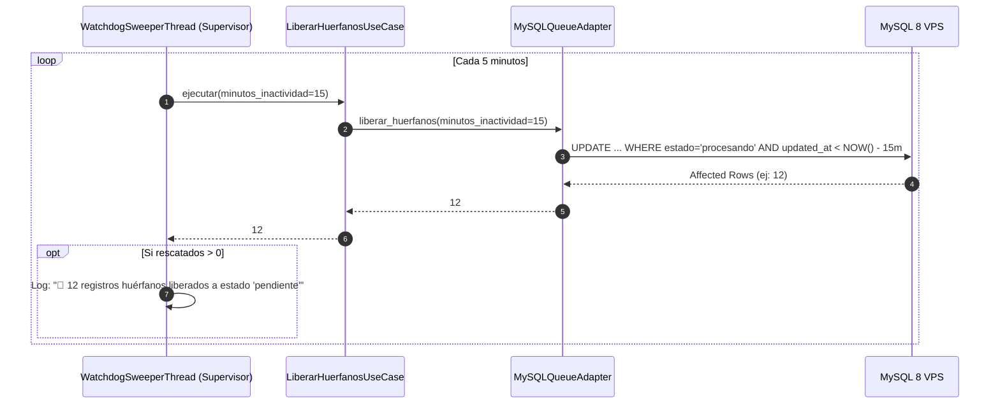

# Caso de Uso: Liberar Huérfanos (`LiberarHuerfanosUseCase`)

En arquitecturas distribuidas de alta concurrencia basadas en colas, uno de los problemas más frecuentes es la aparición de **registros huérfanos o zombies**: filas de base de datos que quedan atrapadas permanentemente en estado `procesando` debido a la terminación abrupta de un proceso worker (apagado forzado de máquina, caída de energía, *Out-of-Memory Killer* del sistema operativo o excepciones no capturadas).

El caso de uso [`LiberarHuerfanosUseCase`](file:///c:/Users/Usuario/Documents/GitHub/scrapers-reg-no-llame/core/use_cases/cleanup_orphans_use_case.py#L9-L16) actúa como el **Watchdog Sweeper** oficial del sistema, garantizando la auto-reparación continua de la cola.

---

## 1. Responsabilidades del Caso de Uso

1. **Desbloqueo de Registros Abandonados:** Identificar todos los registros que figuren en estado `procesando` cuya última actualización (`updated_at`) exceda un umbral determinado de inactividad (por defecto, 15 minutos).
2. **Reversión Atómica:** Restablecer su estado a `pendiente` para que vuelvan a estar disponibles inmediatamente para cualquier worker libre.
3. **Métrica de Diagnóstico:** Retornar la cantidad exacta de registros rescatados para fines de logging y alerta temprana.

---

## 2. Código Fuente Completo

```python
class LiberarHuerfanosUseCase:
    def __init__(self, cola_repo: IColaRepositorioPort):
        self.cola = cola_repo

    def ejecutar(self, minutos_inactividad: int = 15) -> int:
        """Libera los registros y retorna la cantidad recuperada."""
        return self.cola.liberar_huerfanos(minutos_inactividad=minutos_inactividad)
```

---

## 3. Implementación Subyacente en el Puerto de Base de Datos

Cuando [`LiberarHuerfanosUseCase.ejecutar`](file:///c:/Users/Usuario/Documents/GitHub/scrapers-reg-no-llame/core/use_cases/cleanup_orphans_use_case.py#L13-L15) es invocado, el adaptador de infraestructura de producción ([`MySQLQueueAdapter.liberar_huerfanos`](file:///c:/Users/Usuario/Documents/GitHub/scrapers-reg-no-llame/adapters/queue/mysql_vps_adapter.py#L288-L326)) ejecuta una sentencia SQL atómica y eficiente:

```sql
UPDATE `queue_registro_no_llame`
SET estado = 'pendiente',
    updated_at = CURRENT_TIMESTAMP
WHERE estado = 'procesando'
  AND updated_at < NOW() - INTERVAL 15 MINUTE;
```

### 3.1. Propiedades de la Consulta SQL
- **Filtro de Estado:** Solo afecta registros en estado `procesando`. No toca registros en `completado`, `no_coincidencia` o `error`.
- **Ventana Temporal Relativa:** `NOW() - INTERVAL %s MINUTE` previene falsos positivos sobre workers legítimos que se encuentren actualmente procesando un lote.
- **Eficiencia del Índice:** Utiliza el índice compuesto `idx_scraper_estado (scraper_actual, estado)` para limitar el escaneo únicamente a las filas activas.

---

## 4. Modalidades de Invocación

El caso de uso puede ejecutarse en dos modalidades operativas:

### 4.1. Modo Centinela Autónomo 24/7 (Supervisor)
El orquestador [`SupervisorIndustrial`](file:///c:/Users/Usuario/Documents/GitHub/scrapers-reg-no-llame/runtime/supervisor.py#L97-L117) lanza un hilo demonio secundario (`WatchdogSweeperThread`) que invoca este caso de uso de manera periódica (cada 300 segundos / 5 minutos):



### 4.2. Modo Manual por CLI
El operador o administrador puede disparar un barrido manual en cualquier momento a través del comando CLI provisto en [`main.py`](file:///c:/Users/Usuario/Documents/GitHub/scrapers-reg-no-llame/main.py#L150-L156):

```bash
# Barrido con umbral por defecto (15 minutos)
python main.py sweep-orphans

# Barrido con umbral agresivo de 5 minutos
python main.py sweep-orphans --minutos 5
```

---

## 5. Referencias Cruzadas
- [Caso de Uso: Procesar Lote](file:///c:/Users/Usuario/Documents/GitHub/scrapers-reg-no-llame/docs/02_dominio_y_casos_de_uso/caso_uso_procesar_lote.md)
- [Arquitectura Hexagonal](file:///c:/Users/Usuario/Documents/GitHub/scrapers-reg-no-llame/docs/01_arquitectura/arquitectura_hexagonal.md)
- [Supervisor Inmortal y Auto-Spawn](../06_runtime_y_concurrencia/supervisor_inmortal.md)
- [Watchdog Sweeper Centinela](../06_runtime_y_concurrencia/watchdog_sweeper.md)
- [Runbook de Resolución de Problemas](../07_operacion_y_runbooks/resolucion_problemas.md)
