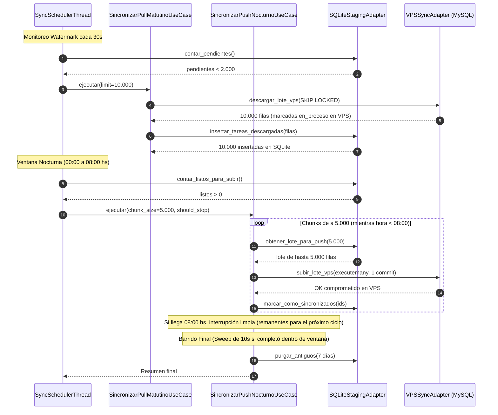

# Casos de Uso: Sincronización Matutina (Pull) y Nocturna (Push)

> **Capa 02: Dominio y Casos de Uso** | Orquestación Desacoplada Staging <-> VPS

Los casos de uso [`SincronizarPullMatutinoUseCase`](file:///c:/Users/automatizacion.crm/Documents/GitHub/scrapers-reg-no-llame/core/use_cases/sync_pull_use_case.py) y [`SincronizarPushNocturnoUseCase`](file:///c:/Users/automatizacion.crm/Documents/GitHub/scrapers-reg-no-llame/core/use_cases/sync_push_use_case.py) regulan el flujo de datos entre el VPS central MySQL y el almacenamiento local SSD (SQLite WAL), garantizando el desacoplamiento total de los workers.

---

## 1. Diagrama de Secuencia de Sincronización

---

## 2. Contratos Hexagonales de Sincronización

Definidos en [`core/ports/sync_port.py`](file:///c:/Users/automatizacion.crm/Documents/GitHub/scrapers-reg-no-llame/core/ports/sync_port.py):

### Puerto Remoto: `ISyncRemoteRepoPort`
- `descargar_lote_vps(tipo_cola, limit, auto_id, pc_id, scraper_actual) -> List[Dict]`: Ejecuta la descarga atómica con `SELECT ... FOR UPDATE SKIP LOCKED` y marca las filas como `en_proceso` o `procesando` en MySQL VPS.
- `subir_lote_vps(tipo_cola, lote) -> int`: Ejecuta una transacción atómica con `executemany()` para un chunk de hasta 5.000 registros.

### Puerto Local: `ISyncLocalRepoPort`
- `insertar_tareas_descargadas(tareas, tipo_cola) -> int`: Inserción masiva en SQLite.
- `obtener_lote_para_push(limit, tipo_cola) -> List[Dict]`: Lectura de filas terminadas (`listo_para_subir` o `fallido`).
- `marcar_como_sincronizados(ids_vps, tipo_cola) -> bool`: Registro de `fecha_sincronizado = CURRENT_TIMESTAMP`.
- `purgar_antiguos(dias_retencion) -> int`: Purga rotativa de tareas sincronizadas con más de 7 días.
- `contar_pendientes(tipo_cola) -> int`: Conteo de tareas en estado `pendiente`.
- `contar_listos_para_subir(tipo_cola) -> int`: Conteo de tareas listas para subir (`listo_para_subir` o `fallido`).

---

## 3. Especificación de Reglas de Negocio

| Regla | Parámetro | Valor | Justificación Técnica |
|---|---|---|---|
| **Bloque de Pull** | `PULL_CHUNK_SIZE` | `10000` | Minimiza viajes de red al VPS a 1 o 2 consultas por turno diario. |
| **Umbral Watermark** | `LOW_WATERMARK_THRESHOLD` | `2000` | Asegura que los workers nunca sufran inanición (*starvation*). |
| **Ventana de Push** | `SYNC_PUSH_WINDOW_START_HOUR` / `END_HOUR` | `0` a `8` | Volcado nocturno exclusivo de 00:00 a 08:00 AM para no competir con el horario comercial. |
| **Cierre de Ventana Limpio** | `should_stop` | Fin a las 08:00 AM | Si el volumen no termina de subir a las 08:00 AM, la subida frena limpiamente y los registros remanentes se suben en el siguiente ciclo. |
| **Techo de Transacción** | `SYNC_CHUNK_SIZE` | `5000` | Previene bloqueos largos y fragmentación en el VPS binlog. |
| **Manejo de Remanentes** | `executemany` | Variable ($\le 5000$) | Si el último chunk tiene 1.450 o 12 filas, se compromete inmediatamente. |
| **Barrido Final (Sweep)** | `SYNC_SWEEP_WAIT_SEC` | `10.0` | Captura registros concluidos por workers durante el push previo. |
| **Retención Rotativa** | `SYNC_RETENTION_DAYS` | `7` | Resguardo local para auditorías y recuperación ante contingencias. |

---

## 4. Documentos Relacionados

- [Adaptador de Staging Local SQLite](../03_base_de_datos_y_colas/staging_local_sqlite.md)
- [Caso de Uso: Procesar Lote](caso_uso_procesar_lote.md)
- [Caso de Uso: Liberar Huérfanos](caso_uso_liberar_huerfanos.md)
- [Guía de Cascada Telco](../05_guia_nuevos_scrapers/guia_cascada_telcos.md)
