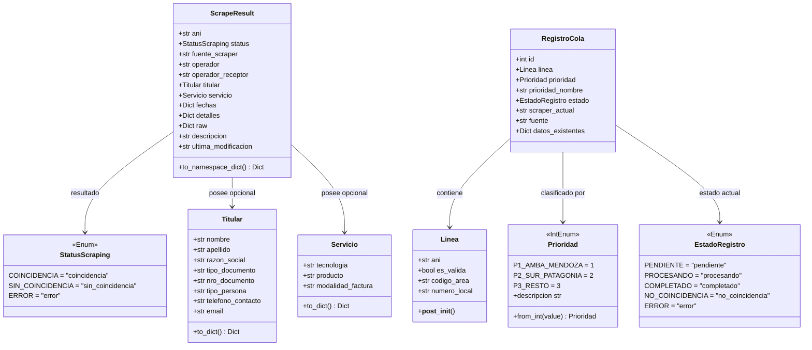

# Entidades y Value Objects de Dominio

En el núcleo de la arquitectura ([`core/domain/`](file:///c:/Users/Usuario/Documents/GitHub/scrapers%20reg%20no%20llame/core/domain)), los modelos representan los conceptos centrales del negocio de telecomunicaciones y procesamiento de colas.

Siguiendo los principios del **Domain-Driven Design (DDD)**:
- Los **Value Objects** carecen de identidad conceptual propia, son inmutables o intercambiables según el valor de sus atributos, y garantizan la validez de los datos desde su instanciación.
- Las **Entidades** poseen identidad explícita (`id`) y encapsulan el estado mutable del ciclo de vida del procesamiento.

---

## 1. Value Object: `Linea`

La clase [`Linea`](file:///c:/Users/Usuario/Documents/GitHub/scrapers%20reg%20no%20llame/core/domain/entities.py#L10-L38) modela una línea telefónica normalizada de la República Argentina. Está definida como `@dataclass(frozen=True)`, garantizando su inmutabilidad absoluta y permitiendo utilizarla como clave de diccionarios o elementos de conjuntos (*sets*).

### 1.1. Código Fuente Real
```python
@dataclass(frozen=True)
class Linea:
    """Value Object que representa una línea telefónica normalizada en Argentina."""
    ani: str

    def __post_init__(self):
        clean_ani = "".join(filter(str.isdigit, str(self.ani))).strip()
        object.__setattr__(self, "ani", clean_ani)

    @property
    def es_valida(self) -> bool:
        return len(self.ani) == 10 and self.ani.isdigit()

    @property
    def codigo_area(self) -> str:
        if not self.es_valida:
            return ""
        if self.ani.startswith("11"):
            return "11"
        if self.ani.startswith(("261", "260", "263", "280", "299", "298", "294", "297", "291")):
            return self.ani[:3]
        return self.ani[:4]

    @property
    def numero_local(self) -> str:
        ca = self.codigo_area
        return self.ani[len(ca):] if ca else self.ani
```

### 1.2. Análisis Técnico de Comportamiento
1. **Normalización en `__post_init__`:** Al ser una clase congelada (`frozen=True`), no es posible asignar directamente atributos con `self.ani = ...`. Por esta razón, se utiliza `object.__setattr__(self, "ani", clean_ani)`. Cualquier entrada como `"+54 9 (011) 4433-2211"` o `"11-44332211"` se depura eliminando caracteres no numéricos, garantizando un string numérico limpio.
2. **Propiedad `es_valida`:** En el plan de numeración nacional argentino (ENACOM), las líneas nacionales tienen exactamente 10 dígitos (código de área sin el prefijo `0` + número de abonado sin el prefijo móvil `15`).
3. **Propiedad `codigo_area`:** Aplica heurística estricta de prefijos:
   - **AMBA (Buenos Aires / CABA):** Prefijo `"11"` (2 dígitos).
   - **Ciudades Principales y Patagonia:** Prefijos de 3 dígitos (`261` Mendoza Capital, `260` San Rafael, `263` San Martín Este, `280` Trelew/Madryn, `299` Neuquén, `298` General Roca, `294` Bariloche, `297` Comodoro Rivadavia, `291` Bahía Blanca).
   - **Resto del País:** Prefijos de 4 dígitos (ej: `351x` Córdoba, `341x` Rosario, etc.).
4. **Propiedad `numero_local`:** Extrae la porción final de la línea restando los dígitos del código de área, indispensable para portales que exigen separar Código de Área y Número de Abonado en campos separados.

---

## 2. Value Object: `Titular`

La clase [`Titular`](file:///c:/Users/Usuario/Documents/GitHub/scrapers%20reg%20no%20llame/core/domain/entities.py#L39-L62) encapsula la información de titularidad registral y comercial de la línea obtenida de cualquier motor de extracción:

### 2.1. Código Fuente Real
```python
@dataclass
class Titular:
    """Value Object que representa la información de titularidad obtenida."""
    nombre: str = ""
    apellido: str = ""
    razon_social: str = ""
    tipo_documento: str = ""
    nro_documento: str = ""
    tipo_persona: str = ""
    telefono_contacto: str = ""
    email: str = ""

    def to_dict(self) -> Dict[str, Any]:
        return {
            "nombre": self.nombre,
            "apellido": self.apellido,
            "razon_social": self.razon_social,
            "tipo_documento": self.tipo_documento,
            "nro_documento": self.nro_documento,
            "tipo_persona": self.tipo_persona,
            "telefono_contacto": self.telefono_contacto,
            "email": self.email
        }
```

### 2.2. Campos y Significado
- `nombre` y `apellido`: Nombre de la persona física titular.
- `razon_social`: Denominación societaria si se trata de una línea corporativa/empresa.
- `tipo_documento`: Tipo de identificación oficial (`"DNI"`, `"CUIT"`, `"CUIL"`, `"PASAPORTE"`, etc.).
- `nro_documento`: Número del documento depurado.
- `tipo_persona`: Clasificación jurídica (`"Fisica"` o `"Juridica"`).
- `telefono_contacto` y `email`: Canales de comunicación alternativos provistos en el trámite o ficha comercial.

---

## 3. Value Object: `Servicio`

La clase [`Servicio`](file:///c:/Users/Usuario/Documents/GitHub/scrapers%20reg%20no%20llame/core/domain/entities.py#L64-L77) encapsula las características técnicas y comerciales del plan telefónico:

### 3.1. Código Fuente Real
```python
@dataclass
class Servicio:
    """Value Object que representa detalles técnicos del servicio extraído."""
    tecnologia: str = ""
    producto: str = ""
    modalidad_factura: str = ""

    def to_dict(self) -> Dict[str, Any]:
        return {
            "tecnologia": self.tecnologia,
            "producto": self.producto,
            "modalidad_factura": self.modalidad_factura
        }
```

### 3.2. Campos y Significado
- `tecnologia`: Estándar de la red asociada (`"GSM"`, `"3G"`, `"4G/5G"`, `"PSTN/Cobre"`, `"Fibra"`).
- `producto`: Modalidad contractual (`"Pospago"`, `"Prepago"`, `"Control"`, `"B2B"`).
- `modalidad_factura`: Método de facturación (`"Digital"`, `"Física"`, `"Débito Automático"`).

---

## 4. Entidad: `ScrapeResult`

La clase [`ScrapeResult`](file:///c:/Users/Usuario/Documents/GitHub/scrapers%20reg%20no%20llame/core/domain/entities.py#L79-L111) es la entidad canónica de intercambio que **todos los adaptadores de scraping deben retornar** de manera obligatoria al invocar [`consultar_linea`](file:///c:/Users/Usuario/Documents/GitHub/scrapers%20reg%20no%20llame/core/ports/scraper_port.py#L30-L35).

### 4.1. Código Fuente Real
```python
@dataclass
class ScrapeResult:
    """
    Entidad que representa el resultado normalizado de un scraper.
    Permite encapsular datos bajo su propio namespace para enriquecimiento acumulativo.
    """
    ani: str
    status: StatusScraping
    fuente_scraper: str
    operador: str = ""
    operador_receptor: str = ""
    titular: Optional[Titular] = None
    servicio: Optional[Servicio] = None
    fechas: Dict[str, Any] = field(default_factory=dict)
    detalles: Dict[str, Any] = field(default_factory=dict)
    raw: Any = field(default_factory=dict)
    descripcion: str = ""
    ultima_modificacion: str = field(default_factory=lambda: datetime.now().strftime("%Y-%m-%d %H:%M:%S"))

    def to_namespace_dict(self) -> Dict[str, Any]:
        """Devuelve el diccionario formateado para persistencia en datos_json."""
        ahora_str = datetime.now().strftime("%Y-%m-%d %H:%M:%S")
        payload = {
            "status": self.status.value,
            "fuente": self.fuente_scraper,
            "operador": self.operador,
            "operador_receptor": self.operador_receptor,
            "titular": self.titular.to_dict() if self.titular else {},
            "servicio": self.servicio.to_dict() if self.servicio else {},
            "fechas": self.fechas,
            "detalles": self.detalles,
            "raw": self.raw,
            "ultima_modificacion": self.ultima_modificacion or ahora_str
        }
        return {self.fuente_scraper: payload}
```

### 4.2. Función Crítica: `to_namespace_dict()` y Trazabilidad Temporal
Este método es el pilar del **enriquecimiento acumulativo**. Retorna un diccionario cuya única clave raíz es el nombre del scraper (`self.fuente_scraper`, por ejemplo `"iris"` o `"claro"`). De este modo, la serialización en la base de datos permite fusionar sin colisiones la información de múltiples fuentes.

Adicionalmente, cada objeto serializado incluye de forma obligatoria el campo `ultima_modificacion` en formato estándar `YYYY-MM-DD HH:MM:SS`. Al inicializarse en el `default_factory` de `ScrapeResult`, captura el momento exacto en que dicho motor de scraping evaluó la línea. Esto garantiza que cada flujo mantenga su propia marca de auditoría temporal independiente dentro de su llave de `datos_json`.

---

## 5. Entidad: `RegistroCola`

La clase [`RegistroCola`](file:///c:/Users/Usuario/Documents/GitHub/scrapers%20reg%20no%20llame/core/domain/entities.py#L114-L124) representa un registro individual extraído y reservado de la cola de base de datos para su procesamiento:

### 5.1. Código Fuente Real
```python
@dataclass
class RegistroCola:
    """Entidad que representa un registro reclamado de la cola de procesamiento."""
    id: int
    linea: Linea
    prioridad: Prioridad = Prioridad.P3_RESTO
    prioridad_nombre: str = "P3 (Resto del País)"
    estado: EstadoRegistro = EstadoRegistro.PENDIENTE
    scraper_actual: str = "iris"
    fuente: Optional[str] = None
    datos_existentes: Dict[str, Any] = field(default_factory=dict)
```

### 5.2. Mapeo entre Tabla SQL y Atributos de Dominio
| Campo SQL (`queue_registro_no_llame`) | Tipo SQL | Atributo `RegistroCola` | Tipo Dominio |
| :--- | :--- | :--- | :--- |
| `id` | `BIGINT AUTO_INCREMENT` | `id` | `int` |
| `ani` | `BIGINT` | `linea` | [`Linea`](file:///c:/Users/Usuario/Documents/GitHub/scrapers%20reg%20no%20llame/core/domain/entities.py#L10) |
| (Calculado por B-Tree) | N/A | `prioridad` | [`Prioridad`](file:///c:/Users/Usuario/Documents/GitHub/scrapers%20reg%20no%20llame/core/domain/enums.py#L8) |
| (Calculado por B-Tree) | N/A | `prioridad_nombre` | `str` |
| `estado` | `ENUM(...)` | `estado` | [`EstadoRegistro`](file:///c:/Users/Usuario/Documents/GitHub/scrapers%20reg%20no%20llame/core/domain/enums.py#L36) |
| `scraper_actual` | `VARCHAR(50)` | `scraper_actual` | `str` |
| `fuente` | `TEXT` | `fuente` | `Optional[str]` |
| `datos_json` | `LONGTEXT` / `JSON` | `datos_existentes` | `Dict[str, Any]` |

---

## 6. Enums de Dominio (`core/domain/enums.py`)

El archivo [`core/domain/enums.py`](file:///c:/Users/Usuario/Documents/GitHub/scrapers%20reg%20no%20llame/core/domain/enums.py) provee las definiciones constantes que garantizan tipado fuerte en todo el sistema:

### 6.1. Enum `Prioridad`
```python
class Prioridad(IntEnum):
    """
    Niveles de prioridad de consumo de líneas telefónicas.
    P1: AMBA (11) y Mendoza completa
    P2: Sur / Patagonia
    P3: Resto del país
    """
    P1_AMBA_MENDOZA = 1
    P2_SUR_PATAGONIA = 2
    P3_RESTO = 3

    @classmethod
    def from_int(cls, value: int) -> "Prioridad":
        for p in cls:
            if p.value == value:
                return p
        return cls.P3_RESTO

    @property
    def descripcion(self) -> str:
        desc = {
            1: "P1 (11 / Mendoza)",
            2: "P2 (Sur / Patagonia)",
            3: "P3 (Resto del País)"
        }
        return desc.get(self.value, "Desconocida")
```

### 6.2. Enum `EstadoRegistro`
```python
class EstadoRegistro(str, Enum):
    """Estados del ciclo de vida de una línea en cola de procesamiento."""
    PENDIENTE = "pendiente"
    PROCESANDO = "procesando"
    COMPLETADO = "completado"
    NO_COINCIDENCIA = "no_coincidencia"
    ERROR = "error"
```

### 6.3. Enum `StatusScraping`
```python
class StatusScraping(str, Enum):
    """Resultado normalizado de una consulta en cualquier scraper."""
    COINCIDENCIA = "coincidencia"
    SIN_COINCIDENCIA = "sin_coincidencia"
    ERROR = "error"
```

---

## 7. Diagrama de Relaciones de Clases (UML)



---

## 8. Referencias Cruzadas
- [Regla de Pipeline en Dominio](file:///c:/Users/Usuario/Documents/GitHub/scrapers%20reg%20no%20llame/docs/02_dominio_y_casos_de_uso/regla_pipeline_dominio.md)
- [Caso de Uso: Procesar Lote](file:///c:/Users/Usuario/Documents/GitHub/scrapers%20reg%20no%20llame/docs/02_dominio_y_casos_de_uso/caso_uso_procesar_lote.md)
- [Arquitectura Hexagonal](file:///c:/Users/Usuario/Documents/GitHub/scrapers%20reg%20no%20llame/docs/01_arquitectura/arquitectura_hexagonal.md)
- [Esquema de Base de Datos](../03_base_de_datos_y_colas/esquema_ddl_vps.md)
