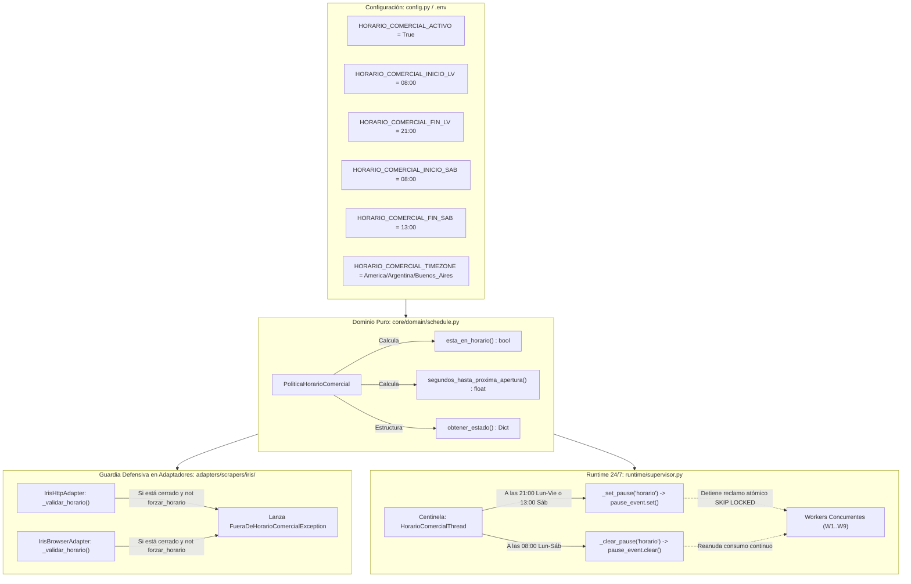

# Política de Dominio: Horario Comercial Oficial (Movistar IRIS)

> **Capa de Dominio y Casos de Uso**: Especificación formal de la política de ventana operativa restringida para scrapers de portales oficiales corporativos.

---

## 1. Motivación y Análisis de Riesgo Operativo

El portal **IRIS** (`http://iris.tmoviles.com.ar`) es la plataforma Oracle BPM interna utilizada por el personal corporativo y sucursales comerciales de **Telefónica / Movistar Argentina**. 

La ejecución de consultas automatizadas fuera de las ventanas laborales habituales representa un **riesgo operativo crítico**:
1. **Detección de Tráfico Anómalo (SIEM / WAF)**: Consultas continuas a altas horas de la madrugada (ej: 03:30 AM) o durante días domingos alertan inmediatamente a los equipos de ciberseguridad corporativos y conllevan bloqueos de credenciales o de IPs de VPN.
2. **Ventanas de Mantenimiento Nocturno**: La infraestructura de Oracle BPM suele programar despliegues, parches o reinicios de WebLogic en horarios inhábiles. Enviar peticiones masivas durante estos periodos genera falsos errores en la cola VPS.
3. **Mimetización con el Comportamiento Humano**: El sistema concibe a IRIS como una herramienta de uso laboral real, operando estrictamente en los turnos y jornadas de los operadores oficiales.

---

## 2. Reglas de Negocio de la Ventana Operativa

La política gobernada por [`PoliticaHorarioComercial`](file:///c:/Users/Usuario/Documents/GitHub/scraper%20iris%20reg%20no%20llame/core/domain/schedule.py) establece las siguientes ventanas estrictas bajo la zona horaria oficial de Argentina (**UTC-3 / `America/Argentina/Buenos_Aires`**):

| Día de la Semana | Rango Horario Habilitado | Estado Operativo | Comportamiento del Sistema |
| :--- | :--- | :--- | :--- |
| **Lunes a Viernes** | `08:00` a `21:00` (UTC-3) | **Abierto / Operativo** | Consumo continuo a ritmo industrial. |
| **Lunes a Viernes** | `21:00` a `08:00` (UTC-3) | **Cerrado / Standby** | Supervisor pausa reclamos; workers en bajo consumo. |
| **Sábado** | `08:00` a `13:00` (UTC-3) | **Abierto / Operativo** | Turno matutino comercial activo. |
| **Sábado** | `13:00` en adelante (UTC-3) | **Cerrado / Standby** | Pausa hasta el lunes a las `08:00`. |
| **Domingo** | Todo el día (`00:00` a `23:59`) | **Cerrado / Inactivo** | Cese total de consultas a IRIS. |

---

## 3. Diagrama de Arquitectura y Flujo Defensivo

La política opera de forma multi-capa garantizando que ninguna consulta no autorizada llegue a los servidores de Movistar:



---

## 4. Estructura de la Clase de Dominio (`PoliticaHorarioComercial`)

Ubicación: [`core/domain/schedule.py`](file:///c:/Users/Usuario/Documents/GitHub/scraper%20iris%20reg%20no%20llame/core/domain/schedule.py).

### Firmas y Métodos

| Método | Parámetros | Retorno | Descripción |
| :--- | :--- | :--- | :--- |
| `__init__` | `activo: bool`, `hora_inicio_lv: str`, `hora_fin_lv: str`, `hora_inicio_sab: str`, `hora_fin_sab: str`, `timezone_name: str` | `None` | Inicializa las ventanas horarias y el contexto de zona horaria nativo (`zoneinfo`). |
| `ahora` | `dt: Optional[datetime] = None` | `datetime` | Normaliza el instante temporal recibido (o el actual del sistema) a la zona horaria oficial. |
| `esta_en_horario` | `dt: Optional[datetime] = None` | `bool` | Evalúa si el momento evaluado se encuentra dentro del rango comercial permitido. |
| `proxima_apertura` | `dt: Optional[datetime] = None` | `datetime` | Calcula con precisión de minutos el próximo instante en que reabrirá la ventana operativa. |
| `segundos_hasta_proxima_apertura` | `dt: Optional[datetime] = None` | `float` | Retorna los segundos exactos de espera restantes para permitir que los hilos duerman eficientemente. |
| `obtener_estado` | `dt: Optional[datetime] = None` | `Dict[str, Any]` | Retorna un diccionario con estado actual, día en español, segundos de espera y texto para dashboards. |

---

## 5. Excepciones de Dominio

Se incorporó la excepción tipada en [`core/domain/exceptions.py`](file:///c:/Users/Usuario/Documents/GitHub/scraper%20iris%20reg%20no%20llame/core/domain/exceptions.py):

```python
class FueraDeHorarioComercialException(ScraperException):
    """Lanzada cuando se intenta ejecutar una consulta a un scraper fuera de su ventana comercial permitida."""
    pass
```

---

## 6. Comandos Operativos y Forzado Manual para Pruebas

Para casos excepcionales de depuración o testing nocturno en desarrollo, todos los puntos de entrada disponen del flag de bypass:

```powershell
# 1. Consulta individual forzando ejecución fuera de hora
python main.py test-line 1144332211 --scraper iris_http --forzar-horario

# 2. Prueba de lote en memoria forzando horario
python main.py test-batch --scraper iris_http --dry-run --forzar-horario

# 3. Supervisor industrial forzando bypass de horario comercial
python supervisor_vps.py --engine http --forzar-horario
```

Si no se especifica el flag `--forzar-horario`, el sistema rechaza la petición defensivamente informando de manera clara la fecha y hora estimada de reapertura.

---

## Enlaces Relacionados
* [02. Arquitectura Hexagonal](../01_arquitectura/arquitectura_hexagonal.md)
* [04. Entidades y Value Objects](entidades_y_value_objects.md)
* [13. Adaptadores IRIS Hexagonales](../04_scrapers_iris/adaptadores_iris_hexagonal.md)
* [23. Supervisor Inmortal](../06_runtime_y_concurrencia/supervisor_inmortal.md)
* [26. Comandos de la CLI Principal](../07_operacion_y_runbooks/comandos_cli_main.md)
