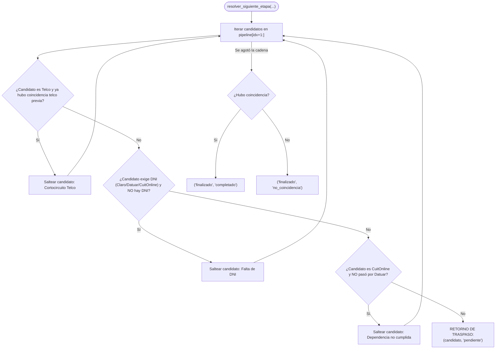

# Regla de Dominio del Pipeline: Lógica Condicional, Ventana Temporal de 7 Días y Cortocircuito

La clase [`ReglaPipeline`](file:///c:/Users/Usuario/Documents/GitHub/scraper%20iris%20reg%20no%20llame/core/domain/entities.py#L146-L300) encapsula una de las reglas de negocio más críticas del sistema: **determinar de forma determinista y pura cuál es el siguiente destino de una línea telefónica en la base de datos y validar la elegibilidad para el modelo de piscina autónoma distribuida (Multi-PC)**.

Al residir en el núcleo de dominio, esta lógica no depende de procedimientos almacenados (*stored procedures*), disparadores (*triggers*) de SQL ni condicionales dispersos en los controladores de la interfaz o en los hilos del supervisor.

---

## 1. Código Fuente Completo y Comentado

```python
class ReglaPipeline:
    """
    Regla de Dominio: Cadena de Responsabilidad con Cortocircuito, Condiciones Dinámicas
    y Ventana Temporal de 7 Días (TTL).
    Determina la siguiente etapa de una línea telefónica en el pipeline y la elegibilidad
    para el modelo de piscina autónoma distribuida multi-PC.
    """
    TELCOS = ("claro", "personal", "movistar")
    REQUIEREN_DNI = ("claro", "datuar", "cuitonline")
    CADENA_DEFAULT = ["iris", "claro", "personal", "movistar", "datuar", "cuitonline"]

    @classmethod
    def es_reciente(cls, fecha_str: Optional[str], max_dias: int = 7) -> bool:
        """
        Determina si una marca temporal está dentro de la ventana de validez de N días (default 7).
        Admite formatos 'YYYY-MM-DD HH:MM:SS' y variantes ISO.
        """
        if not fecha_str or not isinstance(fecha_str, str):
            return False
        try:
            limpia = fecha_str.replace("T", " ").strip()
            if len(limpia) >= 19:
                limpia = limpia[:19]
                dt = datetime.strptime(limpia, "%Y-%m-%d %H:%M:%S")
            elif len(limpia) == 10:
                dt = datetime.strptime(limpia, "%Y-%m-%d")
            else:
                dt = datetime.fromisoformat(fecha_str)
            delta = datetime.now() - dt
            return 0 <= delta.total_seconds() <= (max_dias * 86400)
        except Exception:
            return False

    @classmethod
    def extraer_dni(cls, datos_json: Optional[Dict[str, Any]], dni_directo: Optional[str] = None) -> Optional[str]:
        """Extrae el DNI disponible desde la línea o desde cualquier namespace de datos_json."""
        if dni_directo:
            clean = "".join(filter(str.isdigit, str(dni_directo))).strip()
            if clean:
                return clean
        if not datos_json or not isinstance(datos_json, dict):
            return None

        # 1. Namespace iris
        iris = datos_json.get("iris", {})
        if isinstance(iris, dict):
            titular = iris.get("titular", {})
            if isinstance(titular, dict):
                doc = titular.get("nro_documento") or titular.get("documento") or titular.get("dni")
                if doc:
                    return str(doc).strip()
            detalles = iris.get("detalles", {})
            if isinstance(detalles, dict) and detalles.get("dni"):
                return str(detalles["dni"]).strip()

        # 2. Namespace datuar
        datuar = datos_json.get("datuar", {})
        if isinstance(datuar, dict):
            doc = datuar.get("dni") or datuar.get("detalles", {}).get("dni")
            if doc:
                return str(doc).strip()

        # 3. Namespace cuitonline
        cuit = datos_json.get("cuitonline", {})
        if isinstance(cuit, dict):
            doc = cuit.get("dni") or cuit.get("detalles", {}).get("dni")
            if doc:
                return str(doc).strip()

        # 4. Raíz
        if datos_json.get("dni"):
            return str(datos_json["dni"]).strip()

        return None

    @classmethod
    def es_elegible_para_scraper(
        cls,
        scraper_nombre: str,
        ani: str,
        dni: Optional[str] = None,
        datos_json: Optional[Dict[str, Any]] = None,
        dias_validez: int = 7,
        solo_sin_coincidencia: bool = False
    ) -> tuple[bool, str]:
        """
        Determina si un registro es apto para ser procesado por un scraper específico
        según las reglas de precedencia, dependencias de datos, ventana temporal de 7 días
        y la bandera opcional solo_sin_coincidencia.

        Reglas:
        1. IRIS: Solo necesita ANI. No ejecutado en los últimos 7 días.
        2. CLARO: Exige DNI disponible. Sin coincidencia previa en Personal o Movistar en los últimos 7 días.
           No ejecutado en los últimos 7 días.
        3. PERSONAL: Sin coincidencia previa en Claro o Movistar en los últimos 7 días.
           No ejecutado en los últimos 7 días.
           - Si la línea tiene DNI: EXIGE haber pasado por Claro en los últimos 7 días.
           - Si la línea NO tiene DNI: Entra directo sin requerir Claro.
        4. MOVISTAR: 'De nadie' (no requiere titular ni DNI, solo ANI).
           Sin coincidencia previa en Claro o Personal en los últimos 7 días.
           No ejecutado en los últimos 7 días.
           EXIGE haber pasado por Personal en los últimos 7 días.
        5. DATUAR: Exige DNI disponible. No ejecutado en los últimos 7 días.
        6. CUITONLINE: Exige DNI disponible. No ejecutado en los últimos 7 días.
           EXIGE haber pasado por Datuar en los últimos 7 días.
        7. FLAG solo_sin_coincidencia: Si es True en telcos, descarta registros con coincidencia en cualquiera
           de las 3 telcos (o status raíz), independientemente de la fecha.
        """
        nombre = scraper_nombre.lower().strip()
        if "iris" in nombre:
            nombre = "iris"
        elif "claro" in nombre:
            nombre = "claro"
        elif "personal" in nombre:
            nombre = "personal"
        elif "movistar" in nombre:
            nombre = "movistar"
        elif "cuit" in nombre:
            nombre = "cuitonline"
        elif "datuar" in nombre:
            nombre = "datuar"

        datos = datos_json if isinstance(datos_json, dict) else {}
        dni_activo = cls.extraer_dni(datos, dni)

        # Bandera de auditoría inicial: Si solo_sin_coincidencia está activa en telcos,
        # exige que NINGUNA de las 3 compañías (Claro, Personal, Movistar) posea coincidencia previa,
        # independientemente de la fecha o ventana de días, incluyendo el status raíz legado.
        if solo_sin_coincidencia and nombre in cls.TELCOS:
            for t in cls.TELCOS:
                t_data = datos.get(t, {})
                if isinstance(t_data, dict) and t_data.get("status") == StatusScraping.COINCIDENCIA.value:
                    return False, f"Flag solo_sin_coincidencia: {t} posee coincidencia previa"
            if datos.get("status") == StatusScraping.COINCIDENCIA.value:
                return False, "Flag solo_sin_coincidencia: posee coincidencia previa en raíz"

        # Para motores que NO son de compañía (iris, datuar, cuitonline):
        # NO aplica regla de 7 días. Solo nutrir registros que aún NO tengan datos del motor.
        if nombre not in cls.TELCOS:
            sc_data = datos.get(nombre, {})
            if isinstance(sc_data, dict) and sc_data.get("status"):
                return False, f"{nombre} ya posee datos enriquecidos previamente (no requiere re-consulta)"

        # Para motores de compañía (claro, personal, movistar):
        # Aplica regla de 7 días: no consultar de más si ya corrió en los últimos 7 días.
        if nombre in cls.TELCOS:
            sc_data = datos.get(nombre, {})
            if isinstance(sc_data, dict):
                ts = sc_data.get("ultima_modificacion")
                if cls.es_reciente(ts, max_dias=dias_validez):
                    return False, f"{nombre} ya ejecutado recientemente dentro de la ventana de {dias_validez} días ({ts})"

            # Exclusividad Telco: Si Claro, Personal o Movistar dieron coincidencia en los últimos 7 días
            for telco in cls.TELCOS:
                if telco == nombre:
                    continue
                t_data = datos.get(telco, {})
                if isinstance(t_data, dict) and t_data.get("status") == StatusScraping.COINCIDENCIA.value:
                    t_ts = t_data.get("ultima_modificacion")
                    if cls.es_reciente(t_ts, max_dias=dias_validez):
                        return False, f"Exclusividad telco: {telco} dio coincidencia el {t_ts}"

        # Reglas específicas por motor
        if nombre == "iris":
            return True, "Apto para IRIS"

        if nombre == "claro":
            if not dni_activo:
                return False, "Claro requiere DNI disponible"
            return True, "Apto para Claro"

        if nombre == "personal":
            if dni_activo:
                c_data = datos.get("claro", {})
                c_ts = c_data.get("ultima_modificacion") if isinstance(c_data, dict) else None
                if not cls.es_reciente(c_ts, max_dias=dias_validez):
                    return False, "Línea con DNI requiere haber pasado por Claro en los últimos 7 días"
            return True, "Apto para Personal"

        if nombre == "movistar":
            p_data = datos.get("personal", {})
            p_ts = p_data.get("ultima_modificacion") if isinstance(p_data, dict) else None
            if not cls.es_reciente(p_ts, max_dias=dias_validez):
                return False, "Movistar exige haber pasado por Personal en los últimos 7 días"
            return True, "Apto para Movistar"

        if nombre == "datuar":
            if not dni_activo:
                return False, "Datuar requiere DNI disponible"
            return True, "Apto para Datuar"

        if nombre == "cuitonline":
            if not dni_activo:
                return False, "CuitOnline requiere DNI disponible"
            d_data = datos.get("datuar", {})
            d_ts = d_data.get("ultima_modificacion") if isinstance(d_data, dict) else None
            if not cls.es_reciente(d_ts, max_dias=dias_validez):
                return False, "CuitOnline exige haber pasado por Datuar en los últimos 7 días"
            return True, "Apto para CuitOnline"

        return False, f"Scraper desconocido: {nombre}"

    @classmethod
    def resolver_siguiente_etapa(
        cls, 
        scraper_actual: str, 
        resultado: ScrapeResult,
        cadena: Optional[List[str]] = None,
        dni_disponible: Optional[bool] = None,
        fuentes_previas: Optional[List[str]] = None,
        coincidencia_telco_previa: bool = False,
        datos_previos: Optional[Dict[str, Any]] = None,
        dias_validez: int = 7
    ) -> tuple[str, str]:
        pipeline = list(cadena or cls.CADENA_DEFAULT)
        datos = datos_previos if isinstance(datos_previos, dict) else {}

        # Determinar si hay DNI activo
        tiene_dni = bool(
            dni_disponible
            or cls.extraer_dni(datos)
            or (resultado.titular and resultado.titular.nro_documento)
            or (isinstance(resultado.detalles, dict) and (
                resultado.detalles.get("titular", {}).get("nro_documento") 
                or resultado.detalles.get("dni")
            ))
        )

        # Determinar si ya hubo coincidencia en alguna telco en los últimos 7 días
        telco_coincidio = (
            coincidencia_telco_previa 
            or (resultado.status == StatusScraping.COINCIDENCIA and scraper_actual in cls.TELCOS)
        )
        if not telco_coincidio and datos:
            for t in cls.TELCOS:
                t_info = datos.get(t, {})
                if isinstance(t_info, dict) and t_info.get("status") == StatusScraping.COINCIDENCIA.value:
                    if cls.es_reciente(t_info.get("ultima_modificacion"), max_dias=dias_validez):
                        telco_coincidio = True
                        break

        # Historial de scrapers visitados
        pasados = set(fuentes_previas or [])
        pasados.add(scraper_actual)

        def paso_reciente(sc_name: str) -> bool:
            if sc_name == scraper_actual:
                return True
            if sc_name not in pasados:
                return False
            sc_info = datos.get(sc_name, {})
            if isinstance(sc_info, dict):
                ts = sc_info.get("ultima_modificacion")
                if ts:
                    return cls.es_reciente(ts, max_dias=dias_validez)
            return True

        # Buscar la siguiente posta válida en la cadena
        idx = pipeline.index(scraper_actual) if scraper_actual in pipeline else -1

        for candidato in pipeline[idx + 1:]:
            if telco_coincidio and candidato in cls.TELCOS:
                continue

            if candidato in cls.REQUIEREN_DNI and not tiene_dni:
                continue

            # Precedencias temporales de 7 días:
            if candidato == "personal" and tiene_dni and "claro" in pipeline and not paso_reciente("claro"):
                continue

            if candidato == "movistar" and not paso_reciente("personal"):
                continue

            if candidato == "cuitonline" and not paso_reciente("datuar"):
                continue

            return (candidato, EstadoRegistro.PENDIENTE.value)

        estado_final = (
            EstadoRegistro.COMPLETADO.value 
            if (telco_coincidio or resultado.status == StatusScraping.COINCIDENCIA)
            else EstadoRegistro.NO_COINCIDENCIA.value
        )
        return ("finalizado", estado_final)
```

---

## 2. Anatomía de la Evaluación Booleana

El algoritmo itera sobre la lista `pipeline` evaluando cuatro compuertas condicionales:



### 2.1. Bloque 1: Salto Obligatorio por Falta de DNI
```python
if candidato in cls.REQUIEREN_DNI and not tiene_dni:
    continue
```
- `claro`, `datuar` y `cuitonline` requieren estrictamente un DNI.
- Como **Personal y Movistar no devuelven DNI**, este solo puede provenir de origen (`linea.dni`) o de un trámite detectado en `iris`.
- Si una línea no tiene DNI, el motor saltea estos tres scrapers y deriva directamente a la siguiente telco que solo requiera el número telefónico (`personal` o `movistar`).

### 2.2. Bloque 2: Cortocircuito de Telcos
```python
if telco_coincidio and candidato in cls.TELCOS:
    continue
```
- Si `claro`, `personal` o `movistar` ya encontraron la línea activa (`StatusScraping.COINCIDENCIA`), no se consulta ninguna otra telco.
- Si en la cadena aún quedan scrapers de identidad (`datuar`, `cuitonline`) y se cuenta con DNI, la línea avanza hacia ellos para completar el perfil.

### 2.3. Bloque 3: Dependencia Estricta de Identidad
```python
if candidato == "cuitonline" and not paso_datuar:
    continue
```
- Garantiza que `cuitonline` nunca se ejecute si la línea no fue auditada previamente por `datuar`.

### 2.4. Bloque 4: Terminación del Pipeline
```python
estado_final = (
    EstadoRegistro.COMPLETADO.value 
    if (telco_coincidio or resultado.status == StatusScraping.COINCIDENCIA)
    else EstadoRegistro.NO_COINCIDENCIA.value
)
return ("finalizado", estado_final)
```

### 2.5. Bloque 5: Ventana Temporal de 7 Días (TTL) y Piscina Autónoma Multi-PC
El método `ReglaPipeline.es_elegible_para_scraper` evalúa si un registro es reclamable por un scraper específico cuando 10 o más PCs ejecutan scrapers en simultáneo:

1. **Regla de 7 Días Exclusiva para Compañías Telco (`claro`, `personal`, `movistar`)**:
   - **Objetivo doble**: Aprovechar a no pasar consultas de más dentro de los 7 días y habilitar que en el futuro el scraper pueda volver a auditar la línea.
   - Si una telco ya corrió en los últimos 7 días (`es_reciente(ultima_modificacion, max_dias=7)`), no se re-consulta. Si transcurrieron más de 7 días, queda habilitada para re-ejecución futura.
   - **PC Movistar**: *De nadie* (no requiere DNI ni titular, solo ANI). Exige estrictamente haber pasado por `personal` en los **últimos 7 días**. Si Claro o Personal tuvieron coincidencia positiva en los últimos 7 días, Movistar queda vetado por exclusividad telco.
   - **PC Personal**: Si la línea **NO tiene DNI**, entra libre directo sin esperar a Claro. Si la línea **TIENE DNI**, exige haber pasado por `claro` en los últimos 7 días. Si Claro o Movistar tuvieron coincidencia positiva en los últimos 7 días, Personal queda vetado.
   - **PC Claro**: Exige DNI disponible. Si no hay DNI, saltea Claro. Respeta exclusividad telco ante coincidencias de Personal o Movistar.

2. **Motores de Enriquecimiento No-Telco (`iris`, `datuar`, `cuitonline`)**:
   - **NO tienen regla de 7 días**.
   - **Regla de Nutrición**: Solo nutren registros que aún **no posean datos** de dicho motor (`datos_json[motor]` ausente). Una vez enriquecidos, nunca caducan por tiempo.
   - **PC Datuar**: Exige DNI disponible y que la línea no posea datos previos de Datuar.
   - **PC CuitOnline**: Exige DNI disponible, que la línea no posea datos previos de CuitOnline y que `datuar` ya haya sido ejecutado previamente (sin restricción de 7 días, puede haber sido auditado hace meses).

3. **Bloqueo Concurrente Anti-Colisión**:
   - Ninguna PC puede reclamar un registro cuyo estado sea `'procesando'`, garantizado mediante transacciones InnoDB con `FOR UPDATE SKIP LOCKED`.

---

## 3. Ejemplo Práctico de Recorrido Paso a Paso

Supongamos que una línea telefónica ingresa a la base de datos con el número `1144332211`:

### Paso 1: Ingreso a la Cola
- `scraper_actual`: `"iris"`
- `estado`: `"pendiente"`
- `fuente`: `NULL`
- `datos_json`: `{}`

### Paso 2: Ejecución en IRIS
- Un worker de IRIS reclama el registro (`estado = 'procesando'`).
- `IrisHttpAdapter.consultar_linea` detecta un trámite de Port-Out hacia Claro con DNI `92838540`. Retorna `ScrapeResult(status=COINCIDENCIA, fuente_scraper="iris", ...)`.
- Se invoca `ReglaPipeline.resolver_siguiente_etapa("iris", resultado)`:
  - Al poseer DNI, avanza al siguiente motor: `("datuar", "pendiente")`.
- Persistencia en BD:
  - `scraper_actual`: `"datuar"`
  - `estado`: `"pendiente"`
  - `fuente`: `'["iris"]'`
  - `datos_json`: `{"iris": { ... }}`

### Paso 3: Ejecución en Datuar
- Un worker de Datuar reclama el registro (`estado = 'procesando'`).
- `DatuarAdapter.consultar_linea` extrae nombres y apellidos completos a partir del DNI. Retorna `ScrapeResult(status=COINCIDENCIA, fuente_scraper="datuar", ...)`.
- Al ser motor no-terminal, avanza a `("cuitonline", "pendiente")`.
- Persistencia en BD:
  - `scraper_actual`: `"cuitonline"`
  - `fuente`: `'["iris", "datuar"]'`

### Paso 4: Ejecución en CuitOnline
- Un worker de CuitOnline reclama el registro (`estado = 'procesando'`).
- `CuitOnlineAdapter.consultar_linea` extrae CUIT verificado `20-92838540-0` y condición AFIP.
- Al ser motor no-terminal, avanza a `("claro", "pendiente")`.
- Persistencia en BD:
  - `scraper_actual`: `"claro"`
  - `fuente`: `'["iris", "datuar", "cuitonline"]'`

### Paso 5: Ejecución en Claro (Cortocircuito exitoso)
- Un worker asignado a Claro reclama el registro (`estado = 'procesando'`).
- La consulta en Claro valida que la línea pertenece a su red y obtiene el plan actual. Retorna `ScrapeResult(status=COINCIDENCIA, fuente_scraper="claro", ...)`.
- Se invoca `ReglaPipeline.resolver_siguiente_etapa("claro", resultado)`:
  - Condición 1 (Cortocircuito): **Verdadero** (`status == COINCIDENCIA` y `"claro"` está en la tupla).
  - Retorno: `("finalizado", "completado")`.
- Persistencia en BD:
  - `scraper_actual`: `"finalizado"`
  - `estado`: `"completado"`
  - `fuente`: `'["iris", "datuar", "cuitonline", "claro"]'`
- **Resultado:** La línea **nunca** es consultada por Movistar ni por Personal. Se ahorraron las peticiones innecesarias de la cadena.

### 3.2. Recorrido de una Línea SIN DNI (Volumen Masivo)
Supongamos una línea que ingresa sin DNI previo y no registra Port Out en IRIS:
1. **IRIS**: Retorna `SIN_COINCIDENCIA` (no hay DNI).
2. **Evaluación de Siguiente Posta**:
   - `claro`: Requiere DNI -> **Se saltea**.
   - `datuar`: Requiere DNI -> **Se saltea**.
   - `cuitonline`: Requiere DNI -> **Se saltea**.
   - `personal`: Solo requiere número (ANI) -> **Deriva a `personal` con estado `pendiente`**.
3. **Personal**:
   - Si da `COINCIDENCIA`: Al no haber DNI previo y no proveer DNI Personal, finaliza de inmediato como `("finalizado", "completado")` sin pasar por Datuar.
   - Si da `SIN_COINCIDENCIA`: Avanza a `("movistar", "pendiente")`.
4. **Movistar**:
   - Si da `COINCIDENCIA`: Finaliza como `("finalizado", "completado")`.
   - Si da `SIN_COINCIDENCIA`: Finaliza como `("finalizado", "no_coincidencia")`.

---

## 4. Inyección de Cadenas Personalizadas

Aunque la constante de clase `CADENA_DEFAULT = ["iris", "claro", "personal", "movistar", "datuar", "cuitonline"]` rige el comportamiento estándar, el método admite inyectar cualquier lista arbitraria a través del argumento `cadena: Optional[List[str]] = None`.

Esto permite escenarios operativos avanzados, tales como:
- Pipelines de identidad primero: `cadena=["iris", "datuar", "cuitonline", "claro", "personal", "movistar"]`.
- Pipelines de telcos directas: `cadena=["claro", "personal", "movistar"]`.
- Pipelines exclusivos de enriquecimiento fiscal: `cadena=["datuar", "cuitonline"]`.

---

## 5. Referencias Cruzadas
- [Pipeline en Cascada y Cortocircuito](file:///c:/Users/Usuario/Documents/GitHub/scraper%20iris%20reg%20no%20llame/docs/01_arquitectura/pipeline_cascada.md)
- [Caso de Uso: Procesar Lote](file:///c:/Users/Usuario/Documents/GitHub/scraper%20iris%20reg%20no%20llame/docs/02_dominio_y_casos_de_uso/caso_uso_procesar_lote.md)
- [Entidades y Value Objects de Dominio](file:///c:/Users/Usuario/Documents/GitHub/scraper%20iris%20reg%20no%20llame/docs/02_dominio_y_casos_de_uso/entidades_y_value_objects.md)
- [Guía Scraper CuitOnline](../05_guia_nuevos_scrapers/guia_creacion_cuitonline.md)
- [Guía Scraper Datuar](../05_guia_nuevos_scrapers/guia_creacion_datuar.md)
- [Guía Scraper Claro](../05_guia_nuevos_scrapers/guia_creacion_claro.md)
