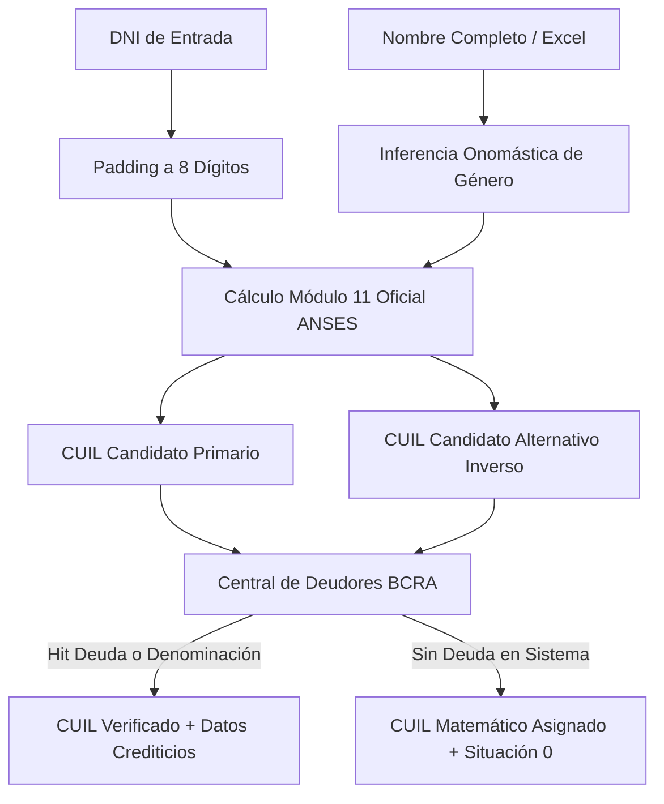

# Módulo de Dominio: Validador y Generador Algorítmico de CUIT/CUIL

> **Capa 02: Dominio y Casos de Uso** | Lógica Pura de Dominio  
> **Archivo Fuente**: [`core/domain/cuit_validator.py`](file:///c:/Users/Usuario/Documents/GitHub/scrapers-reg-no-llame/core/domain/cuit_validator.py)  
> **Aislamiento**: 100% Agnóstico de Red e Infraestructura (solo tipos nativos de Python)

---

## 1. Visión General y Propósito

En la República Argentina, cada ciudadano con Documento Nacional de Identidad (DNI) posee un Código Único de Identificación Laboral (CUIL) o Clave Única de Identificación Tributaria (CUIT) asignado por ANSES/AFIP de forma matemáticamente determinista mediante el algoritmo **Módulo 11**.

Cuando servicios de terceros como CuitOnline o Datuar no disponen de un registro (por ejemplo, personas no registradas en AFIP, jubilados, pensionados o economía informal), omitir la consulta a la Central de Deudores del Banco Central (BCRA) provoca una pérdida crítica de información financiera. El módulo [`core/domain/cuit_validator.py`](file:///c:/Users/Usuario/Documents/GitHub/scrapers-reg-no-llame/core/domain/cuit_validator.py) implementa la generación matemática del CUIL y la inferencia onomástica de género para asegurar una tasa de cobertura de CUIL del 100%.

---

## 2. Especificación del Algoritmo Módulo 11

El CUIL consta de 11 dígitos con la estructura: `XY - DNI (8 dígitos) - Z`.

### 2.1 Pesos y Multiplicadores
Para los primeros 10 dígitos (`XY` + 8 dígitos del DNI), se aplican los multiplicadores posicionales:
$$\text{Pesos} = [5, 4, 3, 2, 7, 6, 5, 4, 3, 2]$$

$$\text{Suma} = \sum_{i=0}^{9} (\text{dígito}_i \times \text{peso}_i)$$
$$\text{Resto} = \text{Suma} \pmod{11}$$

### 2.2 Reglas de Resolución de Prefijo y Dígito Verificador ($Z$)

| Condición | Prefijo Inicial ($XY$) | Prefijo Final ($XY$) | Verificador ($Z$) | Caso de Negocio |
| :--- | :--- | :--- | :--- | :--- |
| $\text{Resto} = 0$ | 20 (M) ó 27 (F) | Sin cambio (20 ó 27) | `0` | Coincidencia exacta sin residuo |
| $\text{Resto} = 1$ | 20 (Masculino) | **23** | **9** | Colisión ANSES Masculino |
| $\text{Resto} = 1$ | 27 (Femenino) | **23** | **4** | Colisión ANSES Femenino |
| $\text{Resto} > 1$ | 20 (M) ó 27 (F) | Sin cambio (20 ó 27) | $11 - \text{Resto}$ | Cálculo estándar |

---

## 3. Firmas del Dominio

### 3.1 `calcular_cuil(dni: str, sexo: str = 'M') -> str`
Calcula el CUIL de 11 dígitos normalizado.
* **Parámetros**:
  * `dni`: Cadena con el DNI numérico (se aplica `zfill(8)`).
  * `sexo`: `'M'`, `'F'` o variante textual.
* **Retorno**: Cadena de 11 dígitos numéricos con su prefijo y verificador oficial.

### 3.2 `inferir_genero(nombre: str) -> str`
Determina heurísticamente el género de una persona a partir de un léxico onomástico argentino de más de 300 nombres y exclusión de apellidos terminados en 'a'.
* **Retorno**: `'F'` (Femenino) o `'M'` (Masculino).

### 3.3 `obtener_cuils_candidatos(dni: str, nombre: str = "", genero_hint: Optional[str] = None) -> Tuple[str, str]`
Genera la tupla `(cuil_primario, cuil_alternativo)` para garantizar doble verificación en endpoints crediticios (ej. BCRA).

---

## 4. Garantía de Calidad y No-Regresión

Este módulo asegura:
1. **0% Omisiones en BCRA**: Ningún registro en el pipeline es omitido por falta de CUIT.
2. **Cero Dependencias de Infraestructura**: Opera en memoria pura en $< 0.05 \text{ ms}$ por registro.
3. **Idempotencia Absoluta**: El cálculo matemático es puramente funcional y libre de efectos secundarios.
