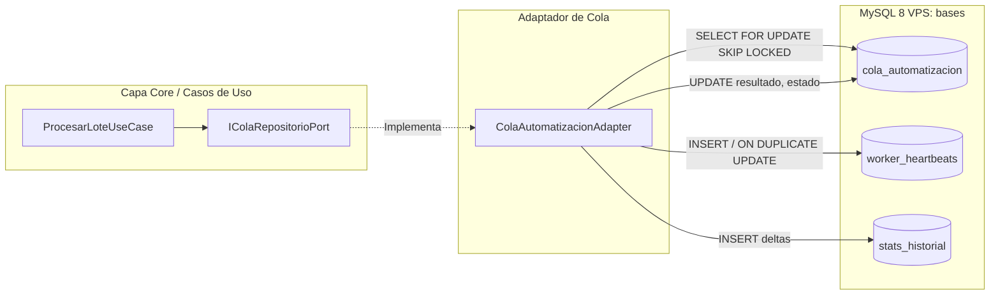

# Adaptador de Cola: Cola Automatización (VPS Central)

> **Capa 03: Base de Datos y Colas** | Módulo de Extensión Hexagonal  
> **Puerto Implementado**: [`IColaRepositorioPort`](file:///c:/Users/automatizacion.crm/Documents/GitHub/scrapers-reg-no-llame/core/ports/queue_port.py)  
> **Archivo de Código**: [`adapters/queue/cola_automatizacion_adapter.py`](file:///c:/Users/automatizacion.crm/Documents/GitHub/scrapers-reg-no-llame/adapters/queue/cola_automatizacion_adapter.py)

---

## 1. Propósito y Visión General

El adaptador [`ColaAutomatizacionAdapter`](file:///c:/Users/automatizacion.crm/Documents/GitHub/scrapers-reg-no-llame/adapters/queue/cola_automatizacion_adapter.py) permite que la arquitectura hexagonal multi-scraper consuma y persista tareas directamente desde la tabla central `cola_automatizacion` de la base de datos MySQL VPS (`bases`).

Este adaptador desacopla por completo la fuente de datos del dominio de la aplicación:
* **Consumo Transparente**: Traduce los registros de `cola_automatizacion` a instancias puras de [`RegistroCola`](file:///c:/Users/automatizacion.crm/Documents/GitHub/scrapers-reg-no-llame/core/domain/entities.py#L131) y [`Linea`](file:///c:/Users/automatizacion.crm/Documents/GitHub/scrapers-reg-no-llame/core/domain/entities.py#L9).
* **Compatibilidad Retrospectiva**: Formatea la columna `resultado` (tipo `JSON`) respetando la estructura que esperan los consumidores y dashboards legados del proyecto `worker_package`.
* **Enriquecimiento sin Pérdidas**: Conserva en el JSON todas las capas de datos extendidos que extraen los motores modernos (`tramite`, `fechas`, `detalles_extendidos`, `raw`), evitando pérdida de precisión técnica.
* **Telemetría e Integración**: Emite latidos de vida en `worker_heartbeats` y deltas de producción en `stats_historial`.



---

## 2. Esquema DDL de las Tablas Consumidas

### 2.1 Tabla Principal: `cola_automatizacion`

```sql
CREATE TABLE IF NOT EXISTS `cola_automatizacion` (
  `id` bigint NOT NULL AUTO_INCREMENT,
  `auto_id` varchar(50) NOT NULL,
  `estado` enum('pendiente','en_proceso','completado','fallido') NOT NULL DEFAULT 'pendiente',
  `datos` json NOT NULL,
  `numero_de_linea` varchar(30) DEFAULT NULL,
  `dni` varchar(20) DEFAULT NULL,
  `target_pc` varchar(100) DEFAULT NULL,
  `reintentos` int NOT NULL DEFAULT '0',
  `fecha_creacion` datetime DEFAULT CURRENT_TIMESTAMP,
  `fecha_inicio` datetime DEFAULT NULL,
  `fecha_fin` datetime DEFAULT NULL,
  `resultado` json DEFAULT NULL,
  `error_msg` text,
  `scrapers_intentados` text,
  PRIMARY KEY (`id`),
  KEY `idx_auto_estado_pc` (`auto_id`,`estado`,`target_pc`),
  KEY `idx_numero_linea` (`numero_de_linea`)
) ENGINE=InnoDB DEFAULT CHARSET=utf8mb4 COLLATE=utf8mb4_unicode_ci;
```

### 2.2 Telemetría y Heartbeats: `worker_heartbeats`

```sql
CREATE TABLE IF NOT EXISTS `worker_heartbeats` (
  `pc_id` varchar(100) NOT NULL,
  `auto_id` varchar(50) NOT NULL,
  `last_seen` datetime NOT NULL,
  `total_procesados` int NOT NULL DEFAULT '0',
  PRIMARY KEY (`pc_id`,`auto_id`)
) ENGINE=InnoDB DEFAULT CHARSET=utf8mb4;
```

---

## 3. Protocolo de Reserva Atómica (`FOR UPDATE SKIP LOCKED`)

La reserva se ejecuta en una transacción dedicada evitando bloqueos entre múltiples nodos del cluster:

```python
query_select = f"""
    SELECT id, datos, numero_de_linea, reintentos
    FROM {self.table_name}
    WHERE auto_id = %s
      AND estado = 'pendiente'
      AND (target_pc = %s OR target_pc IS NULL OR target_pc = '')
    ORDER BY id ASC
    LIMIT %s
    FOR UPDATE SKIP LOCKED;
"""
```

Al reservarse:
1. El estado pasa inmediatamente a `en_proceso`.
2. Se registra `fecha_inicio = NOW()`.
3. Se asigna `target_pc = self.pc_id` para trazabilidad de nodo.

---

## 4. Formato de Salida Unificado: Trazabilidad `iris_v2` y Retrocompatibilidad

El campo `resultado` (JSON) en `cola_automatizacion` almacena de forma íntegra e idéntica la estructura de `datos_json` generada por la arquitectura hexagonal en `queue_registro_no_llame`, incorporando además la marca de versión `_version: "iris_v2"`, el namespace `iris_v2` y el bloque legado `data` (`persona`, `servicio`, `lineas`) para no perder compatibilidad con sistemas anteriores:

### 4.1 Resultado con Coincidencia (`completado`)

```json
{
  "_version": "iris_v2",
  "_sistema": "scrapers_reg_no_llame",
  "status": "completado",
  "timestamp": "2026-09-22T15:30:00.000000",
  "data": {
    "persona": {
      "nombre": "GAMARRA AZUCENA BEATRIZ",
      "apellido": "",
      "nro_doc_ident": "18541128",
      "nro_documento": "18541128",
      "tipo_documento": "Documento Nacional Identidad",
      "tipo_de_persona": "Persona Fisica",
      "cuil": "",
      "email": "",
      "telefono_contacto": "-"
    },
    "servicio": {
      "producto": "Activa (Prepago)",
      "tecnología": "Celular",
      "tecnologia": "Celular",
      "modalidad_de_contratación_con_factura": "NO",
      "modalidad_factura": "NO",
      "operador_receptor": "Claro"
    },
    "lineas": [
      "1122830769"
    ],
    "tramite": {
      "nro_tramite_abd": "202109151818145558588",
      "id_tramite_spn": "20195737"
    }
  },
  "enacom": {
    "operador_origen": "Movistar",
    "operador_oficial": "TELEFONICA MOVILES ARGENTINA S.A.",
    "grupo_economico": "Telefónica Hispanoamérica (Movistar)",
    "tipo_linea": "Móvil / Celular",
    "es_celular": true,
    "soporta_whatsapp": true,
    "servicio_oficial": "SRMC/STM/PCS",
    "modalidad": "CPP",
    "modalidad_descripcion": "Calling Party Pays (El que llama paga)",
    "codigo_area": "11",
    "bloque": "2283",
    "prefijo_completo": "112283",
    "capacidad_bloque": 10000,
    "rango_asignado": "1122830000 - 1122839999",
    "localidad_origen": "AMBA",
    "provincia_origen": "Buenos Aires / CABA",
    "macro_region": "Región Metropolitana / AMBA",
    "resolucion": "SC 22/14",
    "organismo_emisor": "Secretaría de Comunicaciones",
    "fecha_asignacion": "2014-06-04",
    "ano_asignacion": 2014,
    "ani": "1122830769",
    "numero_local": "22830769",
    "numero_abonado": "0769",
    "formatos": {
      "e164": "+5491122830769",
      "whatsapp": "5491122830769",
      "nacional_celular": "011 15-22830769"
    }
  },
  "iris": {
    "status": "coincidencia",
    "fuente": "iris",
    "operador": "Claro",
    "operador_receptor": "Claro",
    "titular": {
      "nombre": "GAMARRA AZUCENA BEATRIZ",
      "apellido": "",
      "razon_social": "",
      "tipo_documento": "Documento Nacional Identidad",
      "nro_documento": "18541128",
      "tipo_persona": "Persona Fisica",
      "telefono_contacto": "-",
      "email": "",
      "cuil": "",
      "edad": "",
      "genero": "",
      "provincia": "",
      "ciudad": "",
      "municipio": ""
    },
    "servicio": {
      "tecnologia": "Celular",
      "producto": "Activa (Prepago)",
      "modalidad_factura": "NO"
    },
    "fechas": {
      "fecha_operacion": "2021-09-15 18:18:43-03:00",
      "fecha_alta": "2021-09-15 18:18:43-03:00",
      "fecha_estado": "2021-09-16 17:10:58-03:00",
      "fvc_orig": "",
      "fvc_aprobada": "2021-09-20 17:11:00-03:00"
    },
    "detalles": {
      "nro_tramite_abd": "202109151818145558588",
      "id_tramite_spn": "20195737",
      "sistema_origen": "SPN",
      "resultado_spn": "Aprobado",
      "sistema_comercial": "Amdocs",
      "estado_tramite": "Aprobación del ABD",
      "error_spn": "",
      "observaciones": "",
      "cantidad_lineas_portadas": "1",
      "cantidad_lineas_revertidas": "0",
      "estado_reversion": "Total"
    },
    "raw": {
      "nro_tramite_abd": "202109151818145558588",
      "operador_receptor": "Claro",
      "fecha_operacion": "2021-09-15 18:18:43-03:00",
      "lineas_asociadas": ["1122830769"]
    },
    "ultima_modificacion": "2026-09-21 15:59:18"
  },
  "iris_v2": {
    "status": "coincidencia",
    "fuente": "iris",
    "operador": "Claro",
    "operador_receptor": "Claro",
    "titular": { ... },
    "servicio": { ... },
    "fechas": { ... },
    "detalles": { ... },
    "raw": { ... }
  }
}
```

### 4.2 Resultado sin Coincidencia (`no_encontrado`)

```json
{
  "_version": "iris_v2",
  "_sistema": "scrapers_reg_no_llame",
  "status": "no_encontrado",
  "timestamp": "2026-09-22T15:30:00.000000",
  "message": "Sin registros en IRIS / No posee Port Out",
  "linea": "1150639769",
  "enacom": {
    "operador_origen": "Movistar",
    "codigo_area": "11",
    "es_celular": true
  },
  "iris": {
    "status": "sin_coincidencia",
    "fuente": "iris",
    "detalles": {
      "mensaje": "Sin registros en IRIS / No posee Port Out"
    }
  },
  "iris_v2": {
    "status": "sin_coincidencia",
    "fuente": "iris"
  }
}
```

### 4.3 Política de Separación de Responsabilidades (`error_msg` vs `resultado`)

Para garantizar que los dashboards, reportes y consultas SQL no confundan tareas fallidas con tareas que tienen datos procesados (ej. `WHERE resultado IS NOT NULL`), se aplica una separación estricta de responsabilidades:

1. **Tareas Exitosas (`estado = 'completado'`)**:
   - `resultado`: Contiene el payload JSON enriquecido (`enacom`, `iris`).
   - `error_msg`: Permanece estrictamente en `NULL`.

2. **Tareas Fallidas (`estado = 'fallido'`)**:
   - `resultado`: Permanece estrictamente en `NULL` (no contamina el campo de datos).
   - `error_msg`: Registra el error estructurado con código y tipo:
     ```text
     [HTTPError:500] Error interno del servidor en IRIS BPM
     [Timeout:408] Tiempo de espera agotado al consultar endpoint
     [FueraDeHorarioComercialException:OUT_OF_HOURS] Consulta rechazada: IRIS opera únicamente en horario comercial
     ```

```sql
-- Ejemplo de consulta para auditar errores sin parsear JSON:
SELECT id, numero_de_linea, error_msg, fecha_fin 
FROM cola_automatizacion 
WHERE estado = 'fallido' AND error_msg IS NOT NULL 
ORDER BY fecha_fin DESC;
```

---

## 5. Variables de Entorno y Configuración

| Variable | Tipo | Default | Descripción |
| :--- | :--- | :--- | :--- |
| `QUEUE_TYPE` | `str` | `registro_no_llame` | Define el adaptador activo: `registro_no_llame` o `cola_automatizacion`. |
| `COLA_AUTO_ID` | `str` | `iris_scraper` | Identificador del tipo de automatización a consumir. |
| `WORKER_PC_ID` | `str` | `socket.gethostname()` | Nombre de nodo para `target_pc` y telemetría de latidos. |
| `VPS_DB_USE_PURE` | `bool` | `True` | Fuerza implementación pura Python en `mysql.connector` (vital en Python 3.13 Windows). |

---

## 6. Verificación y Pruebas

El adaptador cuenta con una suite de pruebas unitarias y de integración en:
* [`tests/test_cola_automatizacion_adapter.py`](file:///c:/Users/automatizacion.crm/Documents/GitHub/scrapers-reg-no-llame/tests/test_cola_automatizacion_adapter.py)

Para ejecutar la verificación:
```powershell
.\venv\Scripts\python.exe tests/test_cola_automatizacion_adapter.py
```
