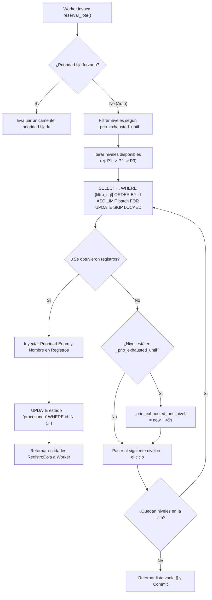

# Cascada de Prioridades B-Tree Geográfica

Este documento documenta la estrategia de consumo por prioridades geográficas implementada en [`MySQLQueueAdapter`](file:///c:/Users/Usuario/Documents/GitHub/scrapers-reg-no-llame/adapters/queue/mysql_vps_adapter.py#L25-L35), detallando los rangos numéricos B-Tree sobre el número telefónico (`ani`), el algoritmo de cascada con penalización temporal (`backoff`), y su correlación con la numeración de telecomunicaciones en Argentina.

---

## 1. Fundamentos de los Rangos Numéricos Geográficos en Argentina

Las líneas telefónicas argentinas cuentan con 10 dígitos (código de área sin prefijo 0 + número local sin prefijo 15). Al almacenar el ANI como `BIGINT UNSIGNED`, las consultas aprovechan comparaciones matemáticas en árbol B-Tree mediante operadores `BETWEEN`, evitando operaciones costosas con cadenas (`LIKE '11%'` o `SUBSTRING`):

```python
# Rangos numéricos B-Tree sobre columna ani (BIGINT de 10 dígitos)
SQL_RANGE_P1 = "((ani BETWEEN 1100000000 AND 1199999999) OR (ani BETWEEN 2600000000 AND 2639999999))"
SQL_RANGE_P2 = "((ani BETWEEN 2800000000 AND 2809999999) OR (ani BETWEEN 2900000000 AND 2999999999))"
SQL_RANGE_P3 = f"NOT ({SQL_RANGE_P1} OR {SQL_RANGE_P2})"
```

### Detalle de Prioridades y Cobertura Territorial

| Prioridad | Nombre / Nivel | Filtro SQL / Rangos de ANI | Zonas Geográficas Cubiertas | Justificación de Negocio |
| :--- | :--- | :--- | :--- | :--- |
| **P1** | `P1 (11 / Mendoza)` | `1100000000` - `1199999999`<br>`2600000000` - `2639999999` | **AMBA**: CABA y Gran Buenos Aires (11).<br>**Mendoza**: Capital/Gran Mendoza (261), San Rafael (260), San Martín/Este (263). | Mayor volumen comercial, mayor tasa de conversión en portabilidades numéricas y contacto. |
| **P2** | `P2 (Sur / Patagonia)` | `2800000000` - `2809999999`<br>`2900000000` - `2999999999` | **Patagonia y Región Sur**: Rawson/Trelew/Pto. Madryn (280), Neuquén/Río Negro (299), Bariloche (294), Comodoro Rivadavia (297), Bahía Blanca (291), Río Gallegos/Tierra del Fuego (2966/2901). | Segmento estratégico de alto ticket promedio en telecomunicaciones fijas y móviles. |
| **P3** | `P3 (Resto del País)` | Complemento booleano:<br>`NOT (P1 OR P2)` | Córdoba (351), Rosario/Santa Fe (341/342), Tucumán (381), Salta, Corrientes, Entre Ríos y demás áreas del interior. | Consumo continuo de fondo sin saturar las colas principales. |

---

## 2. Configuración y Mapeo con el Dominio

En el código fuente, la configuración se asocia al enum de dominio [`Prioridad`](file:///c:/Users/Usuario/Documents/GitHub/scrapers-reg-no-llame/core/domain/enums.py#L8-L17) mediante el diccionario [`PRIORIDADES_CONFIG`](file:///c:/Users/Usuario/Documents/GitHub/scrapers-reg-no-llame/adapters/queue/mysql_vps_adapter.py#L30-L34):

```python
PRIORIDADES_CONFIG = {
    1: {"nombre": "P1 (11 / Mendoza)", "filtro": SQL_RANGE_P1, "enum": Prioridad.P1_AMBA_MENDOZA},
    2: {"nombre": "P2 (Sur / Patagonia)", "filtro": SQL_RANGE_P2, "enum": Prioridad.P2_SUR_PATAGONIA},
    3: {"nombre": "P3 (Resto del País)", "filtro": SQL_RANGE_P3, "enum": Prioridad.P3_RESTO},
}
```

---

## 3. Algoritmo de Cascada y Mecanismo Anti-Starvation (Penalización Temporal)

Si el adaptador intentara consultar P1 incondicionalmente en cada ciclo, y la cola P1 estuviera vacía, se generarían cientos de queries vacías por segundo consumiendo ciclos del motor de base de datos. Por otro lado, si P1 tiene millones de filas, P2 y P3 jamás serían procesadas a menos que se regule la asignación.

Para mitigar el costo de búsquedas en colas vacías, [`MySQLQueueAdapter`](file:///c:/Users/Usuario/Documents/GitHub/scrapers-reg-no-llame/adapters/queue/mysql_vps_adapter.py#L42) implementa un registro interno de agotamiento temporal:

```python
self._prio_exhausted_until: Dict[int, float] = {1: 0.0, 2: 0.0}
```

### Flujo de Ejecución de la Cascada



### Lógica de Código

```python
now = time.time()
if prioridad is not None:
    niveles = [prioridad]
else:
    niveles = [
        n for n in [1, 2, 3] 
        if n not in self._prio_exhausted_until or now >= self._prio_exhausted_until[n]
    ]
    if not niveles:
        niveles = [1, 2, 3]

# Evaluación sucesiva:
for nivel in niveles:
    cfg = PRIORIDADES_CONFIG.get(nivel)
    # ... ejecución de query ...
    if filas:
        # Encontró registros en esta prioridad: interrumpe la cascada y retorna el lote
        break
    else:
        # Agotamiento: si P1 no tiene registros, se congela su consulta por 45 segundos
        if prioridad is None and nivel in self._prio_exhausted_until:
            self._prio_exhausted_until[nivel] = time.time() + 45.0
```

---

## 4. Eficiencia del Ordenamiento B-Tree con `ORDER BY id ASC`

Al ejecutarse el `SELECT ... WHERE {filtro_sql} ORDER BY id ASC LIMIT 15`, la conjunción de las condiciones opera de la siguiente manera:
1. Las condiciones de rango numérico se resuelven a través de las ramas del índice secundario B-Tree `(scraper_actual, estado, ani, id)`.
2. Como los registros se insertan secuencialmente a través del autoincremento, los `id` dentro de cada página del árbol ya presentan orden físico monótonamente creciente.
3. El motor InnoDB aplica el `LIMIT` de manera inmediata al encontrar los primeros 15 registros no bloqueados (`SKIP LOCKED`), suspendiendo el escaneo sin necesidad de recorrer todo el conjunto de resultados.
