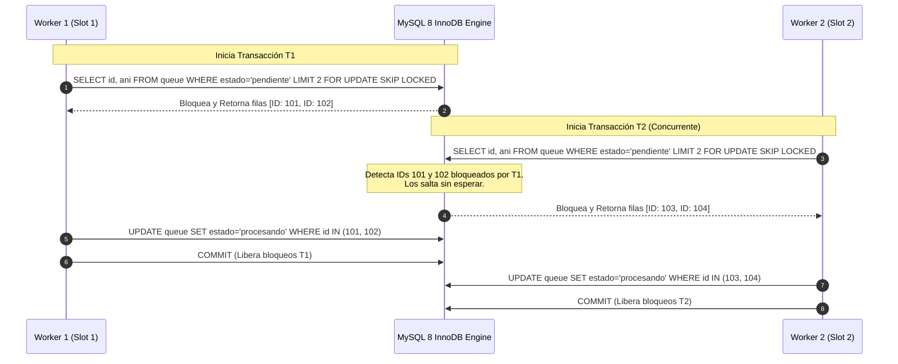

# Concurrencia y Bloqueos con SELECT FOR UPDATE SKIP LOCKED

Este documento expone la mecánica de concurrencia a nivel de fila utilizada en el repositorio central de MySQL 8, detallando cómo la cláusula `FOR UPDATE SKIP LOCKED` implementada en [`MySQLQueueAdapter.reservar_lote`](file:///c:/Users/automatizacion.crm/Documents/GitHub/scrapers-reg-no-llame/adapters/queue/mysql_vps_adapter.py#L68-L184) elimina la contención entre procesos, previene deadlocks y asegura el aislamiento transaccional estricto.

---

## 1. El Problema Clásico de Contención en Colas de Base de Datos

En sistemas concurrentes tradicionales de scraping (con múltiples workers accediendo a una tabla compartida):
1. **Bloqueo Pesimista Estándar (`FOR UPDATE`)**: Si el Worker 1 ejecuta un `SELECT ... LIMIT 15 FOR UPDATE`, adquiere un bloqueo exclusivo (`X Lock`) sobre esas 15 filas. Cuando el Worker 2 intenta reclamar el siguiente lote con el mismo predicado, se suspende esperando que el Worker 1 libere el bloqueo (`Lock Wait Timeout Exceeded`), serializando la ejecución y reduciendo a cero la ventaja del paralelismo.
2. **Bloqueo Optimista (`UPDATE ... WHERE estado = 'pendiente' LIMIT 15`)**: Bajo alta concurrencia, múltiples workers intentan actualizar las mismas filas simultáneamente. Aunque atómico, genera constantes colisiones, lecturas repetidas o fallos de actualización cruzada.

---

## 2. Solución en MySQL 8: `FOR UPDATE SKIP LOCKED`

La instrucción `FOR UPDATE SKIP LOCKED` introducida en MySQL 8.0 permite que una transacción solicite bloqueos exclusivos sobre filas candidatas, pero **omita silenciosamente cualquier fila que ya esté bloqueada por otra transacción activa**:



### Ventajas Operativas
* **Cero Tiempos de Espera (No-Wait)**: Los workers nunca entran en estado de bloqueo esperando a otros procesos.
* **Escalabilidad Horizontal Lineal**: Es posible elevar la cantidad de workers concurrentes (ej. 9 workers en [`SupervisorIndustrial`](file:///c:/Users/automatizacion.crm/Documents/GitHub/scrapers-reg-no-llame/runtime/supervisor.py#L37)) sin que se degraden los tiempos de respuesta de la base de datos.
* **Inexistencia de Deadlocks por Reclamo**: Al respetarse el orden estricto `ORDER BY id ASC` y omitirse los registros ocupados, dos transacciones nunca intentarán bloquearse mutuamente en orden inverso.

---

## 3. Implementación Literal en Python y Atomismo Transaccional

En [`MySQLQueueAdapter.reservar_lote`](file:///c:/Users/automatizacion.crm/Documents/GitHub/scrapers-reg-no-llame/adapters/queue/mysql_vps_adapter.py#L102-L141), la reserva se realiza en dos fases atómicas bajo la misma conexión con `autocommit=False`:

```python
# Fase 1: Selección con bloqueo omitiendo bloqueados
select_query = f"""
    SELECT id, ani, estado, scraper_actual, fuente, datos_json
    FROM `{self.table}`
    WHERE scraper_actual = %s 
      AND estado = 'pendiente' 
      AND {filtro_sql}
    ORDER BY id ASC
    LIMIT %s
    FOR UPDATE SKIP LOCKED
"""
cursor.execute(select_query, (scraper_nombre, batch_size))
filas = cursor.fetchall()

if not filas:
    conn.commit()
    return []

ids = [r["id"] for r in filas]
format_ids = ",".join(["%s"] * len(ids))

# Fase 2: Transición inmediata a 'procesando'
update_query = f"""
    UPDATE `{self.table}`
    SET estado = 'procesando',
        updated_at = CURRENT_TIMESTAMP
    WHERE id IN ({format_ids})
"""
cursor.execute(update_query, ids)
conn.commit()
```

### Garantía de Integridad (ACID)
1. Si el worker pierde conectividad entre el `SELECT` y el `UPDATE`, la sesión de red se interrumpe, MySQL detecta la desconexión del socket y efectúa un `ROLLBACK` automático, liberando los registros inmediatamente para otros workers.
2. La actualización a `'procesando'` se confirma con `conn.commit()` antes de iniciar la interacción externa con el motor de scraping, garantizando que ninguna otra consulta considere estos registros pendientes.
3. El cursor y la conexión se devuelven al pool en el bloque `finally`, liberando sockets del servidor.

---

## 4. Prevención de Bloqueos de Rango y Gap Locks en InnoDB

InnoDB utiliza habitualmente **Next-Key Locks** (bloqueos de registro más bloqueo de intervalo o gap lock) para prevenir lecturas fantasma cuando se trabaja en nivel de aislamiento `REPEATABLE READ`.

### Riesgo de Gap Locking en Colas
Si la columna `ani` no contara con un índice exacto o si el optimizador realizara un escaneo que abarque registros inexistentes, InnoDB podría bloquear gaps completos de la tabla, impidiendo que otros workers inserten o reclamen registros adyacentes.

### Mitigación en este Proyecto
1. **Índice Compuesto Estricto**: Al utilizar `idx_scraper_estado_ani_id`, InnoDB sitúa los bloqueos exclusivamente sobre los registros reales evaluados (`Record Locks`), evitando gaps amplios.
2. **Nivel de Aislamiento Recomendado en VPS**:
   Configurar el servidor MySQL con aislamiento `READ COMMITTED` elimina completamente los gap locks para búsquedas y escaneos de índices, restringiendo los bloqueos única y exclusivamente a las filas exactas retornadas:

```ini
# /etc/mysql/my.cnf en VPS
[mysqld]
transaction-isolation = READ-COMMITTED
```

---

## 5. Manejo de Reversión Segura y Recuperación de Fallos

Si durante la ejecución del lote el proceso del worker es interrumpido (ej. detención ordenada solicitada por el supervisor vía `stop_event` o falla recuperable), el caso de uso invoca [`revertir_a_pendiente`](file:///c:/Users/automatizacion.crm/Documents/GitHub/scrapers-reg-no-llame/adapters/queue/mysql_vps_adapter.py#L246-L286):

```sql
UPDATE `queue_registro_no_llame`
SET estado = 'pendiente',
    updated_at = CURRENT_TIMESTAMP
WHERE id IN (%s, %s, ...) AND estado = 'procesando';
```

El predicado adicional `AND estado = 'procesando'` asegura idempotencia: no se alterarán registros que ya hubieran sido persistidos o cancelados por otra rutina.
