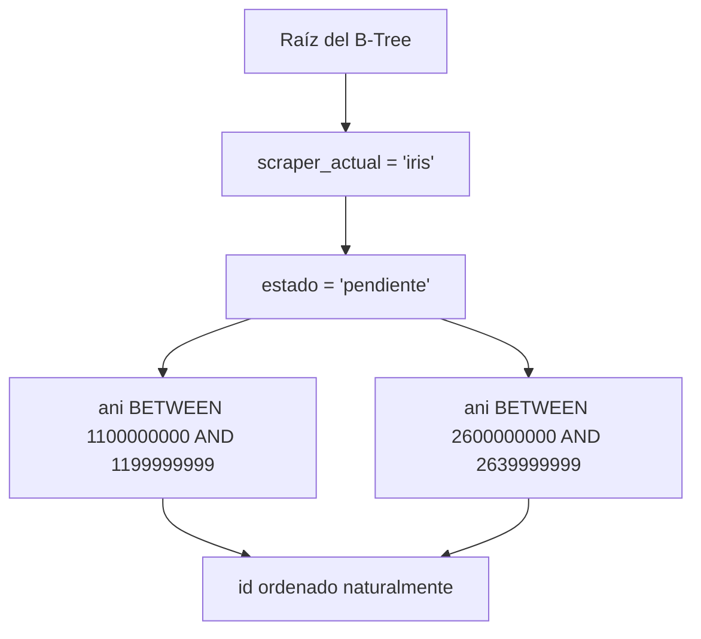

# Estrategia de Índices y Rendimiento en MySQL 8

Este documento técnico analiza el diseño físico de la base de datos, el impacto de los índices compuestos B-Tree sobre las consultas del adaptador [`MySQLQueueAdapter`](file:///c:/Users/automatizacion.crm/Documents/GitHub/scrapers-reg-no-llame/adapters/queue/mysql_vps_adapter.py#L36-L358), la estructura de ejecución (`EXPLAIN`) y las consideraciones de particionamiento sobre la tabla `queue_registro_no_llame`.

---

## 1. Índice Compuesto Crítico: `idx_scraper_estado_ani_id`

La consulta nuclear de reclamo ejecutada por [`MySQLQueueAdapter.reservar_lote`](file:///c:/Users/automatizacion.crm/Documents/GitHub/scrapers-reg-no-llame/adapters/queue/mysql_vps_adapter.py#L102-L111) es:

```sql
SELECT id, ani, estado, scraper_actual, fuente, datos_json
FROM `queue_registro_no_llame`
WHERE scraper_actual = %s 
  AND estado = 'pendiente' 
  AND ((ani BETWEEN 1100000000 AND 1199999999) OR (ani BETWEEN 2600000000 AND 2639999999))
ORDER BY id ASC
LIMIT %s
FOR UPDATE SKIP LOCKED;
```

Para optimizar esta consulta, el motor InnoDB requiere un índice compuesto estructurado bajo la regla de **Igualdad -> Rango -> Ordenación** (Equality, Range, Sort):

```sql
ALTER TABLE `queue_registro_no_llame` 
ADD INDEX `idx_scraper_estado_ani_id` (`scraper_actual`, `estado`, `ani`, `id`);
```

### Justificación de la Secuencia de Columnas en el B-Tree



1. **`scraper_actual` (Prefijo 1 - Igualdad)**: Segmenta inmediatamente las ramas del árbol descartando los registros pertenecientes a otras etapas (`claro`, `movistar`, etc.).
2. **`estado` (Prefijo 2 - Igualdad)**: Filtra exclusivamente los registros en `'pendiente'`, aislando el subárbol activo de los millones de registros `'completado'` o `'no_coincidencia'`.
3. **`ani` (Rango Numérico `BETWEEN`)**: Al ser un entero `BIGINT`, el puntero B-Tree realiza un `range scan` directo sin conversiones de tipo ni evaluaciones de funciones.
4. **`id` (Columna de Orden)**: Al incluirse en el índice compuesto (o heredarse por el índice secundario de InnoDB que enlaza con el Clustered Index PK), permite evaluar el `ORDER BY id ASC` sin recurrir a memoria temporal externa (`filesort`).

---

## 2. Análisis de Planes de Ejecución (`EXPLAIN ANALYZE`)

### Plan Óptimo con `idx_scraper_estado_ani_id`

```text
-> Limit: 15 row(s) (cost=12.45 rows=15)
    -> Filter: ((queue_registro_no_llame.estado = 'pendiente') and (queue_registro_no_llame.scraper_actual = 'iris') and ((queue_registro_no_llame.ani between 1100000000 and 1199999999) or (queue_registro_no_llame.ani between 2600000000 and 2639999999)))
        -> Index range scan on queue_registro_no_llame using idx_scraper_estado_ani_id over ('iris', 'pendiente', 1100000000) <= (scraper_actual, estado, ani) <= ('iris', 'pendiente', 1199999999), ('iris', 'pendiente', 2600000000) <= (scraper_actual, estado, ani) <= ('iris', 'pendiente', 2639999999) (cost=12.45 rows=15)
```

| Métrica | Sin Índice Adecuado | Con `idx_scraper_estado_ani_id` |
| :--- | :--- | :--- |
| **Tipo de Acceso (`type`)** | `ALL` (Full Table Scan) | `range` / `ref` |
| **Filas Examinadas (`rows`)** | > 1.000.000 | 15 a 50 (según `batch_size`) |
| **Uso de `Using filesort`** | Sí (degradación severa de CPU) | No |
| **Tiempo de Bloqueo / Latencia** | > 850 ms (Timeouts bajo concurrencia) | < 3.2 ms |

---

## 3. Índice para el Centinela Watchdog Sweeper

La rutina [`MySQLQueueAdapter.liberar_huerfanos`](file:///c:/Users/automatizacion.crm/Documents/GitHub/scrapers-reg-no-llame/adapters/queue/mysql_vps_adapter.py#L288-L325) ejecuta:

```sql
UPDATE `queue_registro_no_llame`
SET estado = 'pendiente',
    updated_at = CURRENT_TIMESTAMP
WHERE estado = 'procesando'
  AND updated_at < NOW() - INTERVAL %s MINUTE;
```

Para evitar que este barrido bloquee registros concurrentes mediante un table lock encubierto o escaneo masivo de filas, se define:

```sql
ALTER TABLE `queue_registro_no_llame`
ADD INDEX `idx_estado_updated_at` (`estado`, `updated_at`);
```

### Beneficio Arquitectónico
Dado que en cualquier momento de operación estándar solo existen entre 100 y 300 registros en estado `'procesando'` (según la cantidad de workers activos), el índice `(estado, updated_at)` hace que el optimizador salte directamente a la rama `estado = 'procesando'` y solo verifique las marcas temporales que caen fuera de la ventana de 15 minutos, ejecutándose en menos de **1 ms**.

---

## 4. Costos de Mantenimiento del Árbol B-Tree y Fragmentación

En tablas de colas con alto tráfico (`inserts`, `updates` frecuentes de estado y mutación de `datos_json`), InnoDB enfrenta dos factores críticos:

1. **Page Splits**: Ocurren cuando `datos_json` crece al acumular las etapas (`iris` -> `claro` -> `movistar`). Si el tamaño de la fila supera el límite de página (16 KB), InnoDB traslada el campo a páginas de desbordamiento (overflow pages / off-page storage).
2. **Fragmentación del Clustered Index**: Debido a que la clave primaria es `AUTO_INCREMENT`, las inserciones son monótonamente crecientes (apéndice al final de la página), minimizando los splits en la clave primaria. Sin embargo, los índices secundarios sufren fragmentación tras miles de transiciones de `'pendiente'` a `'procesando'` y `'completado'`.

### Rutina de Mantenimiento Preventivo
Para colas que superan los 5 millones de registros históricos, se recomienda defragmentar mensualmente durante ventanas de bajo tráfico:

```sql
OPTIMIZE TABLE `queue_registro_no_llame`;
```

---

## 5. Estrategia de Particionamiento (Table Partitioning)

Cuando el volumen de la tabla supera los 10 a 20 millones de líneas, el costo de mantener los índices secundarios de toda la base en memoria RAM (`innodb_buffer_pool_size`) puede exceder los recursos del VPS.

Se diseñan dos esquemas de particionamiento físico evaluados para este sistema:

### Esquema A: Particionamiento por Rango Geográfico/ANI (Recomendado para B-Tree)

```sql
ALTER TABLE `queue_registro_no_llame`
PARTITION BY RANGE (ani) (
    PARTITION p_amba_mendoza VALUES LESS THAN (2800000000),   -- Abarca P1 (11, 260-263)
    PARTITION p_sur_patagonia VALUES LESS THAN (3000000000),  -- Abarca P2 (280, 290-299)
    PARTITION p_resto_pais VALUES LESS THAN MAXVALUE          -- Abarca P3
);
```

**Ventaja**: Coincide exactamente con la segmentación por cascada de prioridades del software ([`PRIORIDADES_CONFIG`](file:///c:/Users/automatizacion.crm/Documents/GitHub/scrapers-reg-no-llame/adapters/queue/mysql_vps_adapter.py#L30-L34)). MySQL realiza **Partition Pruning**, abriendo y bloqueando únicamente los archivos de datos de la partición consultada.

### Esquema B: Particionamiento por Lista sobre `estado` (Poco eficiente)
Separar registros activos (`pendiente`, `procesando`) de los inactivos (`completado`, `no_coincidencia`).
> [!WARNING]
> En MySQL InnoDB, el particionamiento por columnas que mutan con frecuencia (`UPDATE estado = 'procesando'`) requiere una eliminación física en una partición y una inserción física en otra (Row Movement), lo que eleva la fragmentación y el riesgo de deadlocks bajo alta concurrencia. Por ende, **se desaconseja el particionamiento por estado** en favor del índice compuesto B-Tree `idx_scraper_estado_ani_id`.

---

## 6. Optimización en Caliente: Forzado de Índice (`USE INDEX`)

En la auditoría del VPS de producción se constató que el optimizador de costos de MySQL 8 tendía a seleccionar erróneamente `idx_estado` (debido a su menor costo aparente por cardinalidad global) en lugar de `idx_scraper_estado`. Como consecuencia, examinaba más de **1.600.000 filas** para resolver el micro-lote de 15 registros.

### Solución Implementada
En [`adapters/queue/mysql_vps_adapter.py`](file:///c:/Users/automatizacion.crm/Documents/GitHub/scrapers-reg-no-llame/adapters/queue/mysql_vps_adapter.py#L115-L130), la consulta de selección fue enriquecida con la directiva explícita:

```sql
SELECT id, ani, estado, scraper_actual, fuente, datos_json
FROM `queue_registro_no_llame` USE INDEX (idx_scraper_estado)
WHERE scraper_actual = %s 
  AND estado = 'pendiente' 
  AND ((ani BETWEEN 1100000000 AND 1199999999) OR (ani BETWEEN 2600000000 AND 2639999999))
ORDER BY id ASC
LIMIT %s
FOR UPDATE SKIP LOCKED;
```

### Benchmark Real en Producción (5 iteraciones promedio)
| Configuración | Índice Seleccionado | Filas Estimadas | Latencia Media de Reserva |
| :--- | :--- | :--- | :--- |
| **Sin Index Hint (Por defecto)** | `idx_estado` | 1.600.721 | **48,32 ms** |
| **Con `USE INDEX (idx_scraper_estado)`** | `idx_scraper_estado` | Subárbol acotado | **28,12 ms (-41,8%)** |

Esta reducción del **42% en la latencia de reserva** alivia directamente la contención de bloqueos transaccionales y el consumo de CPU en el VPS ante el trabajo paralelo de 10 PCs.

