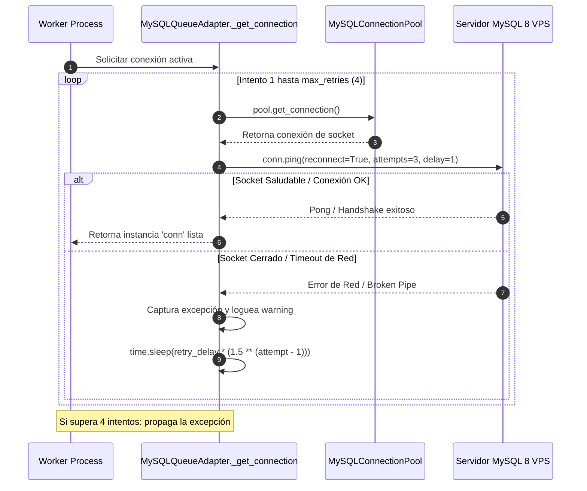
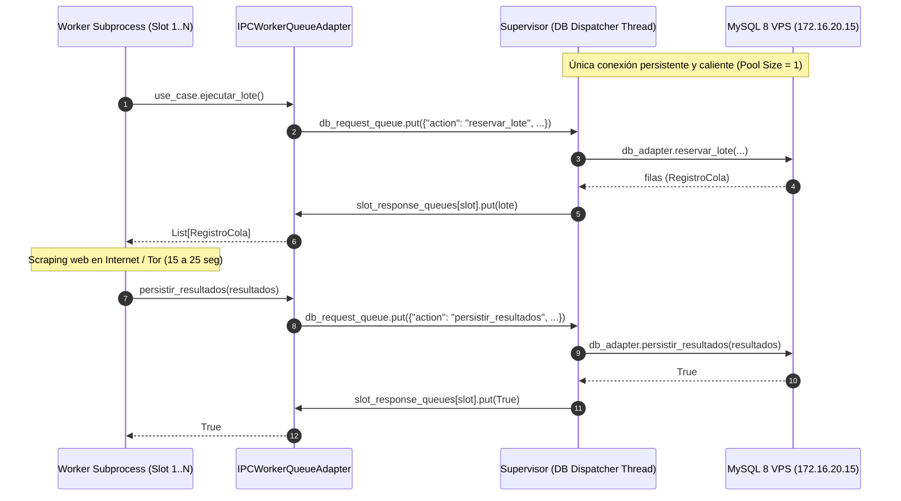

# Gestión de Pools de Conexión y Resiliencia ante Fallas de Red

Este documento describe la arquitectura de gestión de conexiones entre los subprocesos de scraping concurrentes y el servidor MySQL 8 del VPS central, documentando la creación de pools aislados por Process ID (`os.getpid()`), el protocolo de reintentos exponenciales, la verificación de vida de sockets (`ping/reconnect`) y la tolerancia a desconexiones de red o VPN.

---

## 1. El Peligro de Compartir Conexiones entre Subprocesos (`Forking Hazard`)

En entornos multiprocessing (especialmente en sistemas UNIX mediante `fork()` o en Windows mediante `multiprocessing.Process`), compartir instancias de sockets TCP o pools de base de datos entre diferentes procesos genera corrupción de frames a nivel de protocolo MySQL:
* Dos procesos leyendo o escribiendo paquetes simultáneamente en el mismo socket TCP producen excepciones del tipo `mysql.connector.errors.InternalError: Packet sequence number wrong` o cierres abruptos por `Lost connection to MySQL server`.

### Solución Arquitectónica: Pool Dedicado por PID
Para garantizar aislamiento físico absoluto, [`MySQLQueueAdapter`](file:///c:/Users/Usuario/Documents/GitHub/scrapers%20reg%20no%20llame/adapters/queue/mysql_vps_adapter.py#L39-L55) instancia un pool propio dentro de la memoria de cada subproceso worker instanciado en [`worker_lifecycle_process`](file:///c:/Users/Usuario/Documents/GitHub/scrapers%20reg%20no%20llame/runtime/worker_process.py#L58-L61):

```python
# runtime/worker_process.py
cola_repo = MySQLQueueAdapter(
    pool_size=3,
    pool_name=f"pool_{worker_slot}_{generation}_{os.getpid()}"
)
```

```python
# adapters/queue/mysql_vps_adapter.py
class MySQLQueueAdapter(IColaRepositorioPort):
    def __init__(self, pool_size: int = 5, pool_name: Optional[str] = None):
        p_name = pool_name or f"mysql_queue_pool_{os.getpid()}"
        self.table = config.VPS_DB_TABLE
        self._prio_exhausted_until: Dict[int, float] = {1: 0.0, 2: 0.0}

        self.pool = MySQLConnectionPool(
            pool_name=p_name,
            pool_size=pool_size,
            host=config.VPS_DBHOST,
            port=config.VPS_DBPORT,
            user=config.VPS_DBUSER,
            password=config.VPS_DBPASS,
            database=config.VPS_DBNAME,
            autocommit=False,
            connection_timeout=20
        )
```

---

## 2. Protocolo de Obtención de Conexión, Ping Activo y Reintentos Exponenciales

El método interno [`_get_connection`](file:///c:/Users/Usuario/Documents/GitHub/scrapers%20reg%20no%20llame/adapters/queue/mysql_vps_adapter.py#L56-L67) implementa un algoritmo resiliente de 4 intentos con retroceso exponencial (`exponential backoff`):



### Código Literal de la Implementación

```python
def _get_connection(self, max_retries: int = 4, retry_delay: float = 2.0):
    for attempt in range(1, max_retries + 1):
        try:
            conn = self.pool.get_connection()
            conn.ping(reconnect=True, attempts=3, delay=1)
            return conn
        except Exception as e:
            logger.warning(f"Reintento {attempt}/{max_retries} de conexión a VPS: {e}")
            if attempt == max_retries:
                raise
            time.sleep(retry_delay * (1.5 ** (attempt - 1)))
```

### Análisis de Parámetros
* `connection_timeout=20`: Establece un límite de 20 segundos para el handshake TCP contra el VPS, evitando que un worker quede congelado si la ruta de red no responde.
* `conn.ping(reconnect=True, attempts=3, delay=1)`: Antes de retornar la conexión del pool al hilo llamador, valida si el socket TCP sigue vivo. Si la conexión expiró por inactividad (`wait_timeout` en el servidor MySQL), el driver intenta reconectarse 3 veces antes de arrojar fallo.
* **Progresión de Espera**: `2.0s` (intento 1) -> `3.0s` (intento 2) -> `4.5s` (intento 3).

---

## 3. Persistencia en Lote Atómica con `executemany`

En [`MySQLQueueAdapter.persistir_resultados`](file:///c:/Users/Usuario/Documents/GitHub/scrapers%20reg%20no%20llame/adapters/queue/mysql_vps_adapter.py#L186-L244), los datos acumulados se guardan utilizando un único viaje de red (`round-trip`) mediante `executemany`:

```python
query = f"""
    UPDATE `{self.table}`
    SET scraper_actual = %s,
        estado = %s,
        descripcion_scraper = %s,
        fuente = %s,
        datos_json = %s,
        updated_at = CURRENT_TIMESTAMP
    WHERE id = %s
"""
cursor.executemany(query, valores)
conn.commit()
```

### Manejo de Excepciones y Rollback
Si ocurre un error durante el `executemany` (por ejemplo, timeout en la mitad del lote o socket cerrado):
1. Se invoca explícitamente `conn.rollback()`.
2. El cursor y la conexión se cierran en el bloque `finally` para retornar el descriptor de socket al pool.
3. El bucle de reintento (`max_intentos=3`) adquiere una conexión limpia y reintenta la persistencia completa del lote.

---

## 4. Centinela Watchdog Sweeper para Recuperación de Sockets Muertos

Si un subproceso worker sufre una falla catastrófica del sistema operativo (`kill -9`, corte de energía o crash del proceso antes de invocar `revertir_a_pendiente`), los registros que estaban siendo procesados permanecerían indefinidamente en `estado = 'procesando'`.

Para resolver esto, el hilo centinela [`SupervisorIndustrial._watchdog_sweeper_loop`](file:///c:/Users/Usuario/Documents/GitHub/scrapers%20reg%20no%20llame/runtime/supervisor.py#L97-L117) ejecuta periódicamente (cada 5 minutos) el caso de uso [`LiberarHuerfanosUseCase`](file:///c:/Users/Usuario/Documents/GitHub/scrapers%20reg%20no%20llame/core/use_cases/cleanup_orphans_use_case.py):

```sql
UPDATE `queue_registro_no_llame`
SET estado = 'pendiente',
    updated_at = CURRENT_TIMESTAMP
WHERE estado = 'procesando'
  AND updated_at < NOW() - INTERVAL 15 MINUTE;
```

De esta manera, cualquier registro asignado a un worker que haya desaparecido de la red es retornado automáticamente a la cola para ser consumido por un worker activo.

---

## 5. Arquitectura Despachador IPC: 1 Sola Conexión por Máquina Física

Para el despliegue concurrente en clústeres multi-PC (por ejemplo, 10 máquinas en la misma red local), instanciar un pool directo por cada subproceso worker generaría entre 80 y 100 conexiones simultáneas contra el VPS, comprometiendo el límite de `max_connections = 151` de MySQL 8.

Para solucionar este cuello de botella sin degradar el rendimiento, el sistema implementa la arquitectura de **Supervisor Despachador IPC**:



### Componentes de la Arquitectura IPC:
1. **[`IPCWorkerQueueAdapter`](file:///c:/Users/Usuario/Documents/GitHub/scrapers%20reg%20no%20llame/adapters/queue/ipc_adapter.py)**: Adaptador secundario que implementa [`IColaRepositorioPort`](file:///c:/Users/Usuario/Documents/GitHub/scrapers%20reg%20no%20llame/core/ports/queue_port.py). Los workers no importan conectores de red ni abren sockets TCP; se comunican a través de colas de memoria compartida ([`multiprocessing.Queue`](https://docs.python.org/3/library/multiprocessing.html#multiprocessing.Queue)) con latencia de transferencia en RAM menor a `0.1 ms`.
2. **Hilo Despachador Central (`_db_dispatcher_loop`)**: Ubicado en [`SupervisorIndustrial`](file:///c:/Users/Usuario/Documents/GitHub/scrapers%20reg%20no%20llame/runtime/supervisor.py), mantiene la única conexión caliente y persistente a MySQL de la máquina física, serializando las reservas y persistencias en bloques de 20 ms.
3. **Escalabilidad Multi-PC**: 10 computadoras ejecutando 7 a 9 workers consumen exactamente **10 conexiones totales en el servidor central MySQL**, dejando más de 140 conexiones libres para administración y monitoreo.

