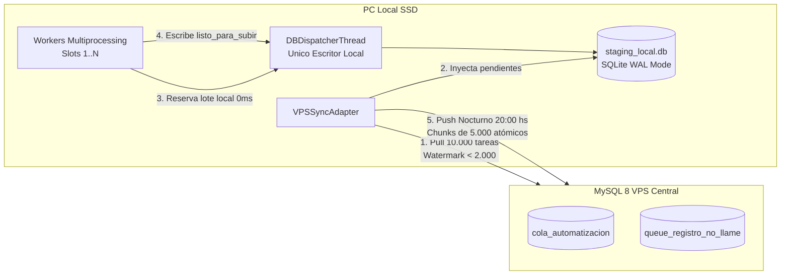

# Adaptador de Staging Local Offline-First (SQLite WAL)

> **Capa 03: Base de Datos y Colas** | Arquitectura Hexagonal y Persistencia Desacoplada

El adaptador [`SQLiteStagingAdapter`](file:///c:/Users/automatizacion.crm/Documents/GitHub/scrapers-reg-no-llame/adapters/queue/sqlite_staging_adapter.py) implementa los puertos [`IColaRepositorioPort`](file:///c:/Users/automatizacion.crm/Documents/GitHub/scrapers-reg-no-llame/core/ports/queue_port.py) e [`ISyncLocalRepoPort`](file:///c:/Users/automatizacion.crm/Documents/GitHub/scrapers-reg-no-llame/core/ports/sync_port.py), permitiendo la ejecución continua de workers en disco local SSD sin generar I/O continuo sobre el VPS central ni saturar los logs binarios (*binlogs*) de MySQL.

---

## 1. Arquitectura de Desacoplamiento Local



---

## 2. Esquema DDL SQLite: `tareas_staging`

La base de datos reside por defecto en `data/staging_local.db` y se inicializa con pragmas industriales:

```sql
PRAGMA journal_mode = WAL;
PRAGMA synchronous = NORMAL;
PRAGMA temp_store = MEMORY;
PRAGMA cache_size = -64000; -- 64 MB de caché en RAM
PRAGMA busy_timeout = 30000; -- 30s tolerancia a bloqueos

CREATE TABLE IF NOT EXISTS tareas_staging (
    id_vps BIGINT NOT NULL,
    tipo_cola TEXT NOT NULL,         -- 'cola_automatizacion' | 'registro_no_llame'
    numero_de_linea TEXT NOT NULL,
    dni TEXT,
    auto_id TEXT,                    -- Identificador de proceso (ej: 'telco_scraper')
    target_pc TEXT NOT NULL,         -- Identificador de nodo worker (ej: 'PC-00')
    scraper_actual TEXT,             -- Etapa del pipeline o motor ejecutado
    estado_local TEXT NOT NULL DEFAULT 'pendiente', -- 'pendiente' | 'en_proceso' | 'listo_para_subir' | 'sincronizado' | 'fallido'
    payload_origen TEXT,             -- JSON original transferido desde el VPS
    resultado_json TEXT,             -- JSON enriquecido con 100% de metadatos acumulados
    fuente TEXT,                     -- Array JSON de fuentes ('["enacom", "claro"]')
    scrapers_intentados TEXT,        -- Lista de motores consultados
    descripcion TEXT,
    latencia REAL DEFAULT 0.0,
    error_msg TEXT,
    reintentos_sync INTEGER DEFAULT 0,
    fecha_descarga DATETIME DEFAULT CURRENT_TIMESTAMP,
    fecha_procesado DATETIME,
    fecha_sincronizado DATETIME,
    PRIMARY KEY (id_vps, tipo_cola)
);

CREATE INDEX IF NOT EXISTS idx_staging_tipo_estado ON tareas_staging(tipo_cola, estado_local);
CREATE INDEX IF NOT EXISTS idx_staging_sincro ON tareas_staging(estado_local, fecha_sincronizado);
```

---

## 3. Estados de Ciclo de Vida Local

| Estado Local (`estado_local`) | Descripción | Disparador de Transición |
|---|---|---|
| `pendiente` | Tarea descargada del VPS lista para raspado local. | Pull matutino o recarga de watermark. |
| `en_proceso` | Tarea reservada por un worker en memoria. | `reservar_lote()` vía `DBDispatcherThread`. |
| `listo_para_subir` | Tarea raspada localmente con éxito (coincidencia o sin coincidencia). | `persistir_resultados()` local. |
| `fallido` | Error irrecuperable en scraping local (WAF, caída de proxy). | `persistir_resultados()` con status error. |
| `sincronizado` | Registros comprometidos exitosamente en MySQL VPS. | Push nocturno de las 20:00 hs. |

---

## 4. Métodos Principales de [`SQLiteStagingAdapter`](file:///c:/Users/automatizacion.crm/Documents/GitHub/scrapers-reg-no-llame/adapters/queue/sqlite_staging_adapter.py)

| Método | Parámetros | Retorno | Propósito Hexagonal |
|---|---|---|---|
| `reservar_lote` | `batch_size: int`, `scraper_nombre: str` | `List[RegistroCola]` | Reclama micro-lotes locales a 0ms sin tocar red. |
| `persistir_resultados` | `resultados: List[Dict[str, Any]]` | `bool` | Persiste en SQLite marcando `listo_para_subir`. |
| `revertir_a_pendiente` | `ids: List[int]` | `bool` | Recupera tareas si un worker concluye anticipadamente. |
| `liberar_huerfanos` | `minutos_inactividad: int = 15` | `int` | Watchdog local contra apagones o reinicios. |
| `insertar_tareas_descargadas` | `tareas: List[Dict]`, `tipo_cola: str` | `int` | Inyecta las 10.000 tareas del pull en SQLite. |
| `obtener_lote_para_push` | `limit: int = 5000`, `tipo_cola: str` | `List[Dict]` | Lee lotes para la subida masiva nocturna. |
| `marcar_como_sincronizados` | `ids_vps: List[int]`, `tipo_cola: str` | `bool` | Registra `fecha_sincronizado = NOW()`. |
| `purgar_antiguos` | `dias_retencion: int = 7` | `int` | Limpia registros sincronizados con > 7 días de resguardo. |
| `contar_pendientes` | `tipo_cola: str` | `int` | Evalúa el umbral mínimo para disparo de recarga. |

---

## 5. Documentos Relacionados

- [Adaptador de Cola Automatización](adaptador_cola_automatizacion.md)
- [Concurrencia SKIP LOCKED en VPS](concurrencia_skip_locked.md)
- [Casos de Uso de Sincronización](../02_dominio_y_casos_de_uso/casos_uso_sincronizacion.md)
- [Supervisor Inmortal y Scheduler](../06_runtime_y_concurrencia/supervisor_inmortal.md)
