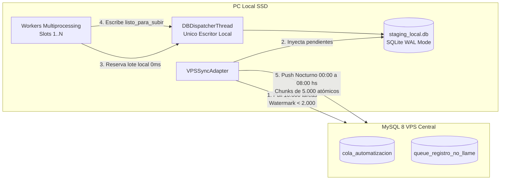

# Adaptador de Staging Local Offline-First (SQLite WAL)

> **Capa 03: Base de Datos y Colas** | Arquitectura Hexagonal y Persistencia Desacoplada

El adaptador [`SQLiteStagingAdapter`](file:///c:/Users/Usuario/Documents/GitHub/scrapers-reg-no-llame/adapters/queue/sqlite_staging_adapter.py) implementa los puertos [`IColaRepositorioPort`](file:///c:/Users/Usuario/Documents/GitHub/scrapers-reg-no-llame/core/ports/queue_port.py) e [`ISyncLocalRepoPort`](file:///c:/Users/Usuario/Documents/GitHub/scrapers-reg-no-llame/core/ports/sync_port.py), permitiendo la ejecución continua de workers en disco local SSD sin generar I/O continuo sobre el VPS central ni saturar los logs binarios (*binlogs*) de MySQL.

---

## 1. Arquitectura de Desacoplamiento Local



---

## 2. Esquema DDL SQLite: `tareas_staging`

La base de datos reside por defecto en `data/staging_local.db` y se inicializa con pragmas industriales:

```sql
PRAGMA journal_mode = WAL;
PRAGMA synchronous = NORMAL;
PRAGMA temp_store = MEMORY;
PRAGMA cache_size = -64000; -- 64 MB de caché en RAM
PRAGMA busy_timeout = 30000; -- 30s tolerancia a bloqueos

CREATE TABLE IF NOT EXISTS tareas_staging (
    id_vps BIGINT NOT NULL,
    tipo_cola TEXT NOT NULL,         -- 'cola_automatizacion' | 'registro_no_llame'
    numero_de_linea TEXT NOT NULL,
    dni TEXT,
    auto_id TEXT,                    -- Identificador de proceso (ej: 'telco_scraper')
    target_pc TEXT NOT NULL,         -- Identificador de nodo worker (ej: 'PC-00')
    scraper_actual TEXT,             -- Etapa del pipeline o motor ejecutado
    estado_local TEXT NOT NULL DEFAULT 'pendiente', -- 'pendiente' | 'en_proceso' | 'listo_para_subir' | 'sincronizado' | 'fallido'
    payload_origen TEXT,             -- JSON original transferido desde el VPS
    resultado_json TEXT,             -- JSON enriquecido con 100% de metadatos acumulados
    fuente TEXT,                     -- Array JSON de fuentes ('["enacom", "claro"]')
    scrapers_intentados TEXT,        -- Lista de motores consultados
    descripcion TEXT,
    latencia REAL DEFAULT 0.0,
    error_msg TEXT,
    reintentos_sync INTEGER DEFAULT 0,
    fecha_descarga DATETIME DEFAULT CURRENT_TIMESTAMP,
    fecha_procesado DATETIME,
    fecha_sincronizado DATETIME,
    PRIMARY KEY (id_vps, tipo_cola)
);

CREATE INDEX IF NOT EXISTS idx_staging_tipo_estado ON tareas_staging(tipo_cola, estado_local);
CREATE INDEX IF NOT EXISTS idx_staging_sincro ON tareas_staging(estado_local, fecha_sincronizado);
```

---

## 3. Estados de Ciclo de Vida Local

| Estado Local (`estado_local`) | Descripción | Disparador de Transición |
|---|---|---|
| `pendiente` | Tarea descargada del VPS lista para raspado local O posta intermedia del pipeline (ej: IRIS -> Telcos -> CuitOnline/Datuar -> BCRA). | Pull matutino, recarga watermark, o `persistir_resultados()` intermedio. |
| `en_proceso` | Tarea reservada por un worker en memoria. | `reservar_lote()` vía `DBDispatcherThread`. |
| `en_subida` | Tarea reservada atómicamente por el proceso de sincronización durante el push hacia el VPS. Previene colisiones multihilo/multiproceso. | `obtener_lote_para_push()` bajo transacción `BEGIN IMMEDIATE`. |
| `listo_para_subir` | Tarea que completó la totalidad de su pipeline local (`scraper_actual = 'finalizado'`) esperando push a VPS. | `persistir_resultados()` al finalizar la cadena. |
| `fallido` | Error fatal irrecuperable en scraping local (WAF, caída de proxy). | `persistir_resultados()` con status error. |
| `sincronizado` | Registros comprometidos exitosamente en MySQL VPS. | Push nocturno (ventana 00:00 a 08:00 hs) o CLI `--sync-now`. |

---

## 4. Métodos Principales de [`SQLiteStagingAdapter`](file:///c:/Users/Usuario/Documents/GitHub/scrapers-reg-no-llame/adapters/queue/sqlite_staging_adapter.py)

| Método | Parámetros | Retorno | Propósito Hexagonal |
|---|---|---|---|
| `reservar_lote` | `batch_size: int`, `scraper_nombre: str` | `List[RegistroCola]` | Reclama micro-lotes locales a 0ms sin tocar red. Prioriza registros con DNI para maximizar cobertura. |
| `persistir_resultados` | `resultados: List[Dict[str, Any]]` | `bool` | Persiste en SQLite marcando `listo_para_subir` solo si finalizó; si restan etapas, preserva `pendiente` y enriquece `payload_origen`. |
| `revertir_a_pendiente` | `ids: List[int]` | `bool` | Recupera tareas si un worker concluye anticipadamente. |
| `revertir_subida_a_listo` | `ids_vps: List[int]`, `tipo_cola: str` | `bool` | Devuelve registros de `en_subida` a `listo_para_subir` si falla o se interrumpe la subida. |
| `liberar_huerfanos` | `minutos_inactividad: int = 15` | `int` | Watchdog local contra caídas imprevistas (recupera `en_proceso` y `en_subida`). |
| `insertar_tareas_descargadas` | `tareas: List[Dict]`, `tipo_cola: str` | `int` | Inyecta tareas del pull en SQLite usando `ON CONFLICT DO NOTHING` para proteger el progreso local. |
| `obtener_lote_para_push` | `limit: int = 5000`, `tipo_cola: str` | `List[Dict]` | Reclama atómicamente registros como `en_subida` para el push masivo al VPS. |
| `marcar_como_sincronizados` | `ids_vps: List[int]`, `tipo_cola: str` | `bool` | Registra `fecha_sincronizado = NOW()` y estado `sincronizado`. |
| `purgar_antiguos` | `dias_retencion: int = 7` | `int` | Limpia registros sincronizados con > 7 días de resguardo. |
| `contar_pendientes` | `tipo_cola: str`, `scraper_actual: str` | `int` | Evalúa el umbral mínimo para disparo de recarga por scraper o global. |
| `contar_listos_para_subir` | `tipo_cola: str` | `int` | Cantidad de registros en espera de subida al VPS. |


---

## 5. Política de Priorización por DNI Exclusiva para Telcos

En la invocación de `reservar_lote(batch_size, scraper_nombre)`:
- Si `canon == "telcos"`:
  ```sql
  SELECT id_vps, numero_de_linea, dni, auto_id, target_pc, payload_origen, resultado_json, fuente
  FROM tareas_staging
  WHERE tipo_cola = ? AND estado_local = 'pendiente'
  ORDER BY (dni IS NOT NULL AND dni != '') DESC, id_vps ASC
  LIMIT ?
  ```
  Esto garantiza que el worker local reciba primero todas las tareas que cuentan con DNI disponible, permitiendo evaluar Claro, Personal y Movistar en cascada completa. Una vez agotadas las tareas con DNI, se consumen aquellas sin DNI (donde Claro se omite y solo se consultan Personal y Movistar).
- Si `canon != "telcos"`:
  ```sql
  ORDER BY id_vps ASC
  ```
  Los demás scrapers (`iris`, `claro`, `datuar`, etc.) consumen en orden secuencial estricto sin discriminación por DNI.

---

## 6. Documentos Relacionados

- [Adaptador de Cola Automatización](adaptador_cola_automatizacion.md)
- [Guía Cascada Telcos](../05_guia_nuevos_scrapers/guia_cascada_telcos.md)
- [Concurrencia SKIP LOCKED en VPS](concurrencia_skip_locked.md)
- [Casos de Uso de Sincronización](../02_dominio_y_casos_de_uso/casos_uso_sincronizacion.md)
- [Supervisor Inmortal y Scheduler](../06_runtime_y_concurrencia/supervisor_inmortal.md)

