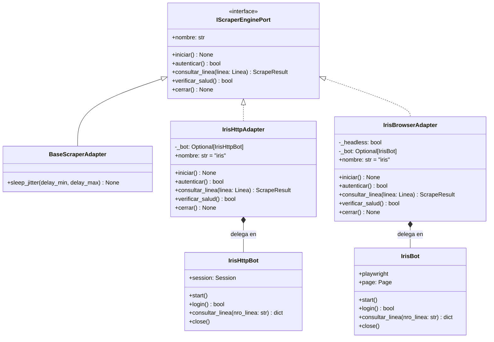

# Adaptadores Hexagonales de IRIS: HTTP vs Browser

Este documento describe la arquitectura de los dos adaptadores secundarios que implementan el puerto de extracción [`IScraperEnginePort`](file:///c:/Users/Usuario/Documents/GitHub/scrapers%20reg%20no%20llame/core/ports/scraper_port.py):
1. [`IrisHttpAdapter`](file:///c:/Users/Usuario/Documents/GitHub/scrapers%20reg%20no%20llame/adapters/scrapers/iris/iris_http_adapter.py)
2. [`IrisBrowserAdapter`](file:///c:/Users/Usuario/Documents/GitHub/scrapers%20reg%20no%20llame/adapters/scrapers/iris/iris_browser_adapter.py)

Ambos adaptadores encapsulan la complejidad de red, autenticación, sesión y scraping, ofreciendo una interfaz uniforme y limpia hacia la capa de casos de uso ([`ProcesarLoteUseCase`](file:///c:/Users/Usuario/Documents/GitHub/scrapers%20reg%20no%20llame/core/use_cases/process_batch_use_case.py)).

---

## 1. Diagrama de Arquitectura de Adaptadores



---

## 2. Implementación de los Métodos del Contrato

### 2.1. Propiedad `nombre`
Ambos adaptadores devuelven la cadena `"iris"` como su identificador único de fuente en el pipeline. Esto permite que el caso de uso y el sistema de enriquecimiento reconozcan la información sin importar si provino de HTTP o Browser.

### 2.2. Ciclo de Vida: `iniciar()` y `cerrar()`
- **HTTP**: [`IrisHttpAdapter.iniciar()`](file:///c:/Users/Usuario/Documents/GitHub/scrapers%20reg%20no%20llame/adapters/scrapers/iris/iris_http_adapter.py#L22-L25) instancia `IrisHttpBot` y configura los pools de sockets TCP con reintentos HTTP automáticos. `cerrar()` cierra la sesión `requests` y libera descriptores de archivo.
- **Browser**: [`IrisBrowserAdapter.iniciar()`](file:///c:/Users/Usuario/Documents/GitHub/scrapers%20reg%20no%20llame/adapters/scrapers/iris/iris_browser_adapter.py#L23-L26) levanta el subproceso `node` de Playwright, arranca el proceso Chromium e inicializa el `BrowserContext`. `cerrar()` cierra context, browser y termina el runtime de Playwright.

### 2.3. Autenticación Perezosa (*Lazy Auth*) en `consultar_linea`
Ambos adaptadores implementan un patrón de inicialización y autenticación tolerante a fallos:

```python
def consultar_linea(self, linea: Linea) -> ScrapeResult:
    if not self._bot:
        self.iniciar()
        self.autenticar()

    datos = self._bot.consultar_linea(linea.ani)
    # Proceso de normalización a ScrapeResult...
```

Si el worker se inicia pero aún no ha recibido tareas de la cola, no consume conexiones remotas de forma prematura.

---

## 3. Matriz de Resultados y Manejo de Casos Nulos

El bot subyacente retorna `None` cuando:
1. La línea no existe en la base de datos de Movistar IRIS.
2. La línea existe pero ninguna de las filas de la grilla corresponde a una operación de tipo **Port Out**.

En este escenario, el adaptador construye un `ScrapeResult` estandarizado de resultado negativo:

```python
if not datos:
    return ScrapeResult(
        ani=linea.ani,
        status=StatusScraping.SIN_COINCIDENCIA,
        fuente_scraper=self.nombre,
        descripcion="Sin registros en IRIS / No posee Port Out",
        detalles={"mensaje": "Sin registros en IRIS / No posee Port Out"}
    )
```

Cuando se obtienen datos válidos, se instancian las entidades de valor `Titular` y `Servicio`, asignando el estado `StatusScraping.COINCIDENCIA`:

```python
nom_tit = f"{titular.nombre} {titular.apellido}".strip()
desc = f"Port Out - Titular: {nom_tit} | Doc: {titular.nro_documento}"[:195]

return ScrapeResult(
    ani=linea.ani,
    status=StatusScraping.COINCIDENCIA,
    fuente_scraper=self.nombre,
    operador=datos.get("operador_receptor", "Movistar"),
    operador_receptor=datos.get("operador_receptor", ""),
    titular=titular,
    servicio=servicio,
    fechas=fechas,
    detalles=detalles,
    raw=datos,
    descripcion=desc
)
```

---

## 4. Captura de Excepciones y Circuito de Salud (`verificar_salud`)

Los adaptadores aíslan al caso de uso de cualquier error de transporte de red o parseo.
- [`IrisHttpAdapter.verificar_salud()`](file:///c:/Users/Usuario/Documents/GitHub/scrapers%20reg%20no%20llame/adapters/scrapers/iris/iris_http_adapter.py#L103-L107) comprueba la accesibilidad del portal WebLogic sin incurrir en un ciclo de búsqueda pesado.
- [`IrisBrowserAdapter.verificar_salud()`](file:///c:/Users/Usuario/Documents/GitHub/scrapers%20reg%20no%20llame/adapters/scrapers/iris/iris_browser_adapter.py#L104-L106) comprueba que la referencia de la página de Playwright permanezca abierta y no haya colapsado por fallas del proceso Chromium.

Si ocurre un error imprevisto (ej. `ConnectionRefusedError`, `PlaywrightTimeoutError`), [`ProcesarLoteUseCase`](file:///c:/Users/Usuario/Documents/GitHub/scrapers%20reg%20no%20llame/core/use_cases/process_batch_use_case.py#L102-L120) captura la excepción en el nivel superior del lote, registra la traza, trunca el mensaje a 195 caracteres y marca el registro como `error` sin botar el proceso daemon.

---

## 5. Guardia Defensiva de Horario Comercial Oficial

Dado que IRIS es una plataforma corporativa oficial de Movistar, tanto [`IrisHttpAdapter`](file:///c:/Users/Usuario/Documents/GitHub/scrapers%20reg%20no%20llame/adapters/scrapers/iris/iris_http_adapter.py) como [`IrisBrowserAdapter`](file:///c:/Users/Usuario/Documents/GitHub/scrapers%20reg%20no%20llame/adapters/scrapers/iris/iris_browser_adapter.py) integran una **guardia defensiva interna** gobernada por [`PoliticaHorarioComercial`](file:///c:/Users/Usuario/Documents/GitHub/scrapers%20reg%20no%20llame/core/domain/schedule.py):

* **Ventana habilitada**: Lunes a Viernes de `08:00` a `21:00`, Sábados de `08:00` a `13:00` (UTC-3 / Argentina).
* **Validación en Entrada**: Antes de emitir peticiones de login (`autenticar()`) o consultas de líneas (`consultar_linea()`), se invoca `_validar_horario()`.
* **Excepción de Dominio**: Si la petición se realiza fuera de horario sin autorización, se interrumpe inmediatamente lanzando [`FueraDeHorarioComercialException`](file:///c:/Users/Usuario/Documents/GitHub/scrapers%20reg%20no%20llame/core/domain/exceptions.py).
* **Bypass de Pruebas**: Para tareas de desarrollo puntual, ambos adaptadores aceptan el parámetro `forzar_horario: bool = True` (activable mediante `--forzar-horario` en CLI).

---

## Enlaces Relacionados
* [08. Política de Horario Comercial Oficial](../02_dominio_y_casos_de_uso/politica_horario_comercial.md)
* [23. Supervisor Inmortal](../06_runtime_y_concurrencia/supervisor_inmortal.md)
* [26. Comandos de la CLI Principal](../07_operacion_y_runbooks/comandos_cli_main.md)
