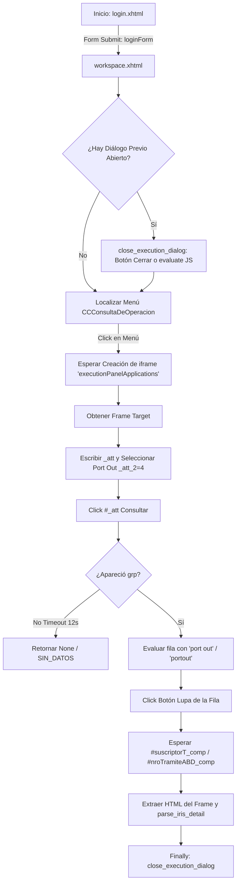

# Automatización de Navegador: Playwright Chromium en IRIS Movistar

Este documento documenta en detalle la implementación del motor de automatización de navegador basado en **Playwright (Chromium)**, contenido en [`IrisBot`](file:///c:/Users/Usuario/Documents/GitHub/scrapers%20reg%20no%20llame/adapters/scrapers/iris/iris_bot.py) y expuesto a través de [`IrisBrowserAdapter`](file:///c:/Users/Usuario/Documents/GitHub/scrapers%20reg%20no%20llame/adapters/scrapers/iris/iris_browser_adapter.py).

Aunque el motor HTTP ([`IrisHttpBot`](file:///c:/Users/Usuario/Documents/GitHub/scrapers%20reg%20no%20llame/adapters/scrapers/iris/iris_http_bot.py)) es el preferido por rendimiento, el motor de navegador headless cumple dos funciones estratégicas vitales:
1. **Mecanismo de Fallback**: Permite continuar la operación si Movistar actualiza tokens ofuscados o mecanismos anti-bot a nivel HTTP.
2. **Inspección Visual y Depuración (Headful)**: Diagnóstico visual del portal IRIS en tiempo real mediante `HEADLESS=False`.

---

## 1. Configuración y Lanzamiento de Chromium

El arranque del navegador se ejecuta en [`IrisBot.start()`](file:///c:/Users/Usuario/Documents/GitHub/scrapers%20reg%20no%20llame/adapters/scrapers/iris/iris_bot.py#L23-L51) utilizando flags de optimización y evasión de bloqueos en entornos Linux/Windows:

```python
launch_args = ["--no-sandbox", "--disable-dev-shm-usage"]
if not self.headless:
    launch_args.append("--start-maximized")
    self.browser = self.playwright.chromium.launch(
        headless=False,
        slow_mo=80,
        args=launch_args
    )
    self.context = self.browser.new_context(no_viewport=True)
else:
    launch_args.extend(["--window-size=1920,1080"])
    self.browser = self.playwright.chromium.launch(
        headless=True,
        slow_mo=20,
        args=launch_args
    )
    self.context = self.browser.new_context(
        viewport={"width": 1920, "height": 1080},
        user_agent="Mozilla/5.0 (Windows NT 10.0; Win64; x64) AppleWebKit/537.36 (KHTML, like Gecko) Chrome/122.0.0.0 Safari/537.36"
    )
```

### Prevención de Congelamientos por Diálogos Nativos
La aplicación JSF de IRIS ocasionalmente dispara ventanas modales `window.alert()` o `window.confirm()`. Para evitar que el proceso de scraping quede bloqueado indefinidamente esperando interacción humana, se registra un listener global:

```python
self.page.on("dialog", lambda dialog: dialog.dismiss())
```

---

## 2. Flujo de Navegación y Gestión de iframes Fuego BPM

El portal IRIS organiza sus componentes dentro de portlets dinámicos y marcos aislados (`<iframe>`). El flujo operativo recorre las siguientes etapas:



---

## 3. Selectores de Playwright y Resolución de Elementos

### 3.1. Formulario de Autenticación
- **Input Usuario**: `input[id='loginForm:workspace_login_user_name']`
- **Input Clave**: `input[id='loginForm:workspace_login_password']`
- **Botón Ingreso**: `input[id='loginForm:submitbutton']`
- **Condición de Éxito**: Navegación confirmada hacia `/workspace.xhtml` con estado de red `networkidle`.

### 3.2. Botón del Menú de Aplicaciones
La interfaz JSF puede renderizar la opción con etiquetas de enlace o `<span>` y nombres levemente diferentes según el perfil de usuario:
```xpath
//a[contains(@title, 'CCConsultaDeOperacion')] | 
//span[contains(text(), 'CCConsultaDeOperacion')] | 
//a[contains(@title, 'ConsultaDeOperacion')] | 
//span[contains(text(), 'ConsultaDeOperacion')] | 
//span[contains(text(), 'Consulta de operacion')]
```

### 3.3. Detección y Amarre del `<iframe>` de Consulta
El motor Fuego BPM incrusta el formulario de consulta dentro de un frame dinámico identificado como `executionPanelApplications`. El bot implementa un bucle de sondeo de hasta 15 segundos con validación de visibilidad de los inputs:

```python
target_frame = None
for _ in range(15):
    target_frame = self.page.frame("executionPanelApplications")
    if not target_frame:
        for f in self.page.frames:
            if f.locator("input[name='_att']").count() > 0:
                target_frame = f
                break
    if target_frame and target_frame.locator("input[name='_att']").is_visible():
        break
    time.sleep(1)
```

### 3.4. Formulario de Entrada y Filtros
- **Número de Línea**: `input[name='_att']` (se limpia previamente con `filter(str.isdigit)` asegurando 10 dígitos numéricos).
- **Filtro Port Out**: `select[name='_att_2'] -> .select_option("4")`.
- **Botón Ejecutar Consulta**: `#_att` (se escapa el signo dólar característico de Fuego BPM).

### 3.5. Detección Inteligente de la Fila Port Out vía Inyección JS
Para evitar errores por ordenamiento variable o filas mixtas (ej. consultas previas, migraciones internas), se inyecta una función JavaScript en el contexto del iframe que evalúa el contenido textual de cada fila `<tr>` asociada a un botón de detalle:

```javascript
() => {
    const btns = Array.from(document.querySelectorAll("input[id*='grp']"));
    for (const btn of btns) {
        const row = btn.closest("tr");
        const rowText = row ? row.innerText.toLowerCase() : "";
        if (rowText.includes("port out") || rowText.includes("portout") || rowText.includes("solicitud portout")) {
            return btn.id;
        }
    }
    return null;
}
```

### 3.6. Cierre del Diálogo Modal (Ciclo Limpio)
Para prevenir acumulación de pestañas modales y fugas de estado DOM entre consultas consecutivas, [`close_execution_dialog()`](file:///c:/Users/Usuario/Documents/GitHub/scrapers%20reg%20no%20llame/adapters/scrapers/iris/iris_bot.py#L112-L141) implementa una estrategia defensiva de tres niveles:
1. **Selector directo ID**: `#portletComponentApplications_menuActionNormalModeApplications_executionDialogViewApplications_executionDialogApplications_CloseButton`
2. **Selector XPath alternativo**: `//input[@title='Cerrar'][contains(@id, 'executionDialogApplications_CloseButton')]`
3. **Fallback JavaScript nativo**:
   ```javascript
   const dlg = oc?.Page?.['portletComponentApplications_menuActionNormalModeApplications_executionDialogViewApplications_executionDialogApplications'];
   if (dlg && dlg.close) dlg.close();
   ```

---

## 4. Estrategia de Auto-Sanación (*Self-Healing*)

En entornos de alta carga o redes inestables, el portal puede cerrar la sesión o mostrar páginas intermedias de error. [`ensure_in_query_screen()`](file:///c:/Users/Usuario/Documents/GitHub/scrapers%20reg%20no%20llame/adapters/scrapers/iris/iris_bot.py#L142-L226) audita el estado del navegador antes de cada consulta:
- **Expiración de Sesión**: Si detecta `login.xhtml` o inputs de login visibles, reinvoca `self.login()`.
- **Navegación Extraviada**: Si la URL no contiene `workspace.xhtml`, fuerza una redirección hacia la URL base de Workspace.
- **Ventanas Congeladas**: Si el diálogo está abierto pero no muestra el formulario de búsqueda, lo cierra y reabre desde el menú lateral.
