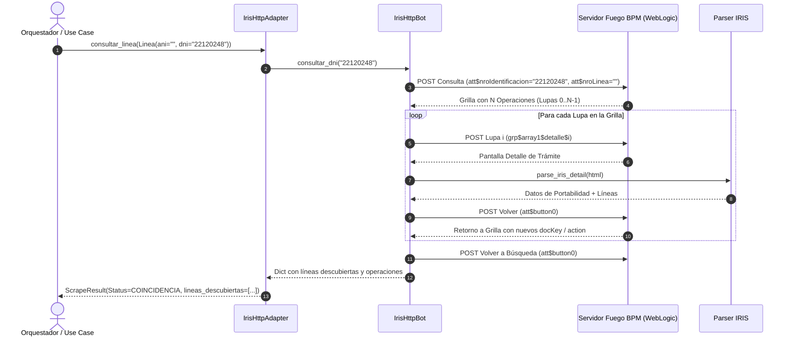

# Búsqueda por DNI y Extracción Multi-Lupa en IRIS Movistar

> **Capa 04: Scrapers IRIS** | Módulo de Extracción Avanzada  
> **Adaptador**: [`IrisHttpAdapter`](file:///c:/Users/Usuario/Documents/GitHub/scrapers-reg-no-llame/adapters/scrapers/iris/iris_http_adapter.py) | [`IrisHttpBot`](file:///c:/Users/Usuario/Documents/GitHub/scrapers-reg-no-llame/adapters/scrapers/iris/iris_http_bot.py)  
> **Parser Asociado**: [`parse_iris_detail`](file:///c:/Users/Usuario/Documents/GitHub/scrapers-reg-no-llame/adapters/scrapers/iris/parser.py)

---

## 1. Propósito y Visión General

Tradicionalmente, las consultas sobre el portal BPM de Movistar IRIS se ejecutaban exclusivamente por número de línea telefónica (`ani` en el campo `att$nroLinea`). La funcionalidad de **Búsqueda por DNI** permite ingresar el número de documento de identidad en el campo `att$nroIdentificacion`, recuperando el historial completo de operaciones de portabilidad asociadas al titular.

Dado que un titular puede registrar múltiples trámites históricos (Port Out, Port In, Altas o Cambios) y cada trámite puede involucrar múltiples números de teléfono, el motor implementa un **algoritmo de extracción exhaustiva multi-lupa**:
1. Envía el DNI a través de la petición HTTP POST de búsqueda (`att$nroIdentificacion`).
2. Identifica todas las filas presentes en la grilla de resultados (`grp$array1$detalle$0`, `grp$array1$detalle$1`, ...).
3. Abre cada trámite pulsando la lupa correspondiente, extrae los detalles mediante [`parse_iris_detail`](file:///c:/Users/Usuario/Documents/GitHub/scrapers-reg-no-llame/adapters/scrapers/iris/parser.py), recolecta todas las líneas telefónicas involucradas y retorna a la grilla presionando `att$button0` (Volver).
4. Consolida el conjunto único de líneas descubiertas para ser inyectadas en las fases posteriores del pipeline (Claro, Personal y Movistar).



---

## 2. Parámetros Técnicos del Formulario WebLogic

| Parámetro POST | Tipo | Descripción |
| :--- | :--- | :--- |
| `att$nroIdentificacion` | String | Número de DNI normalizado (ej. `"22120248"`). |
| `att$nroLinea` | String | Cadena vacía `""` cuando se consulta por DNI. |
| `xo$ChangedAtts` | String | `"att$nroIdentificacion,"` para notificar al listener JSF. |
| `xo$AttName` | String | `"att$button6"` para disparar la búsqueda. |
| `xo$Action` | String | `"11"` (Acción estándar de ejecución). |
| `xo$DocSessKey` | String | Token de sesión del formulario activo (`docKey`). |
| `xo$executionType` | String | `"rscript"` (Motor de ejecución Fuego). |

---

## 3. Navegación Multi-Lupa y Garantía de Idempotencia

Para evitar desincronizaciones en el servidor WebLogic durante la iteración de múltiples trámites:

```python
for idx, op in enumerate(filas_operaciones):
    lupa_id = op["lupa_id"]
    # 1. Petición POST para abrir la lupa específica
    detail_post_url = f"http://iris.tmoviles.com.ar{current_action}&C=undefined&U={int(time.time() * 1000)}"
    detail_payload = {
        "xo$Action": "11",
        "xo$AttName": lupa_id,
        "xo$ChangedAtts": "",
        "xo$DocSessKey": current_doc_key,
        "xo$ScreenSessKey": "0",
        "xo$executionType": "rscript"
    }
    r_detail_post = self.session.post(detail_post_url, data=detail_payload, timeout=25)
    
    # 2. GET del detalle y parseo exhaustivo
    r_detail = self.session.get("http://iris.tmoviles.com.ar" + finish_url, timeout=25)
    det_datos = parse_iris_detail(r_detail.text)

    # 3. Retorno obligatorio a la tabla con att$button0
    back_payload = {
        "xo$Action": "11",
        "xo$AttName": "att$button0",
        "xo$DocSessKey": det_doc_key,
        "xo$executionType": "rscript"
    }
    r_back = self.session.post(back_url, data=back_payload, timeout=25)
    
    # 4. Actualización de tokens de la tabla para la siguiente iteración
    current_doc_key = nuevo_doc_key
    current_action = nuevo_action
```

---

## 4. Estructura de Datos Consolidada

El adaptador [`IrisHttpAdapter`](file:///c:/Users/Usuario/Documents/GitHub/scrapers-reg-no-llame/adapters/scrapers/iris/iris_http_adapter.py) retorna un [`ScrapeResult`](file:///c:/Users/Usuario/Documents/GitHub/scrapers-reg-no-llame/core/domain/entities.py) enriquecido con el payload:

```json
{
  "status": "coincidencia",
  "fuente": "iris",
  "operador": "Movistar",
  "operador_receptor": "Claro",
  "titular": {
    "nombre": "VERA ROSALIA BEATRIZ",
    "tipo_documento": "Documento Nacional Identidad",
    "nro_documento": "22120248"
  },
  "detalles": {
    "dni": "22120248",
    "total_lineas": 5,
    "lineas_descubiertas": ["2625407179", "2625411000", "2625412867", "2625522348", "2625674358"],
    "total_registros_historicos": 3,
    "operaciones": [
      {
        "nro_tramite": "202003051243345559952",
        "operacion": "Port Out",
        "operador_receptor": "Claro",
        "lineas": ["2625674358"]
      },
      {
        "nro_tramite": "201908261733575551794",
        "operacion": "Port Out",
        "operador_receptor": "Claro",
        "lineas": ["2625522348"]
      },
      {
        "nro_tramite": "201911211507455558501",
        "operacion": "Port Out",
        "operador_receptor": "Claro",
        "lineas": ["2625407179", "2625411000", "2625412867"]
      }
    ]
  }
}
```
