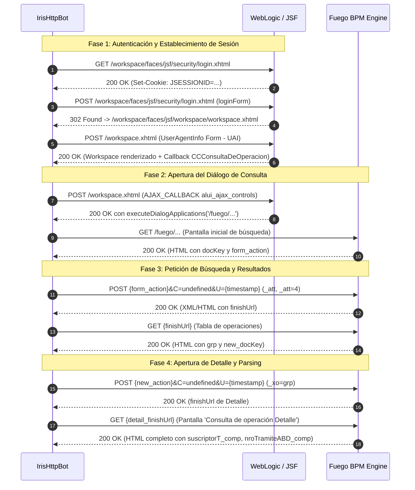

# Ingeniería Inversa del Protocolo HTTP de IRIS Movistar

Este documento detalla el análisis exhaustivo de ingeniería inversa realizado sobre el portal de operaciones **Movistar IRIS** (sustentado sobre la infraestructura legacy de **Oracle WebLogic Server**, **BEA AquaLogic User Interaction / Plumtree** y el motor de procesos de negocio **Fuego BPM / Oracle BPM 10g/11g**).

El cliente HTTP puro está implementado en [`IrisHttpBot`](file:///c:/Users/Usuario/Documents/GitHub/scrapers-reg-no-llame/adapters/scrapers/iris/iris_http_bot.py#L30-L264), el cual reemplaza la sobrecarga de renderizado del navegador emitiendo peticiones directas de servlets.

---

## 1. Arquitectura y Pila Tecnológica del Servidor Remoto

El servidor `http://iris.tmoviles.com.ar` no expone una API REST moderna; su interfaz gráfica se basa en tecnologías corporativas Java EE:

1. **Servidor de Aplicaciones**: Oracle WebLogic Application Server.
2. **Framework de Presentación**: JavaServer Faces (JSF 1.1/1.2 / Apache MyFaces / Oracle ADF Faces primitivo).
3. **Motor BPM**: Fuego BPM Engine (adquirido por BEA Systems y luego Oracle), integrado con portal Plumtree / ALUI (*AquaLogic User Interaction*).
4. **Mecanismo de Interacción Asíncrona**: AJAX propietario basado en bibliotecas JavaScript `oc.ajax.jsf` y servlets de script de Fuego.
5. **Sesiones y Estado**:
   - Cookie `JSESSIONID` ligada al host y contexto `/workspace`.
   - Variables de contexto y claves efímeras de formularios: `docKey`, `_xo`, `_xov`.

### Comparativa: Motor HTTP vs Playwright Chromium

| Métrica / Dimensión | Playwright Headless ([`IrisBot`](file:///c:/Users/Usuario/Documents/GitHub/scrapers-reg-no-llame/adapters/scrapers/iris/iris_bot.py)) | HTTP Puro ([`IrisHttpBot`](file:///c:/Users/Usuario/Documents/GitHub/scrapers-reg-no-llame/adapters/scrapers/iris/iris_http_bot.py)) | Beneficio / Razón |
| :--- | :--- | :--- | :--- |
| **Latencia por consulta** | 15 a 22 segundos | **4 a 8 segundos** | Eliminación del parseo DOM, CSSOM y scripts JS pesados. |
| **Consumo de Memoria RAM** | ~1.200 MB por worker | **~35 MB por worker** | Reducción del 97% del footprint en memoria. |
| **Estabilidad a largo plazo** | Fugas de memoria del motor V8 | **Cero fugas de memoria** | Sesión HTTP stateless reutilizable vía socket pooling. |
| **Escalabilidad concurrente** | 2 a 4 instancias por VM | **20 a 30 workers** en la misma máquina | Limitado únicamente por ancho de banda y conexiones socket. |

---

## 2. Flujo Completo del Protocolo y Diagrama de Secuencia

El ciclo de vida de una consulta requiere atravesar 6 pasos secuenciales obligatorios:



---

## 3. Detalle Exhaustivo de Endpoints y Payloads

### 3.1. GET Inicial de Login
- **URL**: `http://iris.tmoviles.com.ar/workspace/faces/jsf/security/login.xhtml`
- **Método**: `GET`
- **Cabeceras**:
  ```http
  User-Agent: Mozilla/5.0 (Windows NT 10.0; Win64; x64) AppleWebKit/537.36 (KHTML, like Gecko) Chrome/122.0.0.0 Safari/537.36
  Accept: text/html,application/xhtml+xml,application/xml;q=0.9,*/*;q=0.8
  Connection: keep-alive
  ```
- **Propósito**: Obtener la cookie de sesión inicial `JSESSIONID`.

### 3.2. POST de Credenciales
- **URL**: `http://iris.tmoviles.com.ar/workspace/faces/jsf/security/login.xhtml`
- **Método**: `POST`
- **Content-Type**: `application/x-www-form-urlencoded`
- **Form Data (Exacto)**:
  ```urlext
  loginForm:workspace_login_user_name = <IRIS_USER>
  loginForm:workspace_login_password  = <IRIS_PASS>
  loginForm:fix_enter_4_ie            = 
  loginForm:submitbutton              = Login
  loginForm                           = loginForm
  ```
- **Respuesta esperada**: Redirección HTTP 302 hacia `/workspace/faces/jsf/workspace/workspace.xhtml`.

### 3.3. POST de Inicialización de Workspace (UserAgentInfo Form)
JSF requiere un handshake inicial de capacidades del cliente para fijar la zona horaria y plugins:
- **URL**: `http://iris.tmoviles.com.ar/workspace/faces/jsf/workspace/workspace.xhtml`
- **Método**: `POST`
- **Form Data**:
  ```urlext
  useragentinfo                  = true
  useragentinfojavapluginenabled = false
  useragentinfotimezone          = 180
  ```
- **Extracción de la llamada AJAX**:
  En el HTML resultante, se busca el callback que invoca la aplicación `CCConsultaDeOperacion`:
  ```python
  app_link = re.search(
      r"oc\.ajax\.jsf\.doCallback\('portletComponentApplications','([^']+)'\)[^>]*title=\"[^\"]*CCConsultaDeOperacion\"", 
      r_uai.text
  )
  ```
  Esto extrae el identificador del enlace (por defecto: `portletComponentApplications:menuActionNormalModeApplications:_id185:2:applicationLink`).

### 3.4. POST AJAX Callback: Apertura de Pantalla de Búsqueda
- **URL**: `http://iris.tmoviles.com.ar/workspace/faces/jsf/workspace/workspace.xhtml`
- **Método**: `POST`
- **Cabeceras Específicas de ALUI**:
  ```http
  alui_request_type: AJAX_CALLBACK
  pt-httprequest-type: CLIENT_SIDE
  alui_ajax_controls: portletComponentApplications:menuActionNormalModeApplications:_id185:2:applicationLink
  content-type: application/x-www-form-urlencoded
  referer: http://iris.tmoviles.com.ar/workspace/faces/jsf/workspace/workspace.xhtml
  ```
- **Form Data**:
  ```urlext
  portletComponentApplications:menuActionNormalModeApplications:executionDialogViewApplications:abortExecutionListener = 
  portletComponentApplications = portletComponentApplications
  ```
- **Respuesta**:
  Devuelve un fragmento script conteniendo:
  ```javascript
  executeDialogApplications('/fuego/process/workspace/runProcessInstance?...');
  ```
  Se realiza un `GET` a esa URL relativa para descargar el formulario de búsqueda.

### 3.5. Extracción de Tokens Fuego (`docKey` y `form_action`)
Dentro del HTML del diálogo cargado, Fuego BPM inyecta las credenciales de ejecución del formulario:
```html
<script type="text/javascript">
    var docKey = 'a1b2c3d4e5f6...';
</script>
<form name="mainForm" action="/fuego/process/workspace/actionServlet?id=12345" method="POST">
```
Regex utilizadas:
- `doc_key`: `var docKey\s*=\s*'([^']+)';`
- `form_action`: `<FORM[^>]*action=([^ >]+)`

### 3.6. POST de Búsqueda por Línea (Sin Filtros Restrictivos)
- **URL**: `http://iris.tmoviles.com.ar{form_action}&C=undefined&U={epoch_ms}`
- **Método**: `POST`
- **Payload Fuego Engine**:
  ```json
  {
    "xo$Action": "11",
    "xo$AttName": "att$button6",
    "xo$ChangedAtts": "att$nroLinea,",
    "xo$DocSessKey": "<doc_key>",
    "xo$ScreenSessKey": "0",
    "xo$executionType": "rscript",
    "att$nroLinea": "1123456789",
    "": "undefined"
  }
  ```
  > [!NOTE]
  > Se omite intencionalmente cualquier parámetro de filtro (`att$combo3 = 4`) para capturar el historial íntegro de la línea en Movistar IRIS (incluyendo Altas, Cambios de plan, Port In y Port Out). `att$button6` corresponde al evento del botón Consultar.

- **Extracción de `finishUrl`**:
  La respuesta entrega una directiva de navegación interna:
  ```html
  <DIV id="fobject$finishUrl" url="/workspace/servlet/executor?..."/>
  ```
  Se realiza un `GET` a dicha `finishUrl` para acceder a la grilla de resultados.

### 3.7. Detección de Operaciones Múltiples y Navegación Bidireccional
1. **Detección de Resultados**: Si la tabla contiene `0 - 0/ 0` o carece de elementos `grp$array1$detalle$*`, se determina inmediatamente `StatusScraping.SIN_COINCIDENCIA` sin incurrir en peticiones adicionales.
2. **Extracción de Todas las Filas**: Si existen operaciones, se recorre cada fila de la grilla extrayendo sus columnas base:
   - `canal`: Canal o Agente comercial.
   - `operacion`: Tipo de trámite (`Altas`, `Cambios`, `Port Out`, etc.).
   - `producto`: Plan (`Control`, `Full`, etc.).
   - `formulario`: Código de formulario BPM (`PR - Alta de Linea T3`, `CH - Cambios T3`, `PS - Solicitud PortOut`).
   - `nro_tramite`: Identificador numérico del formulario en Fuego BPM.
   - `fecha_alta`: Fecha de inicio del trámite.
   - `estado`: Estado actual (`Controlado - Autorizado`, `Aprobación del ABD`, etc.).
3. **Apertura de Detalle por Fila**: Para cada fila identificada con su lupa (`grp$array1$detalle$<idx>`):
   - Se despacha el POST de apertura del detalle:
     - **URL**: `http://iris.tmoviles.com.ar{current_action}&C=undefined&U={epoch_ms}`
     - **Payload**:
       ```json
       {
         "xo$Action": "11",
         "xo$AttName": "grp$array1$detalle$<idx>",
         "xo$ChangedAtts": "",
         "xo$DocSessKey": "<current_doc_key>",
         "xo$ScreenSessKey": "0",
         "xo$executionType": "rscript"
       }
       ```
   - Se obtiene el `detail_finishUrl` y se realiza `GET` al HTML del detalle, enriqueciendo la fila con los datos de suscriptor (DNI, Titular, fechas, operador donante/receptor).
4. **Retorno a la Grilla con Botón Volver (`att$button0`)**:
   - Salvo para la última fila, el bot despacha un POST con `att$button0` (Volver) hacia el action del detalle para restaurar la vista de lista y actualizar `current_doc_key` y `current_action` para la siguiente fila.
5. **Consolidación**: Se devuelve un diccionario con la lista exhaustiva `registros: [...]`, consolidando en la raíz los datos del registro principal (priorizando Port Out o la operación con DNI/Titular).

---

## 4. Estrategia de Connection Pooling, Resiliencia y Fijación de IP

### 4.1. Fijación de Resolución DNS a IP Estable (10.167.27.185)
El dominio corporativo `iris.tmoviles.com.ar` resolvía intermitentemente por round-robin a dos IPs internas:
- `10.167.46.191`: Servidor secundario Microsoft-IIS/10.0 caído que devuelve HTTP `404 Not Found`.
- `10.167.27.185`: Servidor corporativo WebLogic / Fuego BPM activo que devuelve HTTP `200 OK`.

[`IrisHttpBot`](file:///c:/Users/Usuario/Documents/GitHub/scrapers-reg-no-llame/adapters/scrapers/iris/iris_http_bot.py) aplica monkey-patching sobre `urllib3.util.connection.create_connection` en su método `start()`, enrutando todas las conexiones socket de `iris.tmoviles.com.ar` hacia la IP `10.167.27.185` preservando intactas las cabeceras HTTP `Host`, eliminando al 100% las fallas 404.

### 4.2. Connection Pooling y Resiliencia

El método [`start()`](file:///c:/Users/Usuario/Documents/GitHub/scrapers-reg-no-llame/adapters/scrapers/iris/iris_http_bot.py#L38-L60) configura `urllib3` con reintentos a nivel socket TCP y reuso de conexiones:

```python
retries = Retry(
    total=3,
    backoff_factor=0.5,
    status_forcelist=[500, 502, 503, 504],
    raise_on_status=False
)
adapter = HTTPAdapter(pool_connections=10, pool_maxsize=10, max_retries=retries)
self.session.mount("http://", adapter)
```

### Mecanismo de Auto-Sanación (*Self-Healing*) de Sesión

Si durante cualquier petición intermedia el servidor WebLogic/IRIS invalida la sesión por inactividad, timeout de vista JSF, desincronización de `app_link_id` o bloqueo por diálogo activo en el servidor, [`IrisHttpBot`](file:///c:/Users/Usuario/Documents/GitHub/scrapers-reg-no-llame/adapters/scrapers/iris/iris_http_bot.py#L30-L368) detecta los patrones de fallo y recupera la sesión automáticamente:

1. **Destrucción Preventiva de Sesión y Cookies Obsoletas**:
   Al invocar [`login()`](file:///c:/Users/Usuario/Documents/GitHub/scrapers-reg-no-llame/adapters/scrapers/iris/iris_http_bot.py#L81-L141), la instancia anterior de `requests.Session` es destruida y re-creada para asegurar que WebLogic no mantenga asociadas las cookies `JSESSIONID` colgadas en el estado previo.
2. **Cierre Activo de Diálogos JSF (`close_execution_dialog`)**:
   En [`close_execution_dialog()`](file:///c:/Users/Usuario/Documents/GitHub/scrapers-reg-no-llame/adapters/scrapers/iris/iris_http_bot.py#L72-L88) y en la cláusula `finally` de cada consulta, se emite la petición AJAX de aborto de diálogo al listener de JSF para liberar el proceso en el backend del servidor WebLogic antes de cada nueva iteración.
3. **Intercepción de Respuestas Vacías (`len: 0`)**:
   Si el callback AJAX no retorna la directiva `executeDialogApplications(...)` o devuelve una respuesta XML vacía de 0 bytes (causante previo del error *"No se pudo obtener la URL del diálogo de consulta en la respuesta AJAX"*), el bot invalida el estado (`self.logged_in = False`), ejecuta [`login()`](file:///c:/Users/Usuario/Documents/GitHub/scrapers-reg-no-llame/adapters/scrapers/iris/iris_http_bot.py#L81-L141) con reseteo de sesión y reintenta la solicitud de apertura inmediatamente.
4. **Reseteo del Estado del Worker**:
   Si ocurre cualquier excepción no controlada en la consulta de una línea, el bot fuerza `self.logged_in = False`, garantizando que la siguiente iteración del worker inicie una re-autenticación limpia en lugar de encadenar errores en bucle.
5. **Verificación de Salud**:
   Implementa el método [`check_health()`](file:///c:/Users/Usuario/Documents/GitHub/scrapers-reg-no-llame/adapters/scrapers/iris/iris_http_bot.py#L142-L144) en el motor HTTP para ser consumido directamente por [`verificar_salud()`](file:///c:/Users/Usuario/Documents/GitHub/scrapers-reg-no-llame/adapters/scrapers/iris/iris_http_adapter.py#L134-L138) en el adaptador hexagonal.


