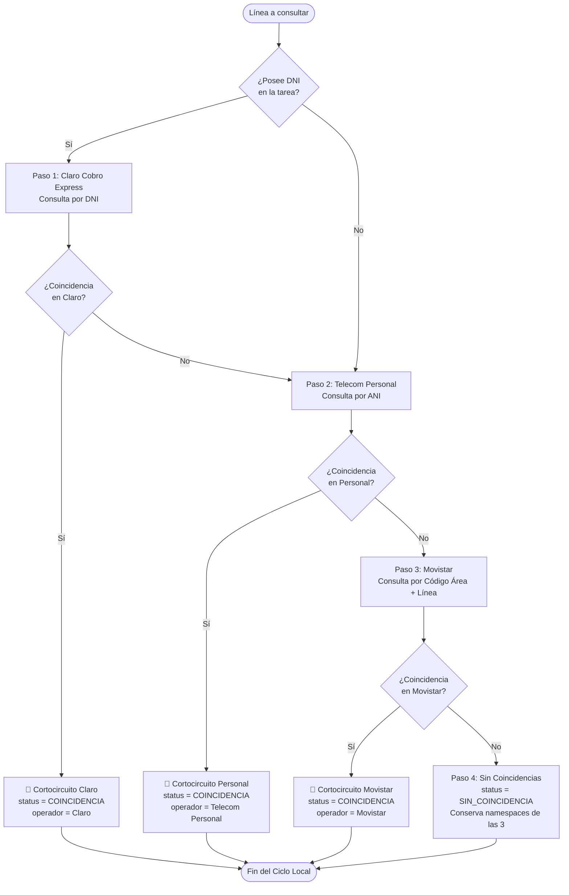

# Guía de Adaptador Compuesto: Cascada Telcos con Cortocircuito

> **Capa 05: Guía de Nuevos Scrapers** | Adaptador Compuesto `TelcoCascadeAdapter`

El adaptador [`TelcoCascadeAdapter`](file:///c:/Users/automatizacion.crm/Documents/GitHub/scrapers-reg-no-llame/adapters/scrapers/telcos/telco_cascade_adapter.py) orquesta la resolución secuencial de líneas exclusivamente en las tres principales compañías telefónicas de Argentina (Claro, Personal y Movistar), aplicando la regla innegociable de cortocircuito (*short-circuit*).

Está registrado en [`ScraperRegistry`](file:///c:/Users/automatizacion.crm/Documents/GitHub/scrapers-reg-no-llame/adapters/scrapers/registry.py) bajo los alias:
- `'telcos'` (alias principal)
- `'telco_cascade'`
- `'claro_personal_movistar'`

---

## 1. Diagrama de Flujo de la Cascada



---

## 2. Invariantes de Negocio y Reglas de Cascada

1. **Requisito de DNI para Claro**:
   - Claro Cobro Express exige DNI activo. Si la línea no tiene DNI (`dni IS NULL` o `dni = ''`), la etapa Claro se omite limpiamente anotando en su namespace:
     ```json
     "claro": {
       "status": "sin_coincidencia",
       "detalles": {"motivo": "Omitido: Claro Cobro Express exige DNI disponible y la línea no posee DNI"}
     }
     ```
   - El pipeline salta de inmediato a Telecom Personal.
2. **Cortocircuito Inmediato**:
   - En cuanto cualquier compañía retorna `StatusScraping.COINCIDENCIA`, se interrumpe la evaluación de las compañías restantes y se retorna inmediatamente el `ScrapeResult`.
3. **Acumulación No Destructiva**:
   - Los datos de cada motor se almacenan bajo su propio namespace (`datos_acumulados["claro"]`, `datos_acumulados["personal"]`, `datos_acumulados["movistar"]`).
   - Se preserva el 100% de comprobantes, montos adeudados, fechas y detalles técnicos.

---

## 3. Ejemplo de Salida JSON Acumulada

En caso de no coincidencia en ninguna telco:

```json
{
  "claro": {
    "status": "sin_coincidencia",
    "fuente": "claro",
    "operador": "Claro",
    "ultima_modificacion": "2026-09-30 09:04:30"
  },
  "personal": {
    "status": "sin_coincidencia",
    "fuente": "personal",
    "operador": "Personal",
    "ultima_modificacion": "2026-09-30 09:04:45"
  },
  "movistar": {
    "status": "sin_coincidencia",
    "fuente": "movistar",
    "operador": "Movistar",
    "ultima_modificacion": "2026-09-30 09:05:00"
  }
}
```

---

## 4. Política de Resiliencia y 3 Reintentos ante Bloqueos WAF

Para evitar falsos positivos de finalización por rate-limiting o desafíos bot de la pasarela de Cobro Express (`pagosce.cobroexpress.com.ar`), los adaptadores [`ClaroAdapter`](file:///c:/Users/automatizacion.crm/Documents/GitHub/scrapers-reg-no-llame/adapters/scrapers/claro/claro_adapter.py), [`PersonalAdapter`](file:///c:/Users/automatizacion.crm/Documents/GitHub/scrapers-reg-no-llame/adapters/scrapers/personal/personal_adapter.py) y [`MovistarAdapter`](file:///c:/Users/automatizacion.crm/Documents/GitHub/scrapers-reg-no-llame/adapters/scrapers/movistar/movistar_adapter.py) aplican un ciclo unificado de **3 reintentos automáticos** (hasta 4 intentos en total):

1. **Disparadores de Reintento**:
   - Bloqueo WAF / Desafío Bot: `HTTP 418` (*I'm a teapot*) o `HTTP 419`.
   - Rate Limit / Forbidden: `HTTP 429` o `HTTP 403`.
   - Errores de Pasarela / Servidor: `HTTP 500`, `502`, `503`, `504`.
   - Errores de Red / Tor: `Timeout`, `ConnectTimeoutError` o `Host unreachable (0x04)`.
2. **Acciones en cada Reintento**:
   - **Rotación Forzada de Circuito Tor**: Emisión de señal reactiva `SIGNAL NEWNYM` para obtener una nueva IP de salida.
   - **Backoff Progresivo**: Pausa incremental (`1.0s` en el 1°, `2.0s` en el 2°, `3.0s` en el 3°).
3. **Comportamiento ante Agotamiento de Reintentos**:
   - Si tras los 3 reintentos persiste el bloqueo de red, el adaptador eleva [`ScraperTransientError`](file:///c:/Users/automatizacion.crm/Documents/GitHub/scrapers-reg-no-llame/core/domain/exceptions.py).
   - En [`ProcessBatchUseCase`](file:///c:/Users/automatizacion.crm/Documents/GitHub/scrapers-reg-no-llame/core/use_cases/process_batch_use_case.py), esta excepción interrumpe el lote y revierte los registros a estado `pendiente` en SQLite local, garantizando que **jamás se marque como completada ni se queme en el CRM una línea afectada por caídas de infraestructura**.

---

## 5. Documentos Relacionados

- [Contrato IScraperEnginePort](contrato_iscraper_engine.md)
- [Guía Creación Claro](guia_creacion_claro.md)
- [Guía Creación Personal](guia_creacion_personal.md)
- [Guía Creación Movistar](guia_creacion_movistar.md)
- [Adaptador de Staging Local SQLite](../03_base_de_datos_y_colas/staging_local_sqlite.md)


