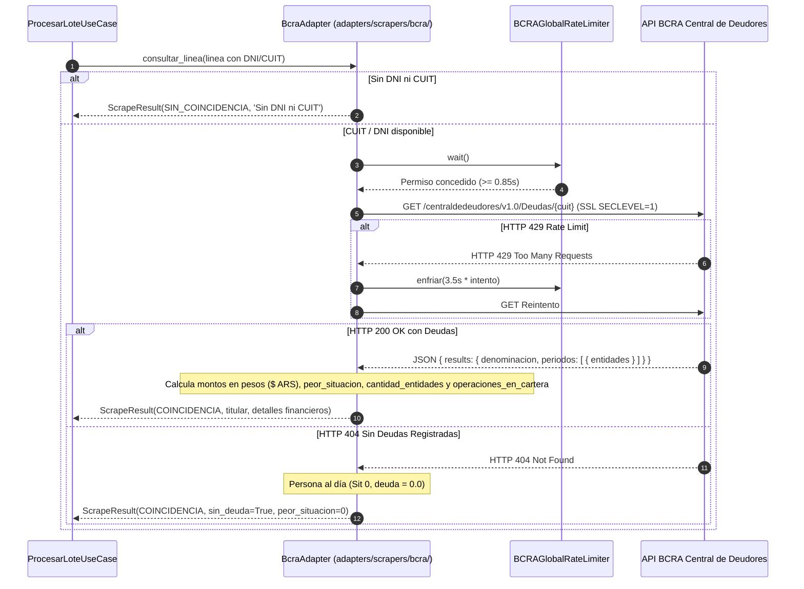

# Guía Técnica: Adaptador Scraper BCRA Central de Deudores (Situación Crediticia y Deuda Financiera)

> **Capa 05: Extensibilidad y Scrapers Secundarios** | Especificación de Integración  
> **Archivo Fuente Principal**: [`adapters/scrapers/bcra/bcra_adapter.py`](file:///c:/Users/Usuario/Documents/GitHub/scrapers-reg-no-llame/adapters/scrapers/bcra/bcra_adapter.py)  
> **Cliente Auxiliar**: [`adapters/scrapers/bcra/bcra_client.py`](file:///c:/Users/Usuario/Documents/GitHub/scrapers-reg-no-llame/adapters/scrapers/bcra/bcra_client.py)  
> **Endpoint Oficial**: `https://api.bcra.gob.ar/centraldedeudores/v1.0/Deudas/{cuit}`

---

## 1. Visión General y Protocolo

El Banco Central de la República Argentina (BCRA) provee un servicio REST público y abierto (sin requerimiento de captcha) para auditar el historial de endeudamiento bancario y situación crediticia de personas humanas y jurídicas bajo el régimen de la Central de Deudores del Sistema Financiero.

[`BcraAdapter`](file:///c:/Users/Usuario/Documents/GitHub/scrapers-reg-no-llame/adapters/scrapers/bcra/bcra_adapter.py) implementa el puerto [`IScraperEnginePort`](file:///c:/Users/Usuario/Documents/GitHub/scrapers-reg-no-llame/core/ports/scraper_port.py) heredando de [`BaseScraperAdapter`](file:///c:/Users/Usuario/Documents/GitHub/scrapers-reg-no-llame/adapters/scrapers/base_scraper.py), incorporando blindajes industriales:

1. **Blindaje Criptográfico SSL SECLEVEL=1 (`BCRA_SSLAdapter`)**:
   - Resuelve incompatibilidades críticas de OpenSSL 3.0 en Windows/Linux que provocan cortes de conexión (`RemoteDisconnected` y `ConnectionResetError`) mediante un contexto SSL con ciphers `DEFAULT@SECLEVEL=1`.
2. **Rate Limiting Global Coordinado (`BCRAGlobalRateLimiter`)**:
   - La API oficial posee un WAF perimetral estricto. Mantener un intervalo coordinado de `0.85s` entre peticiones concurrentes y aplicar un enfriamiento cooperativo de `3.5s` ante HTTP 429 garantiza un 100% de efectividad sin disparar bloqueos.
3. **Resolución Inteligente DNI ➔ CUIT/CUIL**:
   - Si la línea proviene con DNI de 7 u 8 dígitos, genera y consulta automáticamente los candidatos primario y secundario vía [`obtener_cuils_candidatos`](file:///c:/Users/Usuario/Documents/GitHub/scrapers-reg-no-llame/core/domain/cuit_validator.py).
4. **Normalización Monetaria Integral y Métrica de Cartera**:
   - Captura la totalidad del universo de deudas del sistema financiero expuestas por el BCRA, registrando tanto montos originales en miles (`deuda_total_miles`) como montos exactos en pesos argentinos ($ ARS reales = miles * 1000): `deuda_total_pesos`.
   - Consolida con precisión las métricas `cantidad_entidades` y `operaciones_en_cartera`.

---

## 2. Diagrama de Secuencia del Adaptador BCRA



---

## 3. Especificación de Métodos y Parámetros

### 3.1 `consultar_linea(linea: Linea, **kwargs) -> ScrapeResult`

Consulta deudas del sistema financiero por CUIT/CUIL de 11 dígitos o DNI inferido.

* **Parámetros**:
  * `linea` ([`Linea`](file:///c:/Users/Usuario/Documents/GitHub/scrapers-reg-no-llame/core/domain/entities.py)): Instancia que contiene `ani` y `dni`.
* **Retorno** ([`ScrapeResult`](file:///c:/Users/Usuario/Documents/GitHub/scrapers-reg-no-llame/core/domain/entities.py)):
  * `status`: `StatusScraping.COINCIDENCIA` o `StatusScraping.SIN_COINCIDENCIA`.
  * `fuente_scraper`: `'bcra'`.
  * `titular`: [`Titular`](file:///c:/Users/Usuario/Documents/GitHub/scrapers-reg-no-llame/core/domain/entities.py) con razón social y CUIT.
  * `detalles` (`Dict[str, Any]`): Diccionario enriquecido con campos financieros canónicos:

| Campo en `detalles` | Tipo | Descripción |
| :--- | :--- | :--- |
| `cuit` | `str` | CUIT consultado de 11 dígitos numéricos |
| `dni` | `str` | DNI derivado de 7 u 8 dígitos |
| `denominacion` | `str` | Razón social o nombres oficiales registrados ante BCRA |
| `periodo` | `str` | Período evaluado en formato `YYYYMM` (ej. `'202408'`) |
| `peor_situacion` | `int` | Máxima situación de riesgo crediticio (0 a 5) |
| `cantidad_entidades` | `int` | Número de bancos o financieras con las que opera |
| `operaciones_en_cartera` | `int` | Cantidad total de líneas o contratos de crédito activos |
| `deuda_total_pesos` | `float` | Deuda bancaria total consolidada en pesos argentinos ($ ARS) |
| `deuda_total_miles` | `float` | Deuda total reportada en miles de pesos |
| `sin_deuda` | `bool` | `True` si la persona no registra deudas en el período |
| `entidades` | `List[Dict]` | Desglose individual de cada entidad bancaria, situación y montos |

---

## 4. Escala de Clasificación Crediticia BCRA

| Situación | Denominación Oficial | Días de Atraso |
| :---: | :--- | :--- |
| **0** | Sin Deuda Registrada | Al día / Sin registros en Central de Deudores |
| **1** | Normal | Hasta 31 días de atraso |
| **2** | Riesgo Bajo | 32 a 90 días de atraso |
| **3** | Riesgo Medio | 91 a 180 días de atraso |
| **4** | Riesgo Alto | 181 a 365 días de atraso |
| **5** | Irrecuperable | Más de 365 días de atraso |

---

## 5. Formateo y Persistencia en Colas

### 5.1 En `cola_automatizacion` (Columna `resultado`)
El bloque de BCRA se estructura de forma canónica y limpia sin contaminar la raíz del JSON:
```json
{
  "bcra": {
    "cuit": "20301122331",
    "denominacion": "PEREZ JUAN",
    "periodo": "202408",
    "peor_situacion": 2,
    "cantidad_entidades": 2,
    "operaciones_en_cartera": 2,
    "deuda_total_pesos": 200500.0,
    "deuda_total_miles": 200.5,
    "sin_deuda": false,
    "entidades": [ ... ],
    "status": "coincidencia",
    "ultima_modificacion": "2026-10-04 16:30:00"
  }
}
```

### 5.2 En `queue_registro_no_llame` (Columna `datos_json`)
Se almacena bajo el namespace `datos_json["bcra"]`, agregando `'bcra'` a la lista acumulativa de `fuente`.

---

## 6. Comandos de Prueba Operativa

```powershell
# 1. Consulta directa de una línea con DNI por BCRA
python main.py test-line 2604275327 --scraper bcra --dni 30112233

# 2. Prueba en lote en memoria (Dry-run)
python main.py test-batch --scraper bcra --batch-size 2 --dry-run
```
