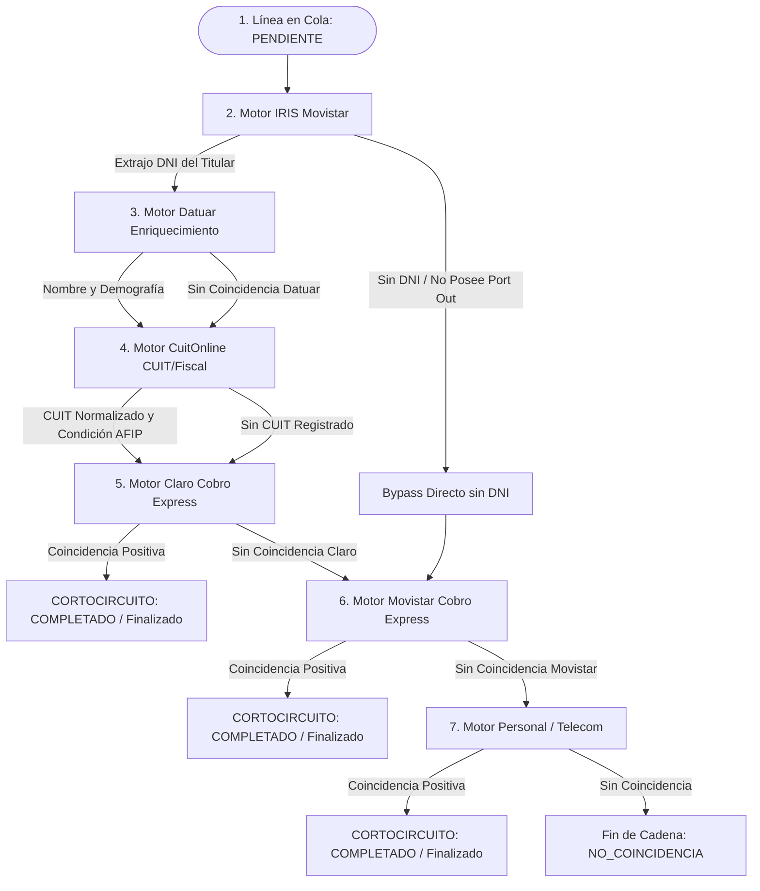

# Guía Técnica: Adaptador Scraper CuitOnline (Enriquecimiento de CUIT y Condición Fiscal)

Este documento detalla el diseño, la especificación de protocolo, la arquitectura de integración y la guía operativa del motor de extracción y normalización de CUIT para **CuitOnline** (`https://www.cuitonline.com`), integrado bajo los principios de la **Arquitectura Hexagonal (Puertos y Adaptadores)**.

---

## 1. Ciclo de Vida del Pipeline y Regla de No-Cortocircuito

En el sistema, CuitOnline opera como un **eslabón de enriquecimiento fiscal y tributario no-terminal** formalizado en [`ReglaPipeline`](file:///c:/Users/Usuario/Documents/GitHub/scrapers%20reg%20no%20llame/core/domain/entities.py):

```text
CADENA_DEFAULT: ["iris", "datuar", "cuitonline", "claro", "movistar", "personal"]
```



### Reglas de Pipeline para CuitOnline
1. **Paso No-Terminal**: Al igual que Datuar y a diferencia de las operadoras telefónicas, [`CuitOnlineAdapter.consultar_linea`](file:///c:/Users/Usuario/Documents/GitHub/scrapers%20reg%20no%20llame/adapters/scrapers/cuitonline/cuitonline_adapter.py) **NUNCA cortocircuita** la línea a `finalizado`. Encuentre o no el CUIT, [`ReglaPipeline.resolver_siguiente_etapa`](file:///c:/Users/Usuario/Documents/GitHub/scrapers%20reg%20no%20llame/core/domain/entities.py) avanza siempre a `scraper_actual = 'claro'` y `estado = 'pendiente'`.
2. **Bypass Inteligente para Líneas sin DNI**: Cuando [`IrisHttpAdapter`](file:///c:/Users/Usuario/Documents/GitHub/scrapers%20reg%20no%20llame/adapters/scrapers/iris/iris_http_adapter.py) no encuentra Port Out ni datos de titular, la línea no posee DNI. Dado que Datuar, CuitOnline y Claro exigen DNI para operar, [`ReglaPipeline`](file:///c:/Users/Usuario/Documents/GitHub/scrapers%20reg%20no%20llame/core/domain/entities.py) deriva automáticamente a `scraper_actual = 'movistar'`, saltando Datuar, CuitOnline y Claro para optimizar el rendimiento y evitar consultas inútiles.
3. **Persistencia Acumulativa**: Los datos extraídos por CuitOnline se preservan de forma atómica en `datos_json["cuitonline"]` y enriquecen la entidad [`Titular`](file:///c:/Users/Usuario/Documents/GitHub/scrapers%20reg%20no%20llame/core/domain/entities.py) inyectando el valor verificado en el campo `cuil`.

---

## 2. Especificación del Protocolo CuitOnline

### 2.1. Endpoints y Cabeceras

| Parámetro | Valor Predeterminado | Descripción |
| :--- | :--- | :--- |
| `base_url` | `https://www.cuitonline.com` | URL base del portal de consulta |
| `search_endpoint` | `/search.php?q={dni}` | Endpoint de búsqueda por DNI |
| `Referer` | `https://www.cuitonline.com/` | Cabecera requerida de navegación |
| `User-Agent` | Navegador moderno (Chrome/Edge/Firefox) | User-Agent rotativo de última generación |
| `timeout` | `15` segundos | Límite de espera de socket HTTP |
| `delay_min` | `0.2` segundos | Jitter mínimo entre peticiones |
| `delay_max` | `0.6` segundos | Jitter máximo entre peticiones |

### 2.2. Campos Extraídos y Mapeo Estructurado

El adaptador realiza una captura exhaustiva en dos fases (búsqueda y ficha detallada oficial), abstrayendo el 100% de la información pública disponible:

| Campo Normalizado | Tipo | Origen en HTML | Descripción |
| :--- | :--- | :--- | :--- |
| `cuit` | `str` | `.p_cuit` / `.cuit` | CUIT formateado con guiones (`20-92838540-0`) |
| `cuit_limpio` | `str` | Derivado de `.cuit` | Solo dígitos numéricos (`20928385400`) |
| `denominacion` | `str` | `h1` / `.denominacion h2` | Razón social o nombre fiscal registrado |
| `nombres` | `str` | Derivado de denominación | Nombres de pila desglosados |
| `apellidos` | `str` | Derivado de denominación | Apellidos familiares desglosados |
| `tipo_persona` | `str` | `.persona-data` | Clasificación legal (`Persona Física` / `Persona Jurídica`) |
| `genero` | `str` | `[itemprop="gender"]` | Género detectado (`Masculino` o `Femenino`) |
| `nacionalidad` | `str` | `[itemprop="nationality"]` | Nacionalidad o condición migratoria (`Inmigrante`) |
| `inmigrante` | `bool` | `.persona-data` | `True` si posee condición de inmigrante |
| `direccion` | `str` | `[itemprop="streetAddress"]` | Domicilio fiscal (calle, número, manzana, casa) |
| `provincia` | `str` | `[itemprop="addressRegion"]` | Provincia declarada ante AFIP |
| `localidad` | `str` | `[itemprop="addressLocality"]` | Ciudad o localidad declarada ante AFIP |
| `ganancias` | `str` | `.persona-data li` | Condición en Ganancias (`Ganancias Personas Fisicas`) |
| `iva` | `str` | `.persona-data li` | Condición ante el IVA (`Iva Inscripto` / `Monotributo`) |
| `empleador` | `str` | `.persona-data li` | Condición de empleador (`Sí` / `No`) |
| `impuestos_activos` | `list` | `h2.impuestos_activos` | Array de impuestos activos con fechas de alta |
| `regimenes_activos` | `list` | `h2.impuestos_activos` | Array de regímenes fiscales vigentes |
| `actividades` | `list` | `h2.impuestos_activos` | Códigos y descripciones oficiales de actividad económica |
| `constancia_inscripcion_afip` | `str` | `a[href*="constancia/inscripcion"]` | Enlace oficial a la constancia de inscripción AFIP |
| `constancia_cuil_anses` | `str` | `a[href*="constancia/cuil"]` | Enlace oficial a la constancia de CUIL de ANSES |
| `actividades_economicas_url` | `str` | `a[href*="constancia/actividades"]` | Enlace a la constancia de actividades económicas |
| `detalle_url` | `str` | `.denominacion a` | Ficha URL en CuitOnline |
| `coincidencias` | `list` | Lista de `.hit` | Array completo de resultados para resolución de homónimos |

---

## 3. Caché Local SQLite de Alta Velocidad (`cuitonline_cache.sqlite`)

Para eliminar peticiones redundantes y garantizar latencias de 0 ms en consultas repetidas de un mismo DNI, [`CuitOnlineAdapter`](file:///c:/Users/Usuario/Documents/GitHub/scrapers%20reg%20no%20llame/adapters/scrapers/cuitonline/cuitonline_adapter.py) implementa una base de datos local SQLite con persistencia relacional y JSON íntegro:

```sql
CREATE TABLE IF NOT EXISTS cache (
    dni TEXT PRIMARY KEY,
    cuit TEXT,
    cuit_limpio TEXT,
    denominacion TEXT,
    nombres TEXT,
    apellidos TEXT,
    tipo_persona TEXT,
    genero TEXT,
    nacionalidad TEXT,
    inmigrante INTEGER,
    direccion TEXT,
    provincia TEXT,
    localidad TEXT,
    ganancias TEXT,
    iva TEXT,
    empleador TEXT,
    constancia_url TEXT,
    full_json TEXT,
    timestamp DATETIME DEFAULT CURRENT_TIMESTAMP
);
```

Cuando un DNI ya existe en la base local:
1. Retorna inmediatamente con `status = StatusScraping.COINCIDENCIA` y `origen = "cuitonline_cache"`.
2. No realiza ninguna llamada de red, consumiendo 0 MB de ancho de banda y protegiendo el scraper de rate limits.

---

## 4. Implementación del Adaptador Hexagonal

El adaptador reside en [`adapters/scrapers/cuitonline/cuitonline_adapter.py`](file:///c:/Users/Usuario/Documents/GitHub/scrapers%20reg%20no%20llame/adapters/scrapers/cuitonline/cuitonline_adapter.py) y cumple con el contrato abstracto [`IScraperEnginePort`](file:///c:/Users/Usuario/Documents/GitHub/scrapers%20reg%20no%20llame/core/ports/scraper_port.py):

```python
class CuitOnlineAdapter(BaseScraperAdapter):
    @property
    def nombre(self) -> str:
        return "cuitonline"

    def consultar_linea(self, linea: Linea, **kwargs) -> ScrapeResult:
        # 1. Fast-path si no posee DNI (<1 ms)
        # 2. Búsqueda en caché SQLite (0 ms)
        # 3. Petición HTTP a https://www.cuitonline.com/search.php?q={dni}
        # 4. Parseo de .hit con BeautifulSoup
        # 5. Persistencia en caché y retorno de ScrapeResult
```

### Registro en ScraperRegistry
El motor está registrado en [`ScraperRegistry`](file:///c:/Users/Usuario/Documents/GitHub/scrapers%20reg%20no%20llame/adapters/scrapers/registry.py) bajo los alias:
- `"cuitonline"`
- `"cuit_online"`

---

## 5. Comandos de Prueba Operativa

```powershell
# 1. Prueba de consulta directa con DNI de prueba
python main.py test-line 2604275327 --scraper cuitonline --dni 92838540

# 2. Prueba de resolución instantánea desde caché SQLite
python main.py test-line 2604275327 --scraper cuitonline --dni 92838540

# 3. Prueba de fast-path de línea sin DNI
python main.py test-line 2604275327 --scraper cuitonline

# 4. Prueba en lote en memoria (Dry-run)
python main.py test-batch --scraper cuitonline --batch-size 2 --dry-run
```
