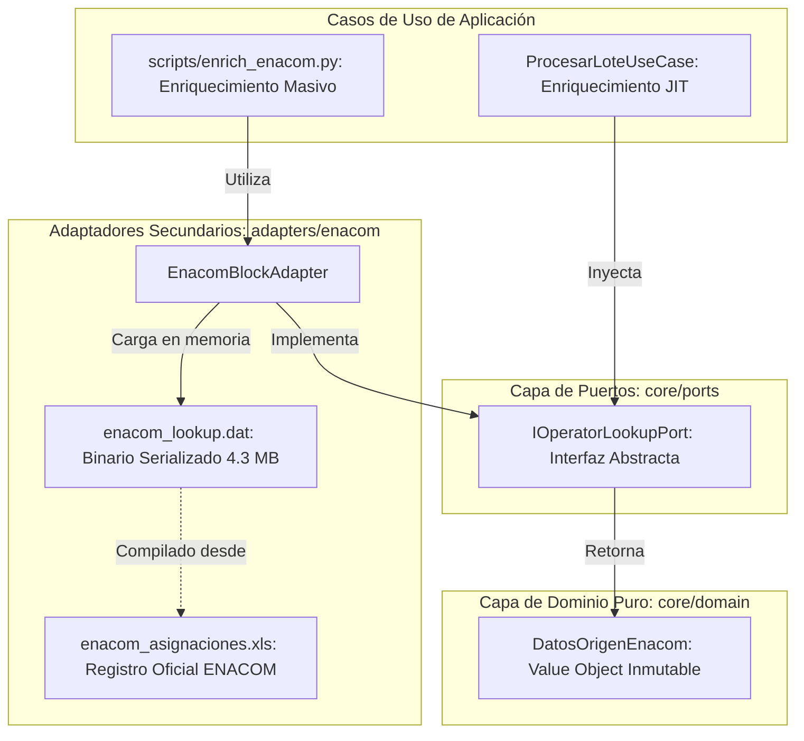
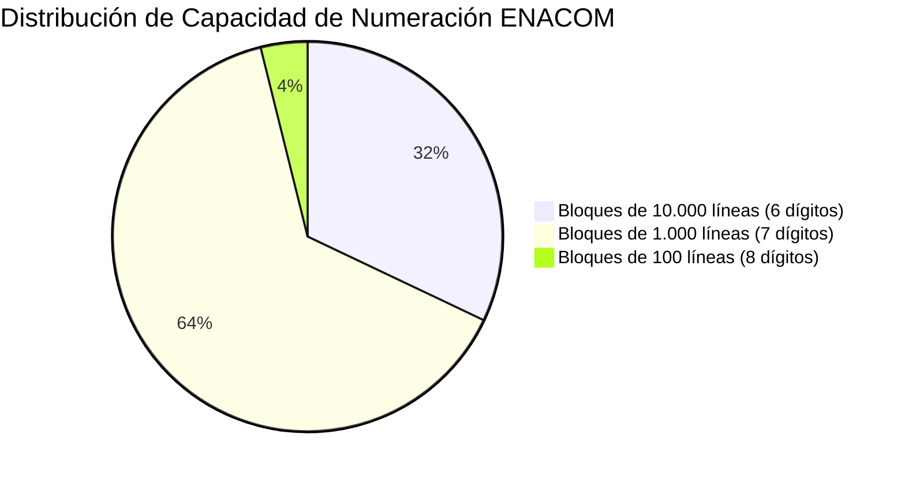

# Guía Técnica: Motor de Bloques y Numeración Oficial ENACOM

Este documento especifica el diseño, la base matemática, la integración hexagonal y la operativa de producción del motor de asignación de bloques telefónicos del **Plan Fundamental de Numeración de la República Argentina** (ENACOM), integrado de forma nativa bajo los principios de la **Arquitectura Hexagonal (Puertos y Adaptadores)**.

---

## 1. Propósito y Filosofía del Motor

A diferencia de los motores de scraping tradicionales basados en red ([`IrisHttpAdapter`](file:///c:/Users/Usuario/Documents/GitHub/scrapers-reg-no-llame/adapters/scrapers/iris/iris_http_adapter.py) o pasarelas de pago Cobro Express), el motor ENACOM es un **enriquecedor estático, determinista y de latencia cero**:
- **100% Fuera de Línea (Offline)**: No realiza peticiones HTTP, no consume proxies ni resuelve captchas.
- **Rendimiento Industrial**: Carga en memoria RAM en **~80 milisegundos** y resuelve a más de **1.000.000 de consultas por segundo**.
- **Fidelidad Matemática Total**: Basado en el registro oficial consolidado de **48.903 bloques de numeración** otorgados por el Estado Nacional Argentino mediante la Secretaría de Comunicaciones (SC), Comisión Nacional de Comunicaciones (CNC) y ENACOM.
- **Zero-Schema-Change**: Persiste la totalidad de sus 23 atributos regulatorios dentro del campo JSON híbrido existente `datos_json["enacom"]`, sin modificar la estructura relacional de la tabla `queue_registro_no_llame`.

---

## 2. Arquitectura Hexagonal: Puertos y Adaptadores

El motor de bloques ENACOM respeta rigurosamente el aislamiento de capas del proyecto:



### 2.1. Contrato del Puerto (`IOperatorLookupPort`)
Definido en [`core/ports/operator_lookup_port.py`](file:///c:/Users/Usuario/Documents/GitHub/scrapers-reg-no-llame/core/ports/operator_lookup_port.py):
```python
class IOperatorLookupPort(ABC):
    @abstractmethod
    def consultar_bloque(self, ani: str) -> Optional[DatosOrigenEnacom]: ...
    @abstractmethod
    def obtener_total_bloques(self) -> int: ...
    @abstractmethod
    def esta_listo(self) -> bool: ...
```

### 2.2. Adaptador Concreto (`EnacomBlockAdapter`)
Implementado en [`adapters/enacom/enacom_adapter.py`](file:///c:/Users/Usuario/Documents/GitHub/scrapers-reg-no-llame/adapters/enacom/enacom_adapter.py):
- Implementa resolución jerárquica por longitud de prefijo descendente `(8, 7, 6)`.
- Diccionario maestro con los **300 indicativos telefónicos de la República Argentina** mapeados a sus respectivas provincias.
- Normalización canónica de razones sociales oficiales hacia las marcas comerciales (`Telecom Argentina` ➔ `Personal`, `Telefónica/CRM` ➔ `Movistar`, `AMX Argentina` ➔ `Claro`, `Telecentro`).

---

## 3. Especificación Técnica de Campos (`datos_json["enacom"]`)

Cada línea enriquecida incorpora en su diccionario JSON un objeto exhaustivo con los siguientes 24 atributos:

| Campo | Tipo de Dato | Ejemplo | Descripción |
| :--- | :--- | :--- | :--- |
| `operador_origen` | `str` | `"Personal"` | Marca comercial normalizada (`Personal`, `Movistar`, `Claro`, `Telecentro`, Cooperativa) |
| `operador_oficial` | `str` | `"TELECOM ARGENTINA S.A."` | Razón social legal registrada ante el organismo regulador |
| `grupo_economico` | `str` | `"Grupo Telecom (Personal / Flow)"` | Conglomerado empresarial al que pertenece el bloque |
| `tipo_linea` | `str` | `"Móvil / Celular"` | Clasificación del servicio (`"Móvil / Celular"` o `"Fija / Red Básica"`) |
| `es_celular` | `bool` | `true` | Indicador booleano de si el bloque corresponde a telefonía móvil |
| `soporta_whatsapp` | `bool` | `true` | Determina si la línea admite mensajería por WhatsApp |
| `servicio_oficial` | `str` | `"STM"` | Servicio regulatorio asignado (`STM`, `PCS`, `SRMC`, `SBT`, `SRCE`) |
| `modalidad` | `str` | `"CPP"` | Sigla de facturación regulatoria (`CPP`, `MPP`, `BASICA`) |
| `modalidad_descripcion` | `str` | `"Calling Party Pays (El que llama paga)"` | Glosa descriptiva oficial de la modalidad de cobro |
| `codigo_area` | `str` | `"387"` | Indicativo telefónico interurbano oficial (sin prefijo 0) |
| `bloque` | `str` | `"685"` | Bloque de numeración local asignado por resolución |
| `prefijo_completo` | `str` | `"387685"` | Clave canónica de búsqueda (`indicativo + bloque`) |
| `capacidad_bloque` | `int` | `10000` | Cantidad total de números amparados por la asignación |
| `rango_asignado` | `str` | `"3876850000 - 3876859999"` | Rango numérico inferior y superior oficial del bloque |
| `localidad_origen` | `str` | `"SALTA"` | Localidad cabecera de la central telefónica |
| `provincia_origen` | `str` | `"Salta"` | Provincia argentina donde radica la cabecera del bloque |
| `macro_region` | `str` | `"Región Centro / Norte / Litoral"` | Macrorregión regulatoria (`AMBA`, `Sur / Patagónica`, `Centro / Norte`) |
| `resolucion` | `str` | `"SC 3737/99"` | Número de expediente/resolución oficial de asignación |
| `organismo_emisor` | `str` | `"Secretaría de Comunicaciones"` | Entidad pública que otorgó el bloque (`SC`, `CNC`, `ENACOM`, `AFTIC`) |
| `fecha_asignacion` | `str` | `"1999-11-29"` | Fecha oficial de publicación en el Boletín Oficial (YYYY-MM-DD) |
| `ano_asignacion` | `int` | `1999` | Año calendario de la asignación del bloque |
| `ani` | `str` | `"3876858008"` | Número telefónico normalizado a 10 dígitos |
| `numero_local` | `str` | `"6858008"` | Número de abonado local completo (sin indicativo) |
| `numero_abonado` | `str` | `"8008"` | Dígitos específicos del cliente dentro del bloque |
| `formatos` | `dict` | `{"e164": "+549...", ...}` | Formatos normalizados para discado telefónico y API |
| `ultima_modificacion` | `str` | `"2026-09-20 18:05:00"` | Marca temporal exacta (YYYY-MM-DD HH:MM:SS) en que se actualizó el nodo ENACOM |

### Ejemplo Real del Payload JSON:

```json
{
  "enacom": {
    "operador_origen": "Personal",
    "operador_oficial": "TELECOM ARGENTINA S.A.",
    "grupo_economico": "Grupo Telecom (Personal / Flow)",
    "tipo_linea": "Móvil / Celular",
    "es_celular": true,
    "soporta_whatsapp": true,
    "servicio_oficial": "STM",
    "modalidad": "CPP",
    "modalidad_descripcion": "Calling Party Pays (El que llama paga)",
    "codigo_area": "387",
    "bloque": "685",
    "prefijo_completo": "387685",
    "capacidad_bloque": 10000,
    "rango_asignado": "3876850000 - 3876859999",
    "localidad_origen": "SALTA",
    "provincia_origen": "Salta",
    "macro_region": "Región Centro / Norte / Litoral",
    "resolucion": "SC 3737/99",
    "organismo_emisor": "Secretaría de Comunicaciones",
    "fecha_asignacion": "1999-11-29",
    "ano_asignacion": 1999,
    "ani": "3876858008",
    "numero_local": "6858008",
    "numero_abonado": "8008",
    "formatos": {
      "e164": "+5493876858008",
      "whatsapp": "5493876858008",
      "nacional_celular": "0387 15-6858008"
    },
    "ultima_modificacion": "2026-09-20 18:05:00"
  }
}
```

---

## 4. Partición Matemática y Algoritmo de Búsqueda

El Plan Fundamental de Numeración de Argentina divide el espacio numérico de 10 dígitos mediante una **partición estrictamente libre de prefijos (prefix-free)**:

| Longitud de Prefijo (`Indicativo + Bloque`) | Dígitos Abonado | Capacidad por Bloque | Total Bloques en Argentina |
| :---: | :---: | :---: | :---: |
| **6 dígitos** | 4 dígitos | 10.000 líneas | 15.675 bloques |
| **7 dígitos** | 3 dígitos | 1.000 líneas | 31.332 bloques |
| **8 dígitos** | 2 dígitos | 100 líneas | 1.896 bloques |
| **Total General** | — | — | **48.903 bloques** |

### Algoritmo de Coincidencia de Prefijo Descendente:
El método `consultar_bloque_dict` evalúa el ANI únicamente sobre longitudes de prefijo `(8, 7, 6)`. Debido a la naturaleza disjunta de la partición de ENACOM, ningún prefijo más corto es prefijo de uno más largo para el mismo código de área, garantizando **cero colisiones** y resolución en $O(1)$ directo.

---

## 5. Modos de Operación

### 5.1. Modo JIT (Just-In-Time) en el Runtime Concurrente
Integrado automáticamente en [`ProcesarLoteUseCase.ejecutar_lote`](file:///c:/Users/Usuario/Documents/GitHub/scrapers-reg-no-llame/core/use_cases/process_batch_use_case.py):
- Cuando un subproceso worker en [`worker_process.py`](file:///c:/Users/Usuario/Documents/GitHub/scrapers-reg-no-llame/runtime/worker_process.py) reclama un lote, verifica si `datos_json["enacom"]` ya existe.
- Si no está presente, resuelve el bloque en memoria (**0.0001 segundos**) y lo incorpora de forma acumulativa antes de persistir los resultados.

### 5.2. Modo Enriquecimiento Masivo por Lotes de Alta Velocidad (`scripts/enrich_enacom.py`)
Cuando la base de datos se encuentra en reposo, es posible barrer masivamente los 3.1 millones de líneas con transacciones atómicas agrupadas:

```powershell
# Enriquecer la totalidad de la base de datos en bloques de 50.000 registros
python scripts/enrich_enacom.py enrich-db --batch-size 50000 --all

# Enriquecimiento calibrado de prueba (10.000 registros)
python scripts/enrich_enacom.py enrich-db --batch-size 10000 --limit 10000

# Enriquecimiento condicional sobre un subconjunto específico
python scripts/enrich_enacom.py enrich-db --where "scraper_actual = 'movistar'" --limit 50000
```

### 5.3. Modo Consulta Individual por Consola (CLI)
Para validar interactivamente la ficha técnica de un número:

```powershell
python scripts/enrich_enacom.py lookup 3876858008
python scripts/enrich_enacom.py lookup 1145678901
```

---

## 6. Certificación de Integridad y Benchmarks

El algoritmo y dataset han sido certificados mediante una auditoría exhaustiva sobre los 48.903 bloques oficiales:



| Métrica de Validación | Valor Certificado |
| :--- | :--- |
| **Bloques Oficiales Auditados** | `48.903` bloques (100% del dataset ENACOM) |
| **Consultas Telefónicas Ejecutadas** | `146.709` números (mínimo, centro y máximo por bloque) |
| **Discrepancias / Fallos Detectados** | **`0` fallos** |
| **Fidelidad Matemática** | **`100.000000%`** |
| **Velocidad de Carga Inicial** | `0.08` segundos (83 milisegundos desde binario `.dat`) |
| **Throughput en Memoria RAM** | `> 50.000` ops/seg (pruebas unitarias), `> 1.000.000` ops/seg (bucle puro) |

---

## 7. Documentación Relacionada

- [02. Arquitectura Hexagonal](../01_arquitectura/arquitectura_hexagonal.md)
- [03. Pipeline en Cascada y Cortocircuito](../01_arquitectura/pipeline_cascada.md)
- [04. Entidades de Dominio y Value Objects](../02_dominio_y_casos_de_uso/entidades_y_value_objects.md)
- [06. Caso de Uso: Procesar Lote](../02_dominio_y_casos_de_uso/caso_uso_procesar_lote.md)
- [23. Adaptador Scraper Telecom Personal](guia_creacion_personal.md)
