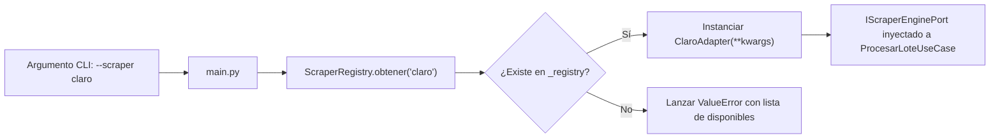

# Registro y Factoría Central de Scrapers (ScraperRegistry)

El componente [`ScraperRegistry`](file:///c:/Users/Usuario/Documents/GitHub/scrapers%20reg%20no%20llame/adapters/scrapers/registry.py) implementa el patrón **Registry / Service Locator** para la resolución dinámica e instanciación de motores de scraping en tiempo de ejecución.

Permite desacoplar los puntos de entrada (CLI, scripts batch, procesos de worker daemon) de las implementaciones concretas de cada operador.

---

## 1. Código Fuente y Estructura del Registro

```python
# -*- coding: utf-8 -*-
from typing import Dict, Type
from core.ports.scraper_port import IScraperEnginePort
from adapters.scrapers.iris.iris_http_adapter import IrisHttpAdapter
from adapters.scrapers.iris.iris_browser_adapter import IrisBrowserAdapter

class ScraperRegistry:
    _registry: Dict[str, Type[IScraperEnginePort]] = {
        "iris_http": IrisHttpAdapter,
        "iris": IrisHttpAdapter,          # Alias por defecto
        "iris_browser": IrisBrowserAdapter,
    }

    @classmethod
    def registrar(cls, alias: str, scraper_cls: Type[IScraperEnginePort]) -> None:
        """Permite a nuevos scrapers registrarse dinámicamente."""
        cls._registry[alias.lower()] = scraper_cls

    @classmethod
    def obtener(cls, alias: str, **kwargs) -> IScraperEnginePort:
        """Instancia un scraper registrado por su alias."""
        alias_clean = alias.lower().strip()
        scraper_cls = cls._registry.get(alias_clean)
        if not scraper_cls:
            disponibles = ", ".join(cls._registry.keys())
            raise ValueError(f"Scraper '{alias}' no encontrado en el registro. Disponibles: {disponibles}")
        return scraper_cls(**kwargs)

    @classmethod
    def listar_disponibles(cls) -> list[str]:
        return list(cls._registry.keys())
```

---

## 2. Métodos de la Factoría

### 2.1. `registrar(alias: str, scraper_cls: Type[IScraperEnginePort]) -> None`
Asocia una clase adaptadora a una clave textual en minúsculas. Permite el auto-registro dinámico tipo plugin sin necesidad de modificar el código interno del registry:
```python
from adapters.scrapers.registry import ScraperRegistry
from adapters.scrapers.claro.claro_adapter import ClaroAdapter

ScraperRegistry.registrar("claro", ClaroAdapter)
```

### 2.2. `obtener(alias: str, **kwargs) -> IScraperEnginePort`
Busca el alias normalizado y construye una nueva instancia pasando los argumentos por palabra clave (`kwargs`).
- Si el alias no existe, lanza un `ValueError` descriptivo indicando todas las opciones actualmente disponibles en el sistema.
- Ejemplo de uso en CLI:
  ```bash
  python main.py supervise --scraper iris_browser --batch-size 15
  ```

### 2.3. `listar_disponibles() -> list[str]`
Retorna la lista de identificadores habilitados para tareas de introspección, validación de argumentos de línea de comandos o menús interactivos:
```bash
python main.py list-scrapers
```

---

## 3. Diagrama de Resolución Dinámica


