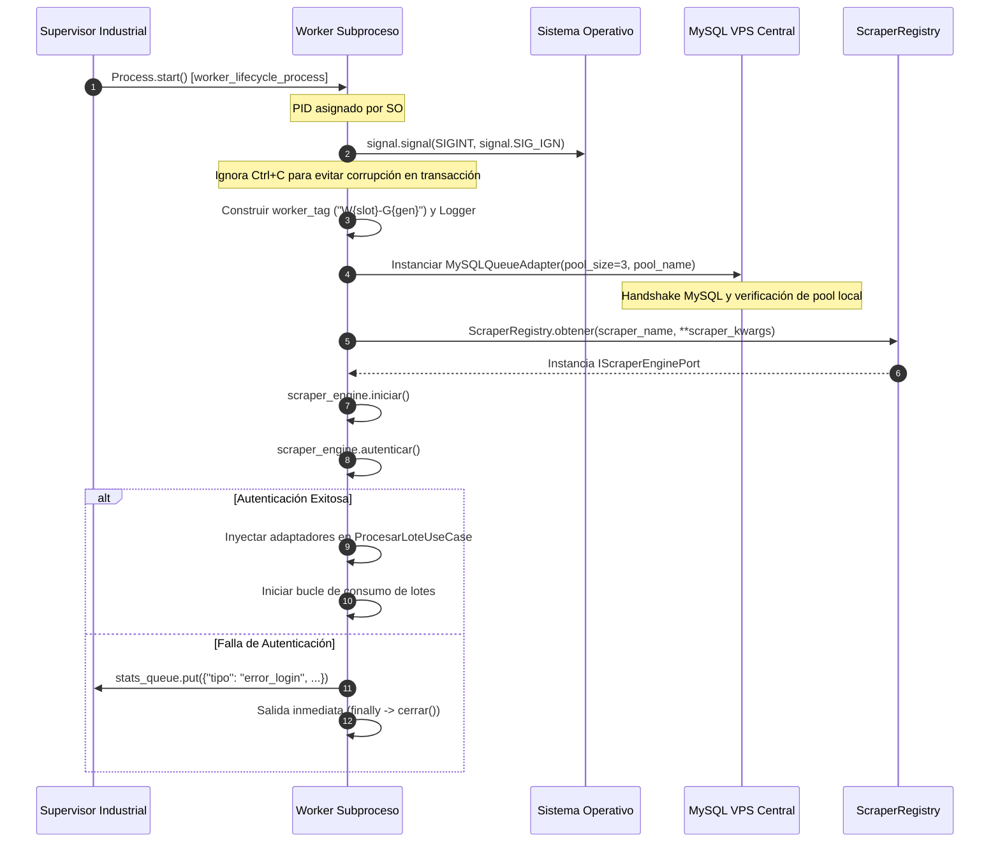

# Ciclo de Vida del Worker (Aislamiento por Subproceso)

El runtime de este sistema implementa un modelo de concurrencia basado en el módulo estándar [`multiprocessing`](https://docs.python.org/3/library/multiprocessing.html) de Python. Cada unidad de trabajo se orquesta como un proceso del sistema operativo completamente independiente y aislado mediante la función de punto de entrada [`worker_lifecycle_process`](file:///c:/Users/Usuario/Documents/GitHub/scrapers%20reg%20no%20llame/runtime/worker_process.py#L23-L181) alojada en [`runtime/worker_process.py`](file:///c:/Users/Usuario/Documents/GitHub/scrapers%20reg%20no%20llame/runtime/worker_process.py).

Este diseño responde a la necesidad crítica de eludir el *Global Interpreter Lock* (GIL) de CPython, evitar la corrupción del estado global en bibliotecas C/C++ subyacentes (como los conectores de MySQL o el motor Chromium/Playwright) y garantizar que la fuga de memoria acumulativa o el fallo fatal de un scraper jamás arrastre al proceso supervisor ni a otros workers paralelos.

---

## 1. Arquitectura de Aislamiento por Subproceso

Cada worker se ejecuta en su propio espacio de memoria virtual con su propio Identificador de Proceso (**PID**). No comparte objetos en memoria con el supervisor ni con otros workers. La comunicación y sincronización se efectúan estrictamente a través de primitivas IPC de multiprocessing:

```
+-------------------------------------------------------------------------+
|                        SUPERVISOR INDUSTRIAL                            |
|  PID: 10420 (runtime/supervisor.py)                                     |
|  - Eventos de sincronización: stop_event, pause_event                   |
|  - Cola de métricas IPC: stats_queue                                    |
+-------------------------------------------------------------------------+
             |                                              |
     Fork / Spawn (Windows)                         Fork / Spawn (Windows)
             |                                              |
             v                                              v
+------------------------------------+      +------------------------------------+
|  WORKER SLOT 1 - GEN 1 (PID 11204) |      |  WORKER SLOT 2 - GEN 1 (PID 11208) |
|  - Signal: SIGINT -> SIG_IGN       |      |  - Signal: SIGINT -> SIG_IGN       |
|  - MySQL Pool: Dedicated (3 conns) |      |  - MySQL Pool: Dedicated (3 conns) |
|  - Scraper Engine: Aislado         |      |  - Scraper Engine: Aislado         |
|  - Consultas ejecutadas: N / 350   |      |  - Consultas ejecutadas: N / 350   |
+------------------------------------+      +------------------------------------+
```

### Justificación Técnica del Aislamiento
1. **Inmunidad al GIL:** Al procesar múltiples canales HTTP o renderizar DOMs intensivos con Playwright/Chromium, la concurrencia multihilo tradicional generaría contención severa sobre el GIL de Python. El multiprocesamiento permite la saturación equilibrada de todos los núcleos del CPU.
2. **Pools de Conexiones DB Desacoplados:** Compartir descriptores de sockets TCP de bases de datos entre procesos bifurcados es propenso a desincronizaciones de protocolo MySQL. Cada subproceso inicializa un pool local único con prefijo de PID.
3. **Encapsulamiento de Fallas Catastróficas:** Si un driver de Chromium genera un *Segmentation Fault* o el scraping HTTP sufre un *Out-Of-Memory*, solo el subproceso del worker colapsa con código de error; el supervisor lo detecta de inmediato y reengendra el slot.

---

## 2. Firma y Desglose de Parámetros del Worker

La función [`worker_lifecycle_process`](file:///c:/Users/Usuario/Documents/GitHub/scrapers%20reg%20no%20llame/runtime/worker_process.py#L23-L36) recibe sus parámetros por valor serializados mediante `pickle`:

```python
def worker_lifecycle_process(
    worker_slot: int,
    generation: int,
    scraper_name: str,
    batch_size: int,
    max_queries: int,
    stop_event: Event,
    pause_event: Event,
    stats_queue: Queue,
    prioridad: Optional[int] = None,
    delay_min: float = 1.5,
    delay_max: float = 2.5,
    scraper_kwargs: Optional[Dict[str, Any]] = None
):
```

### Especificación de Argumentos

| Parámetro | Tipo | Descripción y Uso Operativo |
|---|---|---|
| `worker_slot` | `int` | Identificador numérico del slot de concurrencia asignado por el supervisor (ej. `1` a `9`). Inmutable durante la vida del slot. |
| `generation` | `int` | Número ordinal de generación de relevo (ej. `1`, `2`, `3`). Permite rastrear cuántas rotaciones ha experimentado este slot específico. |
| `scraper_name` | `str` | Nombre clave del scraper a instanciar desde el registro (ej. `"iris"`, `"iris_http"`, `"iris_browser"`, `"claro"`). |
| `batch_size` | `int` | Cantidad máxima de registros que el worker intentará bloquear por lote (`LIMIT %s FOR UPDATE SKIP LOCKED`). Predeterminado: `12`. |
| `max_queries` | `int` | Umbral estricto de consultas acumuladas que el worker ejecutará antes de forzar su salida limpia anti-leak. Predeterminado: `350`. |
| `stop_event` | `multiprocessing.Event` | Centinela IPC de apagado maestro. Cuando el supervisor lo establece (`set()`), el worker interrumpe la iteración y limpia recursos. |
| `pause_event` | `multiprocessing.Event` | Centinela IPC del Circuit Breaker. Cuando se activa por falla de VPN/Red, el worker suspende los reclamos a base de datos. |
| `stats_queue` | `multiprocessing.Queue` | Canal IPC unidireccional para emitir telemetría de cada registro procesado hacia el hilo de métricas del supervisor. |
| `prioridad` | `Optional[int]` | Filtro estricto de prioridad (`1`, `2` o `3`). Si es `None`, activa la cascada de auto-selección (`P1 -> P2 -> P3`). |
| `delay_min` | `float` | Límite inferior en segundos para el cálculo del jitter aleatorio entre lotes consecutivos (ej. `1.5s`). |
| `delay_max` | `float` | Límite superior en segundos para el cálculo del jitter de cortesía entre lotes (ej. `2.5s`). |
| `scraper_kwargs` | `Optional[Dict[str, Any]]` | Diccionario de configuración inyectado al motor de scraping (ej. `{"headless": True}`). |

---

## 3. Protocolo de Inicialización y Configuración de Señales

Al arrancar en un subproceso hijo recién creado en Windows o Linux, el worker ejecuta un protocolo estricto de 4 fases antes de interactuar con la base de datos:



### A. Supresión de SIGINT en el Worker
En la línea 43 de [`runtime/worker_process.py`](file:///c:/Users/Usuario/Documents/GitHub/scrapers%20reg%20no%20llame/runtime/worker_process.py#L43):
```python
signal.signal(signal.SIGINT, signal.SIG_IGN)
```
**Razón de ingeniería:** En entornos de consola interactiva (como PowerShell en Windows), pulsar `Ctrl+C` emite `SIGINT` a todo el árbol de procesos en la sesión de terminal. Si los workers capturan `SIGINT`, podrían interrumpirse violentamente en mitad de una sentencia `UPDATE` o durante el volcado de JSON, dejando registros huérfanos o transacciones abiertas en el VPS. Al forzar `signal.SIG_IGN`, el worker delega la orden de detención exclusivamente al `SupervisorIndustrial`, el cual señaliza el `stop_event` de manera coordinada.

### B. Aislamiento Estricto del Pool de Conexiones
En la línea 58 de [`runtime/worker_process.py`](file:///c:/Users/Usuario/Documents/GitHub/scrapers%20reg%20no%20llame/runtime/worker_process.py#L58-L61):
```python
cola_repo = MySQLQueueAdapter(
    pool_size=3,
    pool_name=f"pool_{worker_slot}_{generation}_{os.getpid()}"
)
```
El conector `mysql.connector.pooling.MySQLConnectionPool` requiere nombres de pool completamente unívocos para evitar colisiones internas. Nombrar el pool incorporando el slot, la generación y el PID (`f"pool_{worker_slot}_{generation}_{os.getpid()}"`) garantiza que cada proceso gestione de forma hermética sus 3 descriptores TCP hacia el VPS (`config.VPS_DBHOST`).

### C. Inyección Dinámica y Autenticación del Scraper
En las líneas 65-70 de [`runtime/worker_process.py`](file:///c:/Users/Usuario/Documents/GitHub/scrapers%20reg%20no%20llame/runtime/worker_process.py#L65-L70):
```python
kwargs = scraper_kwargs or {}
scraper_engine = ScraperRegistry.obtener(scraper_name, **kwargs)
scraper_engine.iniciar()

if not scraper_engine.autenticar():
    # Emite error_login al supervisor y termina ejecución
```
El worker utiliza el [`ScraperRegistry`](file:///c:/Users/Usuario/Documents/GitHub/scrapers%20reg%20no%20llame/adapters/scrapers/registry.py) para resolver la clase concreta (`IrisHttpAdapter`, `IrisBrowserAdapter`, etc.) cumpliendo el puerto [`IScraperEnginePort`](file:///c:/Users/Usuario/Documents/GitHub/scrapers%20reg%20no%20llame/core/ports/scraper_port.py). Si la autenticación falla (ej. credenciales inválidas o bloqueo de cuenta), el worker no inicia ningún ciclo de consumo, reporta el evento por IPC y sale limpiamente.

---

## 4. Estructura de Mensajes IPC hacia `stats_queue`

Durante su ciclo de vida, el subproceso se comunica con el supervisor únicamente mediante la cola multiproceso `stats_queue`.

### Mensaje por Ítem Procesado (Líneas 103-108)
Emitido cada vez que concluye la consulta y persistencia de una línea individual dentro del lote:
```python
{
    "tipo": "completado" | "no_coincidencia" | "error",
    "slot": 1,
    "scraper": "iris_http",
    "latency": 0.42
}
```

### Mensaje de Falla en Autenticación (Líneas 73-79)
Emitido si el handshake de inicio de sesión rechaza las credenciales:
```python
{
    "tipo": "error_login",
    "slot": 1,
    "gen": 1,
    "scraper": "iris_http",
    "msg": "[W1-G1] No se pudo autenticar en el motor IRIS_HTTP."
}
```

### Mensaje de Salida de Worker (Líneas 172-179)
Emitido indefectiblemente en la cláusula `finally` del proceso hijo:
```python
{
    "tipo": "worker_exit",
    "slot": 1,
    "gen": 1,
    "scraper": "iris_http",
    "consultas": 350,
    "recycled": True
}
```
El indicador booleano `recycled` informa al supervisor si la terminación fue programada por cumplimiento de cuota anti-leak (`consultas >= max_queries`) o si fue anómala/prematura.

---

## 5. Salida Limpia y Cierre de Recursos (`finally`)

Garantizar la liberación de puertos de red y descriptores de archivos es crítico para la supervivencia 24/7. En el bloque `finally` (líneas 164-181) de [`runtime/worker_process.py`](file:///c:/Users/Usuario/Documents/GitHub/scrapers%20reg%20no%20llame/runtime/worker_process.py#L164-L181):

```python
finally:
    w_log.info(f"[{worker_tag}] Cerrando recursos del scraper...")
    if scraper_engine:
        try:
            scraper_engine.cerrar()
        except Exception:
            pass

    stats_queue.put({
        "tipo": "worker_exit",
        "slot": worker_slot,
        "gen": generation,
        "scraper": scraper_name,
        "consultas": consultas_realizadas,
        "recycled": consultas_realizadas >= max_queries
    })
    w_log.info(f"[{worker_tag}] Proceso finalizado. Total consultas ejecutadas: {consultas_realizadas}.")
```

1. **Cierre de Conexiones del Motor:** Se invoca `scraper_engine.cerrar()`. En scrapers HTTP (`IrisHttpAdapter`), cierra la sesión TLS `requests.Session`. En scrapers de navegador (`IrisBrowserAdapter`), cierra el contexto de Playwright y destruye el subproceso de Chromium subyacente.
2. **Notificación Final al Supervisor:** Encola el mensaje `"worker_exit"`.
3. **Terminación Natural del Proceso:** La función retorna normalmente. El proceso finaliza con código de salida `exitcode = 0`, momento en el cual el sistema operativo reclama automáticamente toda la memoria RAM consumida por el proceso.
