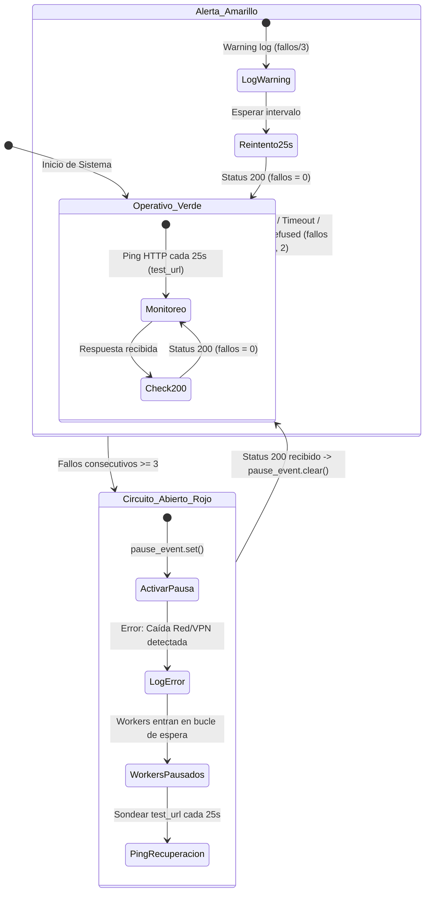

# Circuit Breaker de Red y VPN (Centinela de Conectividad)

En entornos de scraping corporativo contra intranets empresariales (como IRIS Telecom de Telefónica/Movistar), la conectividad depende indefectiblemente de túneles VPN dedicados (F5 BIG-IP Edge Client, Fortinet o WireGuard) y gateways de red internos. 

Una micro-desconexión de la VPN o una caída del balanceador F5 genera fallos masivos en cascada: cientos de consultas lanzadas por los workers fallan en pocos segundos, marcando erróneamente registros como errores fatales o provocando timeouts prolongados que congelan la base de datos central.

Para neutralizar este riesgo, el sistema incorpora un **Circuit Breaker reactivo centralizado**, implementado como un hilo centinela permanente en el supervisor que coordina el estado de todos los workers mediante eventos IPC.

---

## 1. Arquitectura del Centinela Circuit Breaker

El Circuit Breaker se orquesta en el método [`_circuit_breaker_loop`](file:///c:/Users/Usuario/Documents/GitHub/scrapers-reg-no-llame/runtime/supervisor.py#L63-L96) de [`SupervisorIndustrial`](file:///c:/Users/Usuario/Documents/GitHub/scrapers-reg-no-llame/runtime/supervisor.py#L31), ejecutándose como un hilo de soporte en segundo plano (`CircuitBreakerThread`).



---

## 2. Implementación del Bucle de Verificación

El algoritmo verifica activamente el endpoint `config.IRIS_LOGIN_URL` mediante una petición de sondeo ligero vía `urllib.request` con un timeout estricto de **8 segundos**:

```python
def _circuit_breaker_loop(self, check_interval: float = 25.0):
    """Monitor centinela de conectividad y VPN."""
    cb_logger = logging.getLogger("CircuitBreaker")
    fallos = 0
    test_url = config.IRIS_LOGIN_URL

    while not self.stop_event.is_set():
        if self.verificar_vpn and "iris" in self.scraper_name:
            try:
                req = urllib.request.Request(
                    test_url,
                    headers={"User-Agent": "Mozilla/5.0 (Windows NT 10.0; Win64; x64)"}
                )
                with urllib.request.urlopen(req, timeout=8) as resp:
                    if resp.status == 200:
                        if fallos >= 3 and self.pause_event.is_set():
                            cb_logger.info("🟢 [CIRCUIT BREAKER] Conectividad restablecida. Reanudando workers.")
                            self.pause_event.clear()
                        fallos = 0
                    else:
                        fallos += 1
            except Exception as e:
                fallos += 1
                if fallos == 1 or fallos % 5 == 0:
                    cb_logger.warning(f"⚠️ [CIRCUIT BREAKER] Fallo de conectividad ({fallos}/3): {e}")
                if fallos >= 3 and not self.pause_event.is_set():
                    cb_logger.error("🔴 [CIRCUIT BREAKER] Caída de red/VPN detectada. Pausando reclamo de lotes.")
                    self.pause_event.set()

        for _ in range(int(check_interval)):
            if self.stop_event.is_set():
                break
            time.sleep(1)
```

### Reglas Operativas del Centinela
1. **Condición de Evaluación:** Solo se activa si `self.verificar_vpn == True` y el scraper configurado pertenece a la familia `"iris"`.
2. **Umbral de Disparo (3 Fallos Consecutivos):** Si se acumulan 3 fallos seguidos (aproximadamente 75 segundos de indisponibilidad), se considera confirmada la caída de la VPN o del portal.
3. **Disparo del Evento IPC:** Se ejecuta `self.pause_event.set()`. Este evento de `multiprocessing.Event` es visible inmediatamente por todos los procesos workers sin necesidad de enviar señales OS complejas.
4. **Auto-Recuperación Histerética:** En cuanto el portal responde con HTTP `200`, si el sistema estaba en estado pausado, registra el restablecimiento y ejecuta `self.pause_event.clear()`, reactivando instantáneamente el consumo de los workers.

---

## 3. Reacción y Comportamiento de los Workers ante la Pausa

En [`runtime/worker_process.py`](file:///c:/Users/Usuario/Documents/GitHub/scrapers-reg-no-llame/runtime/worker_process.py#L126-L133), antes de intentar reclamar cualquier nuevo lote a la base de datos MySQL, cada worker evalúa la condición del Circuit Breaker:

```python
# Circuit breaker: si está activado por caída de red, pausar sin reclamar lotes
if pause_event.is_set():
    w_log.warning(f"[{worker_tag}] Circuit Breaker activo (Red/VPN en pausa). Esperando...")
    for _ in range(5):
        if stop_event.is_set() or not pause_event.is_set():
            break
        time.sleep(1)
    continue
```

### Ventajas de este Diseño
- **Protección de la Base de Datos Central:** Los workers **no** ejecutan `reservar_lote()` (`SELECT ... FOR UPDATE SKIP LOCKED`). La cola de trabajo en la tabla `queue_registro_no_llame` no se bloquea innecesariamente.
- **Evita Desperdicio de Consultas:** Se evita marcar registros en `estado = 'error'` cuando la causa raíz no es la línea telefónica sino la caída del enlace de telecomunicaciones.
- **Bajo Consumo de CPU:** Mientras la VPN esté caída, los 9 workers entran en estado inactivo (*sleep* en ráfagas de 5 segundos), reduciendo a cero el uso de recursos y ancho de banda.
- **Reactivación Inmediata:** En el instante en que el centinela limpia el `pause_event`, el siguiente tick de 1 segundo de los workers los despierta para retomar el trabajo normalmente.
