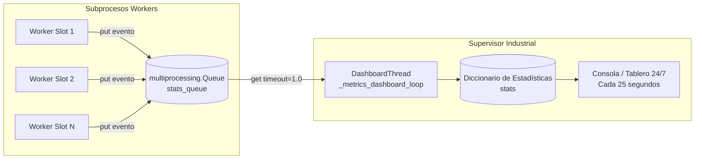

# Tablero de Métricas IPC (Monitor en Tiempo Real)

En una infraestructura distribuida con múltiples subprocesos en paralelo, inspeccionar el rendimiento general sin degradar los workers exige un canal de telemetría de bajísima contención.

El sistema implementa un **drenador de métricas en tiempo real** (*IPC Metrics Drainer*) desacoplado mediante una cola de comunicación entre procesos (`multiprocessing.Queue`). Mientras los workers depositan eventos asíncronos sin bloquear su flujo de trabajo, un hilo especializado en el supervisor consume y totaliza las métricas, calculando la velocidad de procesamiento (RPM), latencias promedio y emitiendo un tablero en consola cada 25 segundos.

---

## 1. Topología del Canal IPC de Métricas

La arquitectura de telemetría interconecta a todos los subprocesos workers con el supervisor maestro a través de la cola multiproceso `stats_queue`:



### Ventajas del Enfoque Asíncrono
- **Cero Bloqueo para los Workers:** La llamada `stats_queue.put(item)` es no bloqueante y toma microsegundos. El worker no espera a que las estadísticas se calculen o se impriman en pantalla.
- **Seguridad Multiproceso (Thread-Safe & Process-Safe):** `multiprocessing.Queue` utiliza tuberías del sistema operativo (*named pipes* en Windows o descriptores UNIX) con serialización binaria segura gestionada por un hilo feeder en background.

---

## 2. Tipos de Mensajes Telemetrados

Los workers emiten diccionarios estandarizados según el evento ocurrido:

### A. Ítem Procesado con Coincidencia Positiva (`"completado"`)
Emitido cuando la línea consultada arrojó datos válidos en el scraper:
```python
{
    "tipo": "completado",
    "slot": 1,
    "scraper": "iris_http",
    "latency": 0.38
}
```

### B. Ítem Procesado sin Coincidencias (`"no_coincidencia"`)
Emitido cuando el scraper determinó fehacientemente que la línea no figura en el padrón o registro:
```python
{
    "tipo": "no_coincidencia",
    "slot": 2,
    "scraper": "iris_http",
    "latency": 0.45
}
```

### C. Error Controlado de Procesamiento (`"error"`)
Emitido ante timeouts, caídas puntuales o respuestas inesperadas de la plataforma:
```python
{
    "tipo": "error",
    "slot": 3,
    "scraper": "iris_http",
    "latency": 5.12
}
```

### D. Salida y Relevo de Worker (`"worker_exit"`)
Emitido en el bloque `finally` de terminación del proceso:
```python
{
    "tipo": "worker_exit",
    "slot": 1,
    "gen": 1,
    "scraper": "iris_http",
    "consultas": 350,
    "recycled": True
}
```

---

## 3. Implementación del Bucle Drenador (`_metrics_dashboard_loop`)

Definido en las líneas 118-170 de [`runtime/supervisor.py`](file:///c:/Users/Usuario/Documents/GitHub/scrapers-reg-no-llame/runtime/supervisor.py#L118-L170):

```python
def _metrics_dashboard_loop(self):
    """Tablero de control en tiempo real."""
    stats = {
        "completados": 0,
        "no_coincidencias": 0,
        "errores": 0,
        "reciclados": 0,
        "latencias": [],
        "t0": time.time()
    }
    last_print = time.time()

    while not self.stop_event.is_set():
        try:
            msg = self.stats_queue.get(timeout=1.0)
            tipo = msg.get("tipo")
            if tipo == "completado":
                stats["completados"] += 1
                stats["latencias"].append(msg.get("latency", 0))
            elif tipo == "no_coincidencia":
                stats["no_coincidencias"] += 1
                stats["latencias"].append(msg.get("latency", 0))
            elif tipo == "error":
                stats["errores"] += 1
            elif tipo == "worker_exit" and msg.get("recycled"):
                stats["reciclados"] += 1
        except Exception:
            pass

        now = time.time()
        if now - last_print >= 25.0:
            total_proc = stats["completados"] + stats["no_coincidencias"] + stats["errores"]
            elapsed = now - stats["t0"]
            rpm = round((total_proc / elapsed) * 60, 1) if elapsed > 0 else 0
            avg_lat = round(sum(stats["latencias"][-50:]) / len(stats["latencias"][-50:]), 2) if stats["latencias"] else 0
            status_vpn = "PAUSADO (Red/VPN)" if self.pause_event.is_set() else "VERDE (Operativo)"

            prio_str = "Auto (P1->P2->P3)" if self.prioridad is None else f"P{self.prioridad}"

            print("\n" + "=" * 72)
            print(f"📊 TABLERO 24/7 SUPERVISOR INDUSTRIAL | {time.strftime('%Y-%m-%d %H:%M:%S')}")
            print(f"  • Scraper Activo:           {self.scraper_name.upper()} ({prio_str})")
            print(f"  • Estado Red / Conectividad:{status_vpn}")
            print(f"  • Workers en paralelo:      {self.workers_count} slots activos")
            print(f"  • Total procesados:         {total_proc:,} registros | Ritmo: {rpm} reg/min")
            print(f"  • Coincidencias positivas:  {stats['completados']:,}")
            print(f"  • Sin coincidencias:        {stats['no_coincidencias']:,}")
            print(f"  • Errores controlados:      {stats['errores']:,}")
            print(f"  • Rotaciones preventivas:   {stats['reciclados']:,} relevos anti-leak")
            print(f"  • Latencia promedio:        {avg_lat}s por consulta")
            print("=" * 72 + "\n", flush=True)
            last_print = now
```

---

## 4. Fórmulas de Cálculo de Telemetría

El tablero computa los indicadores clave de producción en cada intervalo de renderizado:

### A. Total Procesados
$$\text{Total Procesados} = \text{completados} + \text{no\_coincidencias} + \text{errores}$$

### B. Ritmo de Procesamiento (Registros por Minuto - RPM)
Calculado respecto al tiempo global transcurrido desde el inicio de la sesión:
$$\text{RPM} = \frac{\text{Total Procesados}}{\text{now} - t_0} \times 60$$

### C. Latencia Promedio Móvil (Ventana Deslizante)
Para reflejar el estado actual de la infraestructura sin sesgos de arrastre históricos, la latencia promedio por consulta se calcula exclusivamente sobre los **últimos 50 eventos registrados** (`stats["latencias"][-50:]`):
$$\text{Latencia Promedio} = \frac{1}{K} \sum_{i=1}^{K} \text{latencia}_i \quad \text{donde } K = \min(50, \text{len(latencias)})$$

---

## 5. Salida Visual en Consola

Cada 25 segundos, el supervisor imprime la siguiente ficha técnica en la salida estándar (`sys.stdout`):

```text
========================================================================
📊 TABLERO 24/7 SUPERVISOR INDUSTRIAL | 2026-09-18 21:30:00
  • Scraper Activo:           IRIS_HTTP (Auto (P1->P2->P3))
  • Estado Red / Conectividad:VERDE (Operativo)
  • Workers en paralelo:      9 slots activos
  • Total procesados:         18,450 registros | Ritmo: 142.5 reg/min
  • Coincidencias positivas:  4,120
  • Sin coincidencias:        14,210
  • Errores controlados:      120
  • Rotaciones preventivas:   52 relevos anti-leak
  • Latencia promedio:        0.39s por consulta
========================================================================
```
