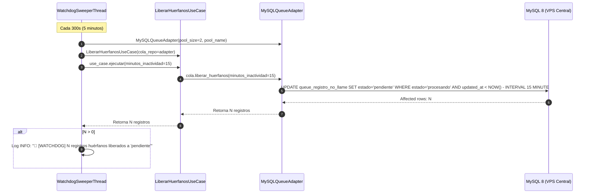

# Watchdog Sweeper (Centinela de Registros Huérfanos)

En sistemas de procesamiento distribuido que implementan el patrón de reclamo exclusivo con bloqueos transaccionales (`SELECT ... FOR UPDATE SKIP LOCKED`), la muerte súbita de un nodo de cómputo, una desconexión intempestiva de energía o la terminación abrupta de un proceso worker puede provocar **registros huérfanos**.

Un registro huérfano es aquel que quedó grabado con `estado = 'procesando'`, pero cuyo worker responsable dejó de existir o perdió conectividad antes de persistir el resultado o devolver el registro a `'pendiente'`. Si no se dispone de un mecanismo de recuperación, estos registros quedan invisibles para el resto de los workers concurrentes y jamás llegarán a procesarse.

Para resolver esto, el sistema incorpora el **Watchdog Sweeper**, un hilo centinela de barrido periódico que rescata de forma autónoma cualquier registro atascado.

---

## 1. Arquitectura Hexagonal del Sweeper

Siguiendo los principios de la arquitectura de Puertos y Adaptadores del repositorio, el Watchdog Sweeper desacopla la periodicidad temporal de la lógica de recuperación:
- **Hilo Centinela (Capa de Runtime):** Método [`_watchdog_sweeper_loop`](file:///c:/Users/Usuario/Documents/GitHub/scrapers-reg-no-llame/runtime/supervisor.py#L97-L117) en [`SupervisorIndustrial`](file:///c:/Users/Usuario/Documents/GitHub/scrapers-reg-no-llame/runtime/supervisor.py#L31).
- **Caso de Uso de Aplicación:** [`LiberarHuerfanosUseCase`](file:///c:/Users/Usuario/Documents/GitHub/scrapers-reg-no-llame/core/use_cases/cleanup_orphans_use_case.py#L9) en [`core/use_cases/cleanup_orphans_use_case.py`](file:///c:/Users/Usuario/Documents/GitHub/scrapers-reg-no-llame/core/use_cases/cleanup_orphans_use_case.py).
- **Adaptador de Infraestructura:** Método [`liberar_huerfanos`](file:///c:/Users/Usuario/Documents/GitHub/scrapers-reg-no-llame/adapters/queue/mysql_vps_adapter.py#L288-L326) de [`MySQLQueueAdapter`](file:///c:/Users/Usuario/Documents/GitHub/scrapers-reg-no-llame/adapters/queue/mysql_vps_adapter.py#L36).



---

## 2. Implementación del Hilo Centinela

En las líneas 97-117 de [`runtime/supervisor.py`](file:///c:/Users/Usuario/Documents/GitHub/scrapers-reg-no-llame/runtime/supervisor.py#L97-L117):

```python
def _watchdog_sweeper_loop(self, sweep_interval_sec: float = 300.0):
    """Centinela que ejecuta el caso de uso LiberarHuerfanosUseCase periódicamente."""
    wd_logger = logging.getLogger("WatchdogSweeper")
    while not self.stop_event.is_set():
        for _ in range(int(sweep_interval_sec)):
            if self.stop_event.is_set():
                break
            time.sleep(1)

        if self.stop_event.is_set():
            break

        try:
            adapter = MySQLQueueAdapter(pool_size=2, pool_name=f"watchdog_{os.getpid()}")
            use_case = LiberarHuerfanosUseCase(cola_repo=adapter)
            rescatados = use_case.ejecutar(minutos_inactividad=self.minutos_inactividad_huerfanos)
            if rescatados > 0:
                wd_logger.info(f"🧹 [WATCHDOG] {rescatados} registros huérfanos liberados a estado 'pendiente'.")
        except Exception as e:
            wd_logger.error(f"Error en barrido de huérfanos: {e}")
```

### Parámetros de Configuración del Centinela
- **Intervalo de Barrido (`sweep_interval_sec`):** Se ejecuta cada **300 segundos (5 minutos)**. La espera se realiza en ticks de 1 segundo para responder de inmediato si se solicita el apagado del supervisor (`self.stop_event.is_set()`).
- **Umbral de Inactividad (`minutos_inactividad_huerfanos`):** Configurado a **15 minutos**. Dado que el procesamiento regular de un lote de 12 registros toma típicamente entre 20 y 45 segundos, un registro que permanezca más de 15 minutos en estado `'procesando'` se considera irremediablemente abandonado.

---

## 3. Sentencia SQL Atómica de Rescate

La recuperación se efectúa de manera puramente atómica a nivel del motor MySQL mediante la siguiente consulta optimizada en [`MySQLQueueAdapter.liberar_huerfanos`](file:///c:/Users/Usuario/Documents/GitHub/scrapers-reg-no-llame/adapters/queue/mysql_vps_adapter.py#L288-L326):

```sql
UPDATE `queue_registro_no_llame`
SET estado = 'pendiente',
    updated_at = CURRENT_TIMESTAMP
WHERE estado = 'procesando'
  AND updated_at < NOW() - INTERVAL %s MINUTE;
```

### Características de la Sentencia
1. **Atómica y Masiva:** No requiere iterar registro por registro en Python ni descargar datos a memoria. MySQL resuelve la actualización directamente sobre el índice `idx_scraper_estado` (`scraper_actual`, `estado`).
2. **Reseteo Transaccional:** Devuelve el campo `estado` al valor `'pendiente'`, lo que permite que el registro vuelva a ser elegible para la cláusula `SELECT ... FOR UPDATE SKIP LOCKED` de cualquier worker disponible.
3. **Actualización de Marca Temporal:** Asigna `updated_at = CURRENT_TIMESTAMP`, evitando que el registro sea capturado nuevamente por el siguiente ciclo del sweeper si no es tomado de inmediato.
4. **Reporte Preciso:** Utiliza `cursor.rowcount` para obtener el número exacto de filas modificadas e informar la métrica en logs y consola.
