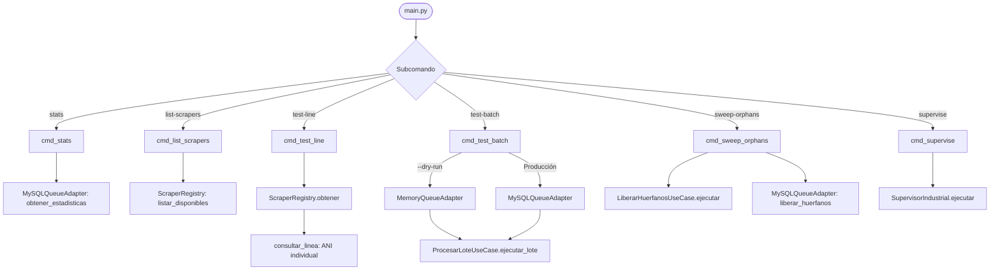

# CLI de Operación y Comandos del Sistema (`main.py`)

El archivo [main.py](file:///c:/Users/Usuario/Documents/GitHub/scrapers%20reg%20no%20llame/main.py) constituye el **Punto de Entrada Unificado** (CLI Principal) del sistema de scraping distribuido bajo arquitectura hexagonal. Permite ejecutar operaciones de diagnóstico, inspección de motores registrados, pruebas atómicas unitarias, pruebas transaccionales de micro-lotes con soporte para colas en memoria (*dry-run*), mantenimiento de registros huérfanos y arranque supervisado de workers.

---

## 1. Arquitectura de Comandos e Interfaz CLI

La CLI utiliza la biblioteca estándar `argparse` con subcomandos modulares. A nivel de infraestructura de consola, garantiza compatibilidad nativa con sistemas Windows configurando la salida estándar y de errores en codificación UTF-8:

```python
if sys.stdout.encoding != 'utf-8':
    sys.stdout.reconfigure(encoding='utf-8')
if sys.stderr.encoding != 'utf-8':
    sys.stderr.reconfigure(encoding='utf-8')
```

### Diagrama de Flujo de la CLI



---

## 2. Referencia Exhaustiva de Subcomandos

### 2.1. `stats`
Consulta el estado global de la tabla central de cola en el VPS (`queue_registro_no_llame`) agrupando por scraper y estado.

* **Firma / Implementación:** `cmd_stats(args)` en [main.py](file:///c:/Users/Usuario/Documents/GitHub/scrapers%20reg%20no%20llame/main.py#L40-L63).
* **Adaptador utilizado:** Instancia de [`MySQLQueueAdapter`](file:///c:/Users/Usuario/Documents/GitHub/scrapers%20reg%20no%20llame/adapters/queue/mysql_vps_adapter.py#L36) con pool dedicado (`cli_stats_pool`, `pool_size=2`).
* **Sintaxis PowerShell / CMD:**
  ```powershell
  python main.py stats
  ```
* **Ejemplo de Salida Real:**
  ```text
  =======================================================
  📊 ESTADÍSTICAS GLOBALES DE LA COLA VPS
  =======================================================
  Scraper / Etapa                |        Cantidad
  -------------------------------------------------------
    • claro_pendiente            |          45,210
    • iris_completado            |          12,450
    • iris_error                 |             120
    • iris_pendiente             |          85,340
    • iris_procesando            |              36
  -------------------------------------------------------
  RESUMEN POR ESTADO:
    • PENDIENTE                  |         130,550
    • PROCESANDO                 |              36
    • COMPLETADO                 |          12,450
    • ERROR                      |             120
  =======================================================
  ```

---

### 2.2. `list-scrapers`
Lista todos los adaptadores de scraping registrados dinámicamente en el [`ScraperRegistry`](file:///c:/Users/Usuario/Documents/GitHub/scrapers%20reg%20no%20llame/adapters/scrapers/registry.py).

* **Firma / Implementación:** `cmd_list_scrapers(args)` en [main.py](file:///c:/Users/Usuario/Documents/GitHub/scrapers%20reg%20no%20llame/main.py#L65-L74).
* **Sintaxis PowerShell / CMD:**
  ```powershell
  python main.py list-scrapers
  ```
* **Ejemplo de Salida Real:**
  ```text
  ==================================================
  🔌 SCRAPERS REGISTRADOS EN ARQUITECTURA HEXAGONAL
  ==================================================
    • iris
    • iris_http
    • iris_browser
    • template
  ==================================================
  ```

---

### 2.3. `test-line`
Ejecuta la extracción y normalización completa de un único ANI (10 dígitos) usando el scraper especificado. Útil para verificar cambios en parsers o credenciales sin interactuar con la cola.

* **Firma / Implementación:** `cmd_test_line(args)` en [main.py](file:///c:/Users/Usuario/Documents/GitHub/scrapers%20reg%20no%20llame/main.py#L76-L108).
* **Parámetros y Flags:**
  | Argumento / Flag | Tipo | Default | Descripción |
  | :--- | :---: | :---: | :--- |
  | `ani` | Posicional (`str`) | *Requerido* | Número de teléfono de 10 dígitos (ej: `1144332211`) |
  | `--dni` | Opción (`str`) | `None` | Número de DNI del titular sin puntos (requerido para Claro Cobro Express) |
  | `--scraper` | Opción (`str`) | `"iris_http"` | Motor de scraping a invocar (`iris_http`, `claro`, etc.) |
  | `--forzar-horario` | Flag booleano | `False` | Permite bypass de la política de horario comercial oficial para pruebas nocturnas |
  | `--tor` | Flag booleano | *Auto* | Fuerza el enrutamiento a través de proxy Tor local para evasión de bloqueos |
  | `--no-tor` | Flag booleano | *Auto* | Deshabilita Tor y fuerza conexión directa a Internet |
  | `--proxy-pool` | Flag booleano | `False` | Utiliza el pool local de proxies públicos rotativos de alta velocidad (<2.5s) |
* **Sintaxis PowerShell / CMD:**
  ```powershell
  # Consulta IRIS
  python main.py test-line 1144332211 --scraper iris_http

  # Consulta Claro (Cobro Express) con DNI y Tor Stream Isolation (latencia 4-8s)
  python main.py test-line 2604275327 --scraper claro --dni 33517690 --tor

  # Consulta Claro (Cobro Express) con Proxy Pool Rotativo (alta velocidad 1-2.5s)
  python main.py test-line 2604275327 --scraper claro --dni 33517690 --proxy-pool

  # Forzar ejecución fuera de horario comercial oficial (pruebas de desarrollo):
  python main.py test-line 1144332211 --scraper iris_http --forzar-horario
  ```
* **Ejemplo de Salida Real:**
  ```text
  🔍 Consultando línea 1144332211 con motor 'iris_http'...

  =======================================================
  🎯 RESULTADO NORMALIZADO: 1144332211
  =======================================================
    • Estatus:     coincidencia
    • Operador:    Movistar
    • Descripción: Port Out confirmada hacia Telecom
    • Titular:     JUAN PEREZ
    • Documento:   DNI 30123456
  -------------------------------------------------------
  JSON PAYLOAD:
  {
    "iris": {
      "ani": "1144332211",
      "status": "coincidencia",
      "timestamp": "2026-09-18T21:40:00.123456",
      "operador": "Movistar",
      "descripcion": "Port Out confirmada hacia Telecom",
      "titular": {
        "nombre": "JUAN",
        "apellido": "PEREZ",
        "razon_social": "",
        "tipo_documento": "DNI",
        "nro_documento": "30123456",
        "tipo_persona": "Fisica",
        "telefono_contacto": "1144332211",
        "email": "juanperez@gmail.com"
      },
      "servicio": {
        "tecnologia": "MOVIL",
        "producto": "Pospago",
        "plan": "Comunidad Movistar 5GB",
        "estado_servicio": "Inactivo"
      },
      "tramite": {
        "nro_tramite_abd": "ABD-2024-998811",
        "modalidad": "Port-Out",
        "motivo": "Cambio de prestador",
        "fecha_solicitud": "2024-05-10 14:30:00",
        "fecha_estado": "2024-05-12 10:15:00"
      },
      "detalles": {}
    }
  }
  =======================================================
  ```

---

### 2.4. `test-batch`
Prueba el ciclo transaccional completo del caso de uso [`ProcesarLoteUseCase`](file:///c:/Users/Usuario/Documents/GitHub/scrapers%20reg%20no%20llame/core/use_cases/process_batch_use_case.py). Permite probar con la base de datos real del VPS o en modo aislado en memoria (`--dry-run`).

* **Firma / Implementación:** `cmd_test_batch(args)` en [main.py](file:///c:/Users/Usuario/Documents/GitHub/scrapers%20reg%20no%20llame/main.py#L110-L148).
* **Parámetros y Flags:**
  | Argumento / Flag | Tipo | Default | Descripción |
  | :--- | :---: | :---: | :--- |
  | `--scraper` | Opción (`str`) | `"iris_http"` | Motor de scraping a utilizar |
  | `--batch-size` | Opción (`int`) | `3` | Cantidad de registros a procesar en el micro-lote |
  | `--dry-run` | Flag booleano | `False` | Utiliza [`MemoryQueueAdapter`](file:///c:/Users/Usuario/Documents/GitHub/scrapers%20reg%20no%20llame/adapters/queue/memory_adapter.py) con ANIs simulados sin tocar la BD VPS |
  | `--proxy-pool` | Flag booleano | `False` | Ejecuta el lote mediante el pool local de proxies públicos rotativos |
* **Sintaxis PowerShell / CMD:**
  ```powershell
  # Prueba simulada en memoria con Proxy Pool (dry-run ultrarrápido)
  python main.py test-batch --scraper claro --batch-size 2 --dry-run --proxy-pool

  # Prueba simulada en memoria con Tor Stream Isolation
  python main.py test-batch --scraper claro --batch-size 2 --dry-run --tor

  # Prueba real contra VPS (reclama 3 registros de la cola central)
  python main.py test-batch --scraper iris_http --batch-size 3
  ```
* **Ejemplo de Salida Real (Dry-run):**
  ```text
  ============================================================
  🧪 TEST DE LOTE - SCRAPER: CLARO (Dry-run: True)
  ============================================================
    ➔ ID: 99901 | ANI: 2604275327 | coincidencia ➔ Siguiente: [finalizado:completado]
    ➔ ID: 99902 | ANI: 2614556677 | sin_coincidencia ➔ Siguiente: [movistar:pendiente]
  ------------------------------------------------------------
  Procesados con éxito: 2 | Sin procesar: 0
  ============================================================
  ```

---

### 2.5. `sweep-orphans`
Ejecuta manualmente el caso de uso [`LiberarHuerfanosUseCase`](file:///c:/Users/Usuario/Documents/GitHub/scrapers%20reg%20no%20llame/core/use_cases/cleanup_orphans_use_case.py) para recuperar registros que quedaron trabados en estado `procesando` debido a cortes de energía, caídas de red o cierres forzados de procesos workers.

* **Firma / Implementación:** `cmd_sweep_orphans(args)` en [main.py](file:///c:/Users/Usuario/Documents/GitHub/scrapers%20reg%20no%20llame/main.py#L150-L156).
* **Parámetros y Flags:**
  | Argumento / Flag | Tipo | Default | Descripción |
  | :--- | :---: | :---: | :--- |
  | `--minutos` | Opción (`int`) | `15` | Umbral de inactividad en minutos (`updated_at < NOW() - INTERVAL %s MINUTE`) |
* **Sintaxis PowerShell / CMD:**
  ```powershell
  # Limpieza con umbral por defecto (15 min)
  python main.py sweep-orphans

  # Limpieza agresiva (5 min) tras falla general
  python main.py sweep-orphans --minutos 5
  ```
* **Ejemplo de Salida Real:**
  ```text
  🧹 Watchdog Sweeper: 14 registros huérfanos recuperados a 'pendiente'.
  ```

---

### 2.6. `supervise`
Inicia el orquestador industrial [`SupervisorIndustrial`](file:///c:/Users/Usuario/Documents/GitHub/scrapers%20reg%20no%20llame/runtime/supervisor.py) directamente desde la interfaz de `main.py`.

* **Firma / Implementación:** `cmd_supervise(args)` en [main.py](file:///c:/Users/Usuario/Documents/GitHub/scrapers%20reg%20no%20llame/main.py#L158-L176).
* **Parámetros y Flags:**
  | Flag | Tipo | Default | Descripción |
  | :--- | :---: | :---: | :--- |
  | `--scraper` | `str` | `"iris_http"` | Identificador del scraper a supervisar |
  | `--workers` | `int` | `9` | Número de procesos workers paralelos permanentes |
  | `--batch-size` | `int` | `12` | Tamaño del lote por reserva atómica en VPS |
  | `--max-queries-worker` | `int` | `350` | Límite de rotación preventiva anti-leak de memoria |
  | `--prioridad` | `str` | `"auto"` | Opciones: `auto` (cascada B-Tree P1->P2->P3), `1`, `2`, `3` |
  | `--delay-min` | `float` | `1.5` | Espera mínima (segundos) entre lotes por worker |
  | `--delay-max` | `float` | `2.5` | Espera máxima (segundos) entre lotes por worker |
  | `--visible` | flag | `False` | Si se usa browser, desactiva el modo headless |
  | `--tor` | flag | *Auto* | Fuerza arquitectura de proxy Tor Stream Isolation (`IsolateSOCKSAuth`) con circuitos dinámicos |
  | `--no-tor` | flag | *Auto* | Deshabilita Tor y ejecuta workers con conexión directa |
  | `--proxy-pool` | flag | `False` | Fuerza arquitectura de Proxy Pool local rotativo de alta velocidad (<2.5s) |
* **Sintaxis PowerShell / CMD:**
  ```powershell
  # Supervisor IRIS Movistar estándar (vía main.py)
  python main.py supervise --scraper iris_http --workers 12 --batch-size 15 --prioridad auto

  # Supervisor IRIS Movistar estándar (vía supervisor_vps.py directo)
  python supervisor_vps.py --engine http --workers 9 --batch-size 10

  # Supervisor Claro Cobro Express con Proxy Pool Rotativo (Máximo RPM, Costo $0)
  python main.py supervise --scraper claro --workers 5 --batch-size 15 --prioridad auto --proxy-pool
  python supervisor_vps.py --scraper claro --proxy-pool --workers 5 --batch-size 15

  # Supervisor Claro Cobro Express con Tor Stream Isolation (Máximo anonimato)
  python main.py supervise --scraper claro --workers 5 --batch-size 15 --prioridad auto --tor
  python supervisor_vps.py --scraper claro --tor --workers 5 --batch-size 15
  ```

---

## 3. Matriz de Códigos de Salida y Manejo de Errores

| Código Salida | Condición | Causa Raíz / Acción |
| :---: | :--- | :--- |
| `0` | Cierre exitoso o interrupción limpia (`SIGINT`) | Ejecución completada o parada solicitada por operador con `Ctrl+C`. |
| `1` | Error crítico no controlado | Conexión fallida al VPS, credenciales inválidas o excepción no manejada. |
| `2` | Argumentos inválidos de línea de comandos | Parámetro faltante o valor fuera de los choices permitidos en `argparse`. |
