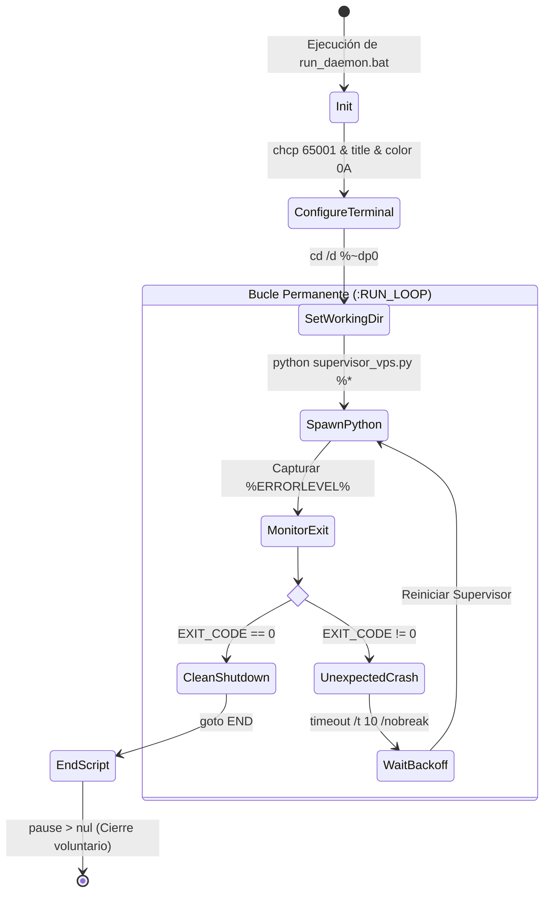

# Demonio de Windows y Bucle Permanente (`run_daemon.bat`)

El archivo [run_daemon.bat](file:///c:/Users/Usuario/Documents/GitHub/scraper%20iris%20reg%20no%20llame/run_daemon.bat) implementa el **demonio de arranque y supervisión en segundo plano para sistemas Windows**, diseñado para operar 24 horas al día, 7 días a la semana sin requerir intervención humana constante.

---

## 1. Arquitectura y Ciclo de Vida del Demonio

El script encapsula la ejecución de [supervisor_vps.py](file:///c:/Users/Usuario/Documents/GitHub/scraper%20iris%20reg%20no%20llame/supervisor_vps.py) dentro de un bucle de control de procesos (*watchdog loop*) que evalúa el código de salida de Python (`%ERRORLEVEL%`).



---

## 2. Análisis Línea por Línea del Código Batch

A continuación se detalla la configuración y directivas de [run_daemon.bat](file:///c:/Users/Usuario/Documents/GitHub/scraper%20iris%20reg%20no%20llame/run_daemon.bat):

### 2.1. Inicialización del Entorno de Consola
```cmd
chcp 65001 > nul
title Scraper IRIS Movistar - Supervisor 24/7 Industrial
color 0A
cd /d "%~dp0"
```
* **`chcp 65001 > nul`**: Configura la página de códigos de la consola de Windows en UTF-8, evitando corrupción de caracteres o cuelgues al imprimir logs con acentos, caracteres especiales o emojis técnicos (📊, 🚀, 🎯).
* **`title ...`**: Asigna un título descriptivo en la barra de tareas de Windows, facilitando la identificación del proceso entre múltiples servicios.
* **`color 0A`**: Establece el esquema de color verde sobre fondo negro, estándar para interfaces de monitoreo de servidores.
* **`cd /d "%~dp0"`**: Cambia de inmediato el directorio de trabajo a la ruta absoluta donde reside el archivo `.bat`, garantizando la correcta resolución de rutas relativas como `.env`, `config.py` y `supervisor_247.log`, sin importar desde dónde fue invocado (por ejemplo, desde el Programador de Tareas de Windows o un acceso directo).

### 2.2. Bucle de Invocación y Detección de Caídas
```cmd
:RUN_LOOP
echo ============================================================================
echo [%DATE% %TIME%] Levantando Supervisor 24/7 para IRIS...
echo ============================================================================

python supervisor_vps.py %*

set EXIT_CODE=%ERRORLEVEL%
echo.
echo [%DATE% %TIME%] El proceso supervisor se detuvo con código: %EXIT_CODE%

if "%EXIT_CODE%"=="0" (
    echo [INFO] Cierre limpio confirmado por el usuario. Finalizando demonio.
    goto END
)

echo [ALERTA] Caída inesperada detectada. Reiniciando supervisor en 10 segundos...
timeout /t 10 /nobreak > nul
goto RUN_LOOP
```
* **`python supervisor_vps.py %*`**: Ejecuta el supervisor transmitiendo íntegramente todos los argumentos de línea de comandos pasados al `.bat` (gracias a `%*`).
* **`set EXIT_CODE=%ERRORLEVEL%`**: Almacena de inmediato el código de salida de Python antes de que cualquier otro comando de CMD lo sobreescriba.
* **Evaluación de salida limpia (`%EXIT_CODE% == 0`)**: Cuando el operador interrumpe el script mediante `Ctrl+C` y el manejador de señales de Python completa el vaciado y cierre ordenado de conexiones, el código de retorno es `0`. En este caso, el demonio respeta la voluntad del operador y finaliza sin reintentar.
* **Recuperación ante fallas (`%EXIT_CODE% != 0`)**: Si Python se cierra por una excepción no capturada, un corte de red fatal, falta de memoria o terminación inesperada del subproceso, el demonio emite una advertencia, espera 10 segundos con `timeout /t 10 /nobreak` y relanza inmediatamente una nueva instancia.

---

## 3. Configuración de Variables de Entorno (`.env` y `config.py`)

El demonio y los subprocesos leen su configuración operativa centralizada desde el archivo [.env](file:///c:/Users/Usuario/Documents/GitHub/scraper%20iris%20reg%20no%20llame/.env) a través del cargador [config.py](file:///c:/Users/Usuario/Documents/GitHub/scraper%20iris%20reg%20no%20llame/config.py):

| Variable | Tipo | Valor Predeterminado | Uso en el Sistema |
| :--- | :---: | :---: | :--- |
| `IRIS_USER` | `str` | `"enorozco"` | Nombre de usuario para autenticación en el portal IRIS BPM |
| `IRIS_PASS` | `str` | *(Credencial)* | Contraseña de autenticación en IRIS |
| `IRIS_LOGIN_URL` | `str` | `http://iris.tmoviles.com.ar/...` | URL del servlet de login de WebLogic |
| `HEADLESS` | `bool` | `True` | Define si el navegador Chromium se ejecuta sin interfaz gráfica |
| `DELAY_MIN` | `float` | `1.5` | Jitter mínimo en segundos entre peticiones |
| `DELAY_MAX` | `float` | `3.5` | Jitter máximo en segundos entre peticiones |
| `VPS_DBHOST` | `str` | `"172.16.20.15"` | Dirección IP privada del servidor MySQL 8 central |
| `VPS_DBPORT` | `int` | `3306` | Puerto de conexión MySQL |
| `VPS_DBUSER` | `str` | `"ignacio_acuna"` | Usuario con permisos `SELECT`, `UPDATE` sobre la cola |
| `VPS_DBPASS` | `str` | *(Credencial)* | Contraseña de acceso a la base de datos |
| `VPS_DBNAME` | `str` | `"bases"` | Catálogo de base de datos de producción |
| `VPS_DB_TABLE` | `str` | `"queue_registro_no_llame"` | Nombre de la tabla central de colas |

---

## 4. Modos de Ejecución desde Consola

El script admite el paso directo de argumentos para parametrizar el supervisor sin modificar el código fuente:

### Ejecución Estándar (Modo HTTP, parámetros por defecto)
```cmd
run_daemon.bat --engine http
```

### Ejecución con Flags Específicos
```cmd
run_daemon.bat --engine http --workers 10 --batch-size 15 --prioridad auto --max-queries-worker 400
```

### Ejecución en Modo Navegador con Chromium
```cmd
run_daemon.bat --engine browser --workers 4 --batch-size 8
```

---

## 5. Instalación como Servicio de Windows o Tarea Programada

Para garantizar el encendido automático del demonio ante reinicios del servidor sin requerir inicio de sesión interactivo de un usuario, se recomienda registrarlo en el **Programador de Tareas de Windows (Task Scheduler)**.

### Comando PowerShell de Registro Automático (Elevado / Administrador):
```powershell
$Action = New-ScheduledTaskAction -Execute "cmd.exe" -Argument '/c "C:\Users\Usuario\Documents\GitHub\scraper iris reg no llame\run_daemon.bat --engine http"'
$Trigger = New-ScheduledTaskTrigger -AtStartup
$Principal = New-ScheduledTaskPrincipal -UserId "SYSTEM" -LogonType ServiceAccount -RunLevel Highest
$Settings = New-ScheduledTaskSettingsSet -AllowStartIfOnBatteries -DontStopIfGoingOnBatteries -RestartCount 3 -RestartInterval (New-TimeSpan -Minutes 1)

Register-ScheduledTask -TaskName "ScraperIris_Daemon_247" -Action $Action -Trigger $Trigger -Principal $Principal -Settings $Settings -Description "Demonio permanente 24/7 para Scraper IRIS Movistar"
```
