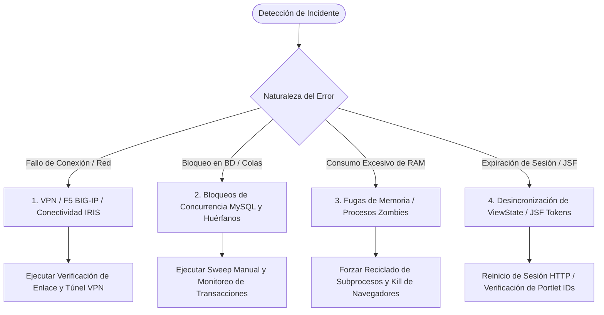

# Runbook de Resolución de Problemas e Incidentes

Esta guía proporciona procedimientos estandarizados de diagnóstico, aislamiento y resolución para los incidentes más frecuentes que pueden presentarse durante la operación en producción del sistema de scraping.

---

## 1. Matriz de Diagnóstico Rápido de Fallas



---

## 2. Diagnóstico de VPN y Balanceador F5 BIG-IP

### 2.1. Síntomas
* Logs indican: `⚠️ [CIRCUIT BREAKER] Fallo de conectividad (1/3): <urlopen error timed out>`.
* El supervisor imprime: `🔴 [CIRCUIT BREAKER] Caída de red/VPN detectada. Pausando reclamo de lotes.`
* Los workers se detienen con: `Circuit Breaker activo (Red/VPN en pausa). Esperando...`

### 2.2. Causa Raíz
El portal IRIS (`http://iris.tmoviles.com.ar`) reside dentro de una red privada corporativa accesible únicamente a través de túneles VPN corporativos o enlaces dedicados gestionados por balanceadores F5 BIG-IP. Si el cliente VPN se desconecta o la IP virtual (VIP) del F5 no responde en el puerto 80/443, las peticiones quedan colgadas hasta agotar el socket timeout.

### 2.3. Procedimiento de Resolución (Runbook de Red)
1. **Comprobar resolución DNS y latencia de capa 3:**
   ```powershell
   Test-NetConnection -ComputerName iris.tmoviles.com.ar -Port 80
   ```
   *Si `TcpTestSucceeded : False`, el túnel VPN está caído.*
2. **Reconectar cliente VPN:**
   * Abrir el cliente VPN corporativo (ej. FortiClient / Cisco AnyConnect / F5 Edge Client) y reautenticar credenciales.
3. **Verificación de respuesta HTTP mediante PowerShell:**
   ```powershell
   Invoke-WebRequest -Uri "http://iris.tmoviles.com.ar/workspace/faces/jsf/security/login.xhtml" -TimeoutSec 5 -UseBasicParsing
   ```
   *Debe responder con `StatusCode : 200`.*
4. **Comportamiento Automático del Supervisor:**
   No es necesario reiniciar el supervisor. Una vez restablecido el enlace, el hilo centinela [`_circuit_breaker_loop`](file:///c:/Users/Usuario/Documents/GitHub/scrapers%20reg%20no%20llame/runtime/supervisor.py#L63) detectará el código 200 y liberará el evento `pause_event`, reanudando los workers en menos de 25 segundos de forma automática.

---

## 3. Bloqueos de Base de Datos y Registros Huérfanos

### 3.1. Síntomas
* La consulta `stats` muestra registros acumulados en estado `procesando` durante horas sin que disminuyan.
* Se observan excepciones `mysql.connector.errors.OperationalError: Lock wait timeout exceeded; try restarting transaction`.

### 3.2. Causa Raíz
* **Registros Huérfanos:** Suceden cuando un proceso worker toma un lote mediante `UPDATE ... SET estado = 'procesando'` y el proceso muere violentamente antes de llamar a `persistir_resultados` o `revertir_a_pendiente`.
* **Lock Contention:** Sucede si múltiples conexiones intentan actualizar el mismo registro simultáneamente sin utilizar `SKIP LOCKED`.

### 3.3. Procedimiento de Resolución
1. **Verificar transacciones trabadas en MySQL VPS (desde consola de base de datos):**
   ```sql
   SHOW FULL PROCESSLIST;
   SELECT * FROM information_schema.innodb_trx;
   ```
2. **Liberación Inmediata de Huérfanos vía CLI:**
   Ejecutar el comando de barrido manual forzando un umbral de 5 minutos de inactividad:
   ```powershell
   python main.py sweep-orphans --minutos 5
   ```
3. **Liberación de Emergencia vía SQL Directo:**
   Si la CLI no puede ejecutarse, aplicar directamente en la base de datos central:
   ```sql
   UPDATE queue_registro_no_llame
   SET estado = 'pendiente',
       updated_at = CURRENT_TIMESTAMP
   WHERE estado = 'procesando'
     AND updated_at < NOW() - INTERVAL 10 MINUTE;
   ```

---

## 4. Fugas de Memoria y Procesos Huérfanos del Navegador

### 4.1. Síntomas
* La memoria RAM del servidor alcanza el 95-100%.
* Los procesos Chromium o Python tardan más de 30 segundos por consulta o el Administrador de Tareas muestra decenas de subprocesos `chrome.exe` o `python.exe`.

### 4.2. Causa Raíz
* Cuando se utiliza el motor `--engine browser` (Playwright Chromium), cada contexto web acumula caché de renderizado, objetos WebGL y árboles DOM. Si el proceso no se destruye periódicamente, la memoria Heap de V8 se fragmenta.

### 4.3. Prevención y Solución
1. **Migración a Motor HTTP:** El motor HTTP ultrarrápido (`--engine http`) consume solo ~35 MB de RAM por worker frente a ~1.2 GB de Chromium. **Se recomienda utilizar `--engine http` en el 100% de los entornos de producción.**
2. **Ajustar Rotación Preventiva:** Reducir `--max-queries-worker` a 200 para forzar reciclado de procesos con mayor frecuencia:
   ```powershell
   python supervisor_vps.py --engine browser --max-queries-worker 200
   ```
3. **Comando de Limpieza Forzada en Windows (PowerShell Administrador):**
   Si el servidor se encuentra congelado por procesos zombies:
   ```powershell
   # Detener procesos huérfanos de Chromium y Playwright
   Stop-Process -Name "chrome" -Force -ErrorAction SilentlyContinue
   Stop-Process -Name "msedge" -Force -ErrorAction SilentlyContinue
   ```

---

## 5. Errores de JSF, ViewState Desincronizado y Portlet Callbacks

### 5.1. Síntomas
* Logs indican: `Fallo en GET login.xhtml: Status 500`.
* `No se pudieron extraer los tokens docKey y form_action del formulario de consulta`.
* `Detectada expiración de sesión en servidor IRIS. Auto-sanando sesión HTTP...`.

### 5.2. Causa Raíz
* El portal IRIS está basado en Oracle WebLogic / Plumtree Portal con JavaServer Faces (JSF) y motor Fuego BPM. Las páginas no son APIs REST estándar: dependen de cookies de sesión (`JSESSIONID`), formularios con campos ocultos de estado (`docKey`, `xo$DocSessKey`, `xo$ScreenSessKey`) y callbacks dinámicos de componentes portlet.
* Si el servidor IRIS reinicia su contenedor de servlets WebLogic o la sesión supera el tiempo límite de inactividad, los tokens de sesión quedan invalidados.

### 5.3. Solución Implementada en el Código y Diagnóstico
1. **Auto-Sanación Nativa:**
   En [adapters/scrapers/iris/iris_http_bot.py](file:///c:/Users/Usuario/Documents/GitHub/scrapers%20reg%20no%20llame/adapters/scrapers/iris/iris_http_bot.py#L156-L161), el método `_open_query_screen` intercepta automáticamente el mensaje `SESSION_TIMED_OUT` o redirecciones a `login.xhtml` y reautentica la sesión de inmediato sin abortar el worker:
   ```python
   if "SESSION_TIMED_OUT" in r_cb.text or "login.xhtml" in r_cb.url:
       logger.warning("Detectada expiración de sesión en servidor IRIS. Auto-sanando sesión HTTP...")
       self.login()
   ```
2. **Auditoría de Credenciales:**
   Verificar que las credenciales en [.env](file:///c:/Users/Usuario/Documents/GitHub/scrapers%20reg%20no%20llame/.env) no hayan expirado:
   ```powershell
   python main.py test-line 1144332211 --scraper iris_http
   ```
   Si la autenticación falla sistemáticamente, solicitar el blanqueo de contraseña del usuario `enorozco` en el directorio activo de Movistar.

---

## 6. Procedimiento de Parada de Emergencia y Reinicio Limpio

Ante cualquier eventualidad crítica en el entorno de producción, seguir este protocolo paso a paso:

1. **Parada Ordenada del Demonio:**
   * Hacer clic en la ventana de consola de `run_daemon.bat` y presionar `Ctrl + C`.
   * Confirmar la terminación con `S` (Sí) si el intérprete de comandos lo solicita.
   * El supervisor interceptará la señal `SIGINT`, notificará a los workers mediante `stop_event.set()` y esperará hasta 15 segundos para que los lotes en curso se guarden limpiamente.
2. **Comprobación de Procesos Activos:**
   ```powershell
   Get-Process python -ErrorAction SilentlyContinue | Select-Object Id, ProcessName, CPU, WorkingSet64
   ```
3. **Liberación de Huérfanos Inmediata:**
   ```powershell
   python main.py sweep-orphans --minutos 0
   ```
4. **Reinicio del Servicio:**
   ```powershell
   .\run_daemon.bat --engine http --workers 9
   ```
