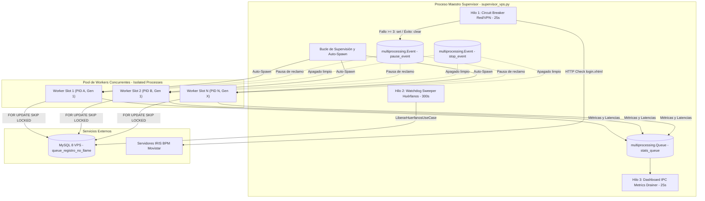

# Supervisor de Producción 24/7 (`supervisor_vps.py` / `runtime/supervisor.py`)

El componente de supervisión de producción es el núcleo de ejecución tolerante a fallas y auto-regenerativo del sistema. Está compuesto por la capa de CLI ejecutiva [supervisor_vps.py](file:///c:/Users/Usuario/Documents/GitHub/scraper%20iris%20reg%20no%20llame/supervisor_vps.py) y el motor orquestador [`SupervisorIndustrial`](file:///c:/Users/Usuario/Documents/GitHub/scraper%20iris%20reg%20no%20llame/runtime/supervisor.py).

---

## 1. Arquitectura del Supervisor Industrial

El supervisor implementa un modelo de orquestación maestro-trabajador (*master-worker pattern*) asistido por hilos centinelas de soporte desacoplados.



---

## 2. Parámetros y Flags de Línea de Comandos

La interfaz de comandos de [supervisor_vps.py](file:///c:/Users/Usuario/Documents/GitHub/scraper%20iris%20reg%20no%20llame/supervisor_vps.py#L61-L73) expone las siguientes opciones de configuración:

| Flag / Opción | Tipo | Valor por Defecto | Opciones Válidas | Descripción Técnica |
| :--- | :---: | :---: | :---: | :--- |
| `--scraper` | `str` | `None` | `iris`, `iris_http`, `iris_browser`, etc. | Nombre explícito del scraper en el registro. Si se omite, se deduce automáticamente a partir de `--engine`. |
| `--engine` | `str` | `"browser"` | `browser`, `http` | Motor de scraping para IRIS. `http`: cliente requests ultrarrápido (4-8s/linea, 35MB RAM). `browser`: Playwright Chromium (15s/linea, 1.2GB RAM). |
| `--prioridad` | `str` | `"auto"` | `auto`, `1`, `2`, `3` | Estrategia de partición geográfica B-Tree. `auto` aplica cascada P1 -> P2 -> P3. `1` solo AMBA/Mendoza, `2` solo Patagonia, `3` resto del país. |
| `--workers` | `int` | `9` | Entero positivo | Cantidad de subprocesos workers independientes ejecutándose simultáneamente. |
| `--batch-size` | `int` | `12` | Entero positivo | Cantidad de registros reclamados atómicamente por worker en cada transacción mediante `FOR UPDATE SKIP LOCKED`. |
| `--max-queries-worker` | `int` | `350` | Entero positivo | Cuota de consultas por ciclo de vida de worker. Al alcanzar este límite, el worker concluye y el supervisor genera una nueva generación (*anti-leak de memoria*). |
| `--delay-min` | `float` | `1.5` | Segundos (float) | Pausa mínima aleatoria (jitter) entre lotes sucesivos de un worker. |
| `--delay-max` | `float` | `2.5` | Segundos (float) | Pausa máxima aleatoria (jitter) entre lotes sucesivos de un worker. |
| `--visible` | `flag` | `False` (Headless) | Booleano | Si se utiliza motor `browser`, abre ventanas reales de Chromium en pantalla para depuración visual. |
| `--solo-sin-coincidencia` | `flag` | `False` | Booleano | **Auditoría Inicial Telco**: Filtra estrictamente líneas que no tengan coincidencia positiva previa en ninguna de las 3 compañías (`claro`, `personal`, `movistar`) ni en el status raíz legado. |

---

## 3. Subcomponentes y Mecanismos de Alta Disponibilidad

### 3.1. Supervisor Inmortal con Auto-Spawn
El bucle principal del supervisor inspecciona el diccionario de slots (`self.worker_slots`):
```python
if not proc.is_alive():
    proc.join(timeout=1.0)
    if not self.stop_event.is_set():
        nueva_gen = gen + 1
        self._spawn_worker(s_id, nueva_gen)
```
Si un proceso worker termina —ya sea por agotar su cuota preventiva de consultas o por una excepción fatal—, el slot es inmediatamente reabierto con un nuevo worker en una generación incrementada (ej: de `W3-G1` a `W3-G2`), asegurando disponibilidad continua del 100% de los slots configurados.

### 3.2. Rotación Preventiva Anti-Leak (Worker Lifecycle)
En motores basados en navegador (Chromium/Playwright) e incluso en bibliotecas de networking con C-bindings, el uso prolongado acumula fragmentación en memoria Heap. Para prevenir degradación de rendimiento:
1. Cada subproceso lleva el contador `consultas_realizadas`.
2. Calcula dinámicamente `batch_to_claim = min(batch_size, max_queries - consultas_realizadas)`.
3. Al alcanzar `max_queries_worker` (default: 350), el worker sale limpiamente del bucle y emite un mensaje `worker_exit` con `recycled=True`.
4. El proceso concluye su ejecución, el sistema operativo recolecta la totalidad de sus páginas de memoria, y el supervisor lanza un reemplazo fresco.

### 3.3. Circuit Breaker de Red y VPN
El hilo `_circuit_breaker_loop` realiza cada 25 segundos una petición HTTP de sondeo contra `config.IRIS_LOGIN_URL` con un timeout estricto de 8 segundos:
* Si se detectan **3 fallos consecutivos**, se activa `self.pause_event.set()`.
* Los workers en ejecución completan su consulta actual y entran en espera pasiva (`time.sleep(1)`), suspendiendo la reserva de nuevos lotes en la base de datos para evitar timeouts y registros trabados.
* Cuando el sondeo detecta un código HTTP 200, se ejecuta `self.pause_event.clear()` y los workers reanudan de inmediato el procesamiento.

### 3.4. Watchdog Sweeper de Huérfanos
El hilo centinela `_watchdog_sweeper_loop` despierta cada 300 segundos (5 minutos) y ejecuta el caso de uso [`LiberarHuerfanosUseCase`](file:///c:/Users/Usuario/Documents/GitHub/scraper%20iris%20reg%20no%20llame/core/use_cases/cleanup_orphans_use_case.py):
```sql
UPDATE `queue_registro_no_llame`
SET estado = 'pendiente',
    updated_at = CURRENT_TIMESTAMP
WHERE estado = 'procesando'
  AND updated_at < NOW() - INTERVAL 15 MINUTE
```
Esto garantiza que si una máquina se reinicia abruptamente o un worker muere por `SIGKILL`, ningún registro quede bloqueado permanentemente en estado `procesando`.

### 3.5. Tablero de Control y Métricas en Tiempo Real (IPC Drainer)
El hilo `_metrics_dashboard_loop` consume la cola multiproceso `stats_queue` e imprime cada 25 segundos el estado operacional consolidado:

```text
========================================================================
📊 TABLERO 24/7 SUPERVISOR INDUSTRIAL | 2026-09-18 21:45:00
  • Scraper Activo:           IRIS_HTTP (Auto (P1->P2->P3))
  • Estado Red / Conectividad:VERDE (Operativo)
  • Workers en paralelo:      9 slots activos
  • Total procesados:         8,420 registros | Ritmo: 112.4 reg/min
  • Coincidencias positivas:  2,310
  • Sin coincidencias:        6,095
  • Errores controlados:      15
  • Rotaciones preventivas:   24 relevos anti-leak
  • Latencia promedio:        4.82s por consulta
========================================================================
```

---

## 4. Casos de Uso y Comandos de Ejecución

### Caso 1: Modo Producción Máxima Velocidad (HTTP Ultrarrápido)
Recomendado para servidores de producción y VPS con enlaces estables. Permite hasta 12 workers con mínimo consumo de CPU/RAM.
```powershell
python supervisor_vps.py --engine http --workers 12 --batch-size 15 --prioridad auto
```

### Caso 2: Modo Navegador Resistente (Chromium Headless)
Útil si el portal de IRIS introduce validaciones adicionales de JavaScript o protecciones anti-bot de cliente.
```powershell
python supervisor_vps.py --engine browser --workers 6 --batch-size 10 --max-queries-worker 250
```

### Caso 3: Campaña Focalizada en AMBA y Mendoza (Prioridad 1)
Procesa exclusivamente líneas de prefijo 11 y 260-263 hasta vaciar la cola prioritaria.
```powershell
python supervisor_vps.py --engine http --workers 8 --prioridad 1 --batch-size 20
```

### Caso 4: Depuración Visual en Laboratorio (Visible)
Abre navegadores Chromium interactivos para auditoría visual del comportamiento del portal.
```powershell
python supervisor_vps.py --engine browser --workers 2 --batch-size 2 --visible
```

### Caso 5: Primera Pasada de Auditoría Masiva en Compañías (`--solo-sin-coincidencia`)
Recomendado para la **primera pasada** sobre la base de datos de 3.17 millones de registros, barriendo únicamente casos vírgenes o no resueltos a través de múltiples PCs especializadas:
```powershell
# En PC dedicada a Claro (audita solo líneas vírgenes con DNI)
python supervisor_vps.py --scraper claro --workers 6 --solo-sin-coincidencia

# En PC dedicada a Personal (audita líneas que Claro no resolvió o que no tienen DNI)
python supervisor_vps.py --scraper personal --workers 6 --solo-sin-coincidencia

# En PC dedicada a Movistar (audita números que Personal no resolvió)
python supervisor_vps.py --scraper movistar --workers 6 --solo-sin-coincidencia
```

Una vez finalizada la pasada inicial de auditoría, se puede **desactivar la bandera** (simplemente omitiendo `--solo-sin-coincidencia`) para restablecer el control estándar con ventana temporal TTL de 7 días, permitiendo re-auditar a futuro registros antiguos.

---

## 5. Rotación de Logs en Disco

El supervisor implementa un manejador [`RotatingFileHandler`](file:///c:/Users/Usuario/Documents/GitHub/scraper%20iris%20reg%20no%20llame/supervisor_vps.py#L42-L47) que escribe en `supervisor_247.log`:
* **Tamaño máximo por archivo:** 20 MB (`maxBytes = 20 * 1024 * 1024`).
* **Copias de respaldo (*backups*):** 5 archivos rotativos (`supervisor_247.log.1`, etc.).
* **Límite total en disco:** 100 MB máximo garantizado.
