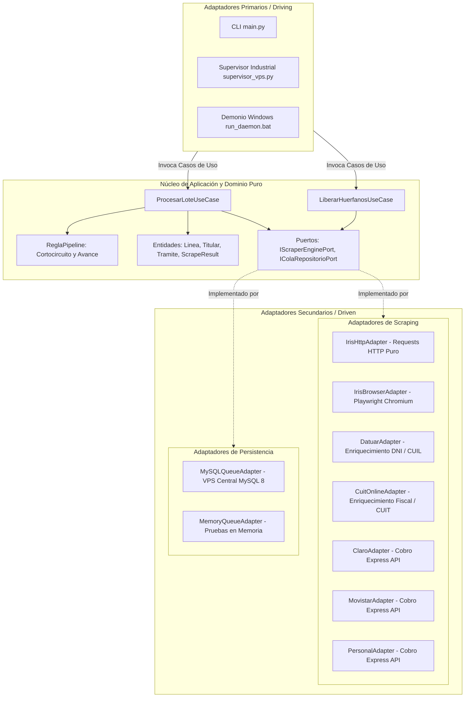

# Sistema de Scraping y Enriquecimiento Telefónico (Arquitectura Hexagonal)

Bienvenido a la documentación técnica exhaustiva del sistema de scraping concurrente distribuido y enriquecimiento de líneas telefónicas. Este sistema ha sido diseñado bajo los principios de **Arquitectura Hexagonal (Puertos y Adaptadores)**, garantizando desacoplamiento total entre el dominio de negocio, las fuentes externas de extracción (motores WebLogic HTTP, Chromium Playwright, etc.), la infraestructura de persistencia (MySQL 8 VPS) y el runtime de orquestación concurrente 24/7.

---

## 1. Mapa Conceptual de Arquitectura Hexagonal



---

## 2. Índice Maestro de Documentación Técnica

La documentación se organiza de forma atómica y modular en 7 capas temáticas estructuradas a continuación:

### Capa 01: Arquitectura y Diseño General
* [01. Visión General del Sistema](file:///c:/Users/automatizacion.crm/Documents/GitHub/scrapers-reg-no-llame/docs/01_arquitectura/vision_general.md): Propósito, pipeline de enriquecimiento, componentes clave y flujos de alto nivel.
* [02. Arquitectura Hexagonal (Puertos y Adaptadores)](file:///c:/Users/automatizacion.crm/Documents/GitHub/scrapers-reg-no-llame/docs/01_arquitectura/arquitectura_hexagonal.md): Desacoplamiento estricto, inversión de dependencias y aislamiento del dominio.
* [03. Pipeline en Cascada y Cortocircuito](file:///c:/Users/automatizacion.crm/Documents/GitHub/scrapers-reg-no-llame/docs/01_arquitectura/pipeline_cascada.md): Cadena de responsabilidad multiproveedor (`iris` ➔ `datuar` ➔ `cuitonline` ➔ `claro` ➔ `movistar` ➔ `personal`) y reglas de corte por coincidencia positiva.

### Capa 02: Dominio de Negocio y Casos de Uso
* [04. Entidades de Dominio y Value Objects](file:///c:/Users/automatizacion.crm/Documents/GitHub/scrapers-reg-no-llame/docs/02_dominio_y_casos_de_uso/entidades_y_value_objects.md): Modelos inmutables y contratos (`Linea`, `Titular`, `Servicio`, `TramitePortabilidad`, `ScrapeResult`, `RegistroCola`).
* [05. Regla de Negocio del Pipeline](file:///c:/Users/automatizacion.crm/Documents/GitHub/scrapers-reg-no-llame/docs/02_dominio_y_casos_de_uso/regla_pipeline_dominio.md): Algoritmo de transición de estados y fusión acumulativa de `datos_json`.
* [06. Caso de Uso: Procesar Lote](file:///c:/Users/automatizacion.crm/Documents/GitHub/scrapers-reg-no-llame/docs/02_dominio_y_casos_de_uso/caso_uso_procesar_lote.md): Orquestación atómica desacoplada implementada en `ProcesarLoteUseCase`.
* [07. Caso de Uso: Liberar Huérfanos](file:///c:/Users/automatizacion.crm/Documents/GitHub/scrapers-reg-no-llame/docs/02_dominio_y_casos_de_uso/caso_uso_liberar_huerfanos.md): Recuperación transaccional periódica de registros colgados mediante `LiberarHuerfanosUseCase`.
* [08. Política de Horario Comercial Oficial](file:///c:/Users/automatizacion.crm/Documents/GitHub/scrapers-reg-no-llame/docs/02_dominio_y_casos_de_uso/politica_horario_comercial.md): Ventana de operación corporativa (Lun-Vie 08:00 a 21:00, Sáb 08:00 a 13:00) y evasión de detección de anomalías.

### Capa 03: Base de Datos y Colas Transaccionales
* [08. Especificación DDL en MySQL 8 VPS](file:///c:/Users/automatizacion.crm/Documents/GitHub/scrapers-reg-no-llame/docs/03_base_de_datos_y_colas/esquema_ddl_vps.md): Estructura relacional e híbrida JSON de la tabla `queue_registro_no_llame`.
* [09. Estrategia de Índices B-Tree y Rendimiento](file:///c:/Users/automatizacion.crm/Documents/GitHub/scrapers-reg-no-llame/docs/03_base_de_datos_y_colas/indices_y_rendimiento.md): Cobertura de índices compuestos para optimización de queries y filtrado sin full table scan.
* [10. Concurrencia Atómica con SKIP LOCKED](file:///c:/Users/automatizacion.crm/Documents/GitHub/scrapers-reg-no-llame/docs/03_base_de_datos_y_colas/concurrencia_skip_locked.md): Bloqueo a nivel de fila y aislamiento entre workers concurrentes sin contención.
* [11. Cascada de Prioridades B-Tree](file:///c:/Users/automatizacion.crm/Documents/GitHub/scrapers-reg-no-llame/docs/03_base_de_datos_y_colas/cascada_prioridades_btree.md): Partición geográfica indexada (P1: AMBA/Mendoza, P2: Patagonia Sur, P3: Resto del País).
* [12. Pool de Conexiones, Reintentos y Despachador IPC](file:///c:/Users/automatizacion.crm/Documents/GitHub/scrapers-reg-no-llame/docs/03_base_de_datos_y_colas/pool_conexiones_y_reintentos.md): Aislamiento de pools por PID, reconexión exponencial y arquitectura despachadora IPC para unificación a 1 conexión por máquina física.
* [13. Adaptador de Cola Modular (Cola Automatización VPS)](file:///c:/Users/automatizacion.crm/Documents/GitHub/scrapers-reg-no-llame/docs/03_base_de_datos_y_colas/adaptador_cola_automatizacion.md): Adaptador secundario `ColaAutomatizacionAdapter` para consumo directo de la tabla `cola_automatizacion`, formateo retrocompatible y telemetría de latidos.

### Capa 04: Motores de Scraping IRIS Movistar
* [13. Adaptadores de Scraping Hexagonales](file:///c:/Users/automatizacion.crm/Documents/GitHub/scrapers-reg-no-llame/docs/04_scrapers_iris/adaptadores_iris_hexagonal.md): Implementación del puerto `IScraperEnginePort` en `IrisHttpAdapter` e `IrisBrowserAdapter`.
* [14. Ingeniería Inversa del Protocolo HTTP (BPM)](file:///c:/Users/automatizacion.crm/Documents/GitHub/scrapers-reg-no-llame/docs/04_scrapers_iris/ingenieria_inversa_http.md): Desglose del flujo WebLogic/Plumtree, cookies JSESSIONID, tokens `docKey` y peticiones AJAX.
* [15. Automatización de Navegador con Playwright](file:///c:/Users/automatizacion.crm/Documents/GitHub/scrapers-reg-no-llame/docs/04_scrapers_iris/automatizacion_browser.md): Fallback visual y headless mediante Chromium con selectores DOM robustos.
* [16. Mapeo y Normalización de Campos (Parser)](file:///c:/Users/automatizacion.crm/Documents/GitHub/scrapers-reg-no-llame/docs/04_scrapers_iris/mapeo_campos_parser.md): Extracción con expresiones regulares y BeautifulSoup sobre tablas HTML de portabilidad.

### Capa 05: Extensibilidad y Nuevos Motores
* [17. Contrato Abstracto IScraperEnginePort](file:///c:/Users/automatizacion.crm/Documents/GitHub/scrapers-reg-no-llame/docs/05_guia_nuevos_scrapers/contrato_iscraper_engine.md): Métodos obligatorios y ciclo de vida que debe implementar cualquier nuevo scraper.
* [18. Registro Centralizado y Factoría Dinámica](file:///c:/Users/automatizacion.crm/Documents/GitHub/scrapers-reg-no-llame/docs/05_guia_nuevos_scrapers/registro_y_factoria.md): Patrón Registry en `ScraperRegistry` para instanciación e introspección desacoplada.
* [19. Adaptador Scraper Datuar (Enriquecimiento de Identidad)](file:///c:/Users/automatizacion.crm/Documents/GitHub/scrapers-reg-no-llame/docs/05_guia_nuevos_scrapers/guia_creacion_datuar.md): Motor de enriquecimiento de identidad (apellidos, nombres, CUIL) a partir de DNI con caché SQLite de alta velocidad (`datuar_cache.sqlite`) y enrutamiento dual anónimo.
* [20. Adaptador Scraper CuitOnline (Enriquecimiento Fiscal)](file:///c:/Users/automatizacion.crm/Documents/GitHub/scrapers-reg-no-llame/docs/05_guia_nuevos_scrapers/guia_creacion_cuitonline.md): Motor de consulta y normalización de CUIT a partir de DNI con caché SQLite de alta velocidad (`cuitonline_cache.sqlite`), determinación de condición AFIP (IVA, Ganancias) y enrutamiento dual.
* [21. Adaptador Scraper Claro (Cobro Express)](file:///c:/Users/automatizacion.crm/Documents/GitHub/scrapers-reg-no-llame/docs/05_guia_nuevos_scrapers/guia_creacion_claro.md): Implementación del motor Claro Telefonía mediante API Cobro Express, decodificación Base64, captura exhaustiva de comprobantes y enrutamiento dual anónimo (Tor Stream Isolation y Proxy Pool de alta velocidad).
* [22. Adaptador Scraper Movistar (Cobro Express)](file:///c:/Users/automatizacion.crm/Documents/GitHub/scrapers-reg-no-llame/docs/05_guia_nuevos_scrapers/guia_creacion_movistar.md): Implementación del motor Movistar mediante API Cobro Express, identificación automática de características argentinas (`caracteristicas_argentina.py`), captura íntegra de comprobantes y enrutamiento dual anónimo (Tor Stream Isolation y Proxy Pool de alta velocidad).
* [23. Adaptador Scraper Personal (Cobro Express)](file:///c:/Users/automatizacion.crm/Documents/GitHub/scrapers-reg-no-llame/docs/05_guia_nuevos_scrapers/guia_creacion_personal.md): Implementación del motor Telecom Personal mediante API Cobro Express (Modalidad 2864), consulta por número directo (campo CBF), captura íntegra del JSON original devuelto por la pasarela y enrutamiento dual anónimo (Tor Stream Isolation y Proxy Pool de alta velocidad).
* [24. Adaptador de Bloques ENACOM (Plan Fundamental de Numeración)](file:///c:/Users/automatizacion.crm/Documents/GitHub/scrapers-reg-no-llame/docs/05_guia_nuevos_scrapers/guia_enacom_bloques.md): Motor determinista de resolución de bloques telefónicos oficiales, identificación de operador de origen, tipo de línea (móvil/fija), geolocalización, formatos de marcación y 23 campos regulatorios sin alterar esquemas relacionales.

### Capa 06: Runtime Concurrente y Resiliencia
* [25. Ciclo de Vida del Worker Individual](file:///c:/Users/automatizacion.crm/Documents/GitHub/scrapers-reg-no-llame/docs/06_runtime_y_concurrencia/ciclo_de_vida_worker.md): Aislamiento en subprocesos OS independientes, buffers y recolección de métricas.
* [26. Rotación Preventiva Anti-Leak de RAM](file:///c:/Users/automatizacion.crm/Documents/GitHub/scrapers-reg-no-llame/docs/06_runtime_y_concurrencia/rotacion_preventiva_ram.md): Mecanismo de relevo por cuota (350 consultas) para estabilidad permanente en servidores Windows/Linux.
* [27. Circuit Breaker de Red y VPN](file:///c:/Users/automatizacion.crm/Documents/GitHub/scrapers-reg-no-llame/docs/06_runtime_y_concurrencia/circuit_breaker_red.md): Centinela de conectividad para suspender y reanudar el reclamo de lotes automáticamente.
* [28. Supervisor Inmortal y Auto-Spawn](file:///c:/Users/automatizacion.crm/Documents/GitHub/scrapers-reg-no-llame/docs/06_runtime_y_concurrencia/supervisor_inmortal.md): Orquestador maestro que mantiene N workers activos, reemplazo preventivo y 5 hilos centinelas con Despachador IPC de base de datos.
* [29. Watchdog Sweeper Centinela](file:///c:/Users/automatizacion.crm/Documents/GitHub/scrapers-reg-no-llame/docs/06_runtime_y_concurrencia/watchdog_sweeper.md): Hilo de limpieza periódica de registros atascados por fallas imprevistas.
* [30. Tablero de Métricas Industrial en Tiempo Real](file:///c:/Users/automatizacion.crm/Documents/GitHub/scrapers-reg-no-llame/docs/06_runtime_y_concurrencia/tablero_metricas_ipc.md): Monitoreo de RPM, latencia promedio y distribución de estados vía colas IPC.

### Capa 07: Operación, Despliegue y Runbooks
* [31. Comandos de la CLI Principal (`main.py`)](file:///c:/Users/automatizacion.crm/Documents/GitHub/scrapers-reg-no-llame/docs/07_operacion_y_runbooks/comandos_cli_main.md): Sintaxis de subcomandos (`stats`, `list-scrapers`, `test-line`, `test-batch`, `sweep-orphans`, `supervise`).
* [32. Supervisor de Producción (`supervisor_vps.py`)](file:///c:/Users/automatizacion.crm/Documents/GitHub/scrapers-reg-no-llame/docs/07_operacion_y_runbooks/supervisor_produccion.md): Flags de producción (`--engine`, `--workers`, `--batch-size`, `--prioridad`) y casos de uso.
* [33. Demonio Permanente de Windows (`run_daemon.bat`)](file:///c:/Users/automatizacion.crm/Documents/GitHub/scrapers-reg-no-llame/docs/07_operacion_y_runbooks/demonio_windows_bat.md): Bucle permanente a prueba de fallos y configuración de variables de entorno `.env`.
* [34. Runbook de Resolución de Problemas e Incidentes](file:///c:/Users/automatizacion.crm/Documents/GitHub/scrapers-reg-no-llame/docs/07_operacion_y_runbooks/resolucion_problemas.md): Protocolos de diagnóstico de VPN/F5, bloqueos de BD, fugas de RAM y errores de sesión JSF.
* [35. Orquestación y Control de Cluster LAN (Master-Worker)](file:///c:/Users/automatizacion.crm/Documents/GitHub/scrapers-reg-no-llame/docs/07_operacion_y_runbooks/orquestacion_cluster_lan.md): Sincronización automática de código Git y control centralizado de scrapers entre múltiples PCs en red local.

---

## 3. Guía Rápida de Comandos Operativos

```powershell
# 1. Monitoreo del estado de la cola global
python main.py stats

# 2. Prueba individual de línea telefónica
python main.py test-line 1144332211 --scraper iris_http

# 3. Prueba Claro con Proxy Pool de alta velocidad (<2.5s, Costo $0)
python main.py test-line 2604275327 --scraper claro --dni 33517690 --proxy-pool

# 4. Prueba Claro con Tor Stream Isolation (Máximo anonimato)
python main.py test-line 2604275327 --scraper claro --dni 33517690 --tor

# 5. Prueba de lote en memoria sin tocar base de datos (Dry-Run)
python main.py test-batch --scraper claro --batch-size 2 --dry-run --proxy-pool

# 6. Limpieza manual de registros huérfanos
python main.py sweep-orphans --minutos 10

# 7. Ejecución industrial continua 24/7 (Demonio Windows)
.\run_daemon.bat --engine http --workers 9 --batch-size 12 --prioridad auto
```
